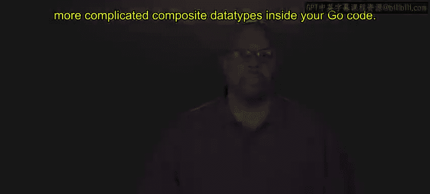
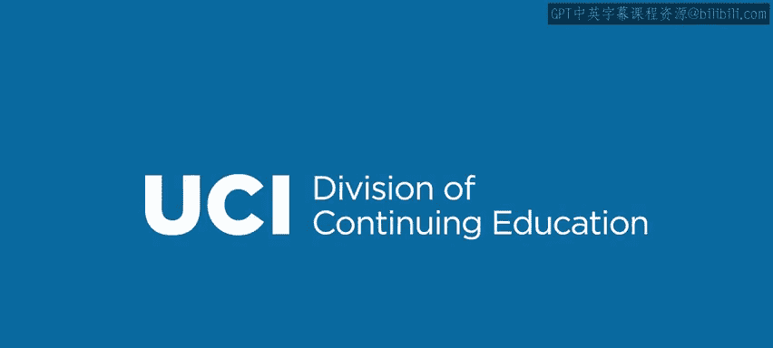

# 022：复合数据类型概述 🧩

在本节课中，我们将要学习Go语言中的复合数据类型。复合数据类型是能够将其他数据类型聚合在一起的数据类型，它们将许多不同的数据类型组合成一个整体。具体来说，我们将探讨数组、切片、映射和结构体。

复合数据类型对于编写复杂的、真实的代码至关重要，因为基本数据类型不足以描述大型代码中需要引用的复杂概念。因此，你需要将它们聚合起来，例如，你可能有一些字符串和一些整数，然后将它们合并成一个能描述你特定应用程序中概念的整体。

完成本模块的学习后，你将能够在Go代码中使用更复杂的复合数据类型。

---

## 什么是复合数据类型？

上一节我们介绍了本模块的学习目标，本节中我们来看看复合数据类型的核心定义。

复合数据类型是聚合了其他数据类型的数据类型。它们将多个不同的数据值组合成一个单一的实体。在Go语言中，主要的复合数据类型包括：
*   **数组**：固定长度的、相同类型元素的序列。
*   **切片**：动态长度的、相同类型元素的序列，基于数组构建，但更灵活。
*   **映射**：存储键值对的无序集合。
*   **结构体**：将不同类型的字段组合成一个逻辑单元。

---

## 为什么需要复合数据类型？

我们已经了解了复合数据类型的种类，现在来探讨为什么它们如此重要。

基本数据类型（如整数、浮点数、字符串）只能表示单一、简单的值。然而，在现实世界的程序中，我们需要描述更复杂的实体。例如，一个“用户”可能包含姓名（字符串）、年龄（整数）和邮箱（字符串）。使用复合数据类型，我们可以将这些信息聚合到一个结构体中，使代码更清晰、更易于管理。

以下是使用复合数据类型的一些关键优势：
*   **组织数据**：将相关的数据字段组合在一起，提高代码可读性。
*   **简化操作**：可以一次性传递或操作整个数据集合，而不是多个分散的变量。
*   **建模现实**：能够更准确地为程序要解决的现实问题建模。

---

## 本模块将涵盖的内容

在接下来的章节中，我们将逐一深入探讨各种复合数据类型。

我们将从**数组**开始，学习如何创建和操作固定大小的元素集合。接着，我们会学习更常用的**切片**，了解其动态增长的特性。然后，我们将探索**映射**，这是一种通过唯一键快速访问值的强大工具。最后，我们将学习**结构体**，它是构建复杂数据模型的基石。

---

## 总结

本节课中我们一起学习了Go语言中复合数据类型的基本概念。我们了解到，复合数据类型（如数组、切片、映射和结构体）能够将多个值聚合起来，以描述程序中的复杂概念，这对于编写超越简单示例的实际应用程序至关重要。在接下来的课程中，我们将详细学习每一种类型的具体用法和特性。