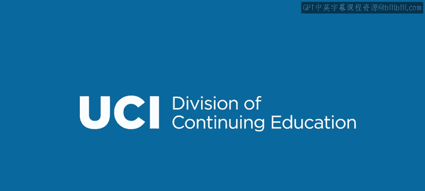

# 024：切片 🍰


在本节课中，我们将要学习Go语言中一个非常核心且强大的数据结构——切片。切片提供了比数组更灵活的操作方式，是Go语言中处理序列化数据的主要工具。

## 什么是切片？

上一节我们介绍了数组，本节中我们来看看切片。切片是一种在许多其他编程语言中不常见的数据类型，但它非常有用。实际上，切片经常被用来替代数组，因为它们具有灵活性，可以改变大小。

本质上，**切片是底层数组的一个窗口**。每个切片都必须基于一个底层数组。切片就是这个数组的一个片段或视图。例如，一个包含100个元素的数组，其切片可能只包含其中的第3、4、5个元素，或者第5到第9个元素。切片的大小可以变化，最大可以达到底层数组的大小。这是切片的一个显著优点。

## 切片的三个属性

每个切片都包含三个基本属性：

以下是切片的三个核心属性：
1.  **指针**：指向切片在底层数组中开始的第一个元素。
2.  **长度**：切片当前包含的元素数量。
3.  **容量**：切片可以扩展到的最大元素数量。它由指针位置和底层数组末尾的距离决定。

例如，一个大小为100的数组，如果切片从数组开头开始，其容量就是100。如果切片从数组索引10开始，那么它的容量就只有90。

## 切片定义与示例

让我们通过一个例子来理解这些概念。

```go
arr := [7]string{"A", "B", "C", "D", "E", "F", "G"}
s1 := arr[1:3] // 包含索引1和2的元素（B, C）
s2 := arr[2:5] // 包含索引2、3、4的元素（C, D, E）
```

在上面的代码中，`arr[1:3]` 定义了一个切片，它包含从索引1开始、到索引3（不包含）结束的元素。因此，`s1` 包含元素 `B` 和 `C`。同理，`s2` 包含元素 `C`、`D`、`E`。注意，`s1` 和 `s2` 都包含了索引2的元素 `C`，这说明切片可以重叠。

## 长度与容量

Go语言提供了 `len()` 和 `cap()` 函数来获取切片的长度和容量。

```go
arr := [3]int{1, 2, 3}
slice := arr[0:1] // 切片包含 arr[0]
fmt.Println(len(slice)) // 输出: 1
fmt.Println(cap(slice)) // 输出: 3
```

这个切片的长度是1，因为它只包含一个元素。但它的容量是3，因为它从数组开头开始，可以扩展到包含整个数组。

## 访问与修改切片元素

对切片元素的读写操作，实际上是在操作其底层数组。重叠的切片可以引用相同的数组元素。

```go
arr := [3]string{"A", "B", "C"}
s1 := arr[0:2] // [A, B]
s2 := arr[1:3] // [B, C]

s1[1] = "Z" // 修改底层数组arr[1]
fmt.Println(s2[0]) // 输出: Z
```

因为 `s1[1]` 和 `s2[0]` 都指向底层数组的同一个元素 `arr[1]`，所以修改其中一个会影响另一个。

## 切片字面量

与数组类似，你也可以使用字面量来初始化切片。

```go
slice := []int{1, 2, 3, 4, 5} // 这是一个切片字面量
```

当你使用切片字面量时，Go会先创建一个底层数组来存放这些值，然后创建一个指向整个该数组的切片。因此，这个切片的长度和容量是相等的。



本节课中我们一起学习了Go语言切片的核心概念。我们了解到切片是底层数组的动态视图，具有长度和容量的属性，并且可以通过字面量方便地创建。理解切片是掌握Go语言中高效数据操作的关键。