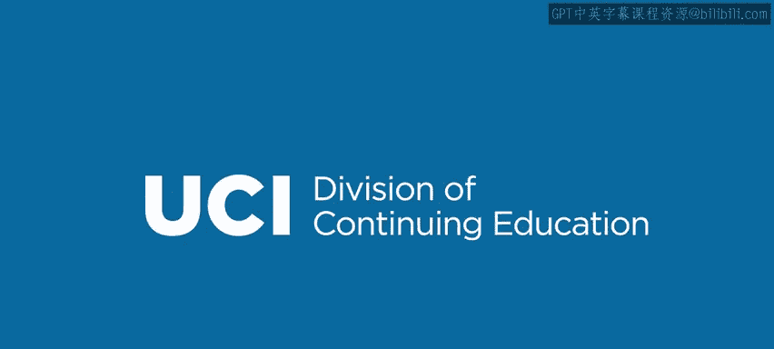

# 030：RFC与数据交换标准 📜


在本节课中，我们将要学习什么是RFC，以及为什么在编程中，尤其是在Go语言中，理解和使用基于RFC的标准协议与数据格式至关重要。

## 概述

当我们编写大型程序时，程序经常需要与其他系统或数据块进行交互。为了实现这种交互，数据必须以双方都能理解的格式进行传输。RFC（Request for Comments，征求意见稿）就是定义这些协议或格式的标准文档。它们虽然不是Go语言本身的一部分，但在构建需要网络通信或数据交换的系统时，扮演着核心角色。

上一节我们介绍了程序间交互的必要性，本节中我们来看看实现这种交互的通用“语言”——RFC标准。

## 什么是RFC？ 🤔

RFC在技术上是“征求意见稿”，但其本质是协议或格式的定义，即一种标准规范。我们关注RFC，是因为在编写程序时，你总会需要与其他系统交互。例如，你的程序可能需要读取文件或处理来自数据库的数据。这些数据必须遵循一种公认的格式，你的代码才能处理它。

同样，在网络通信中，例如构建一个Web客户端，它必须按照特定的协议（如HTTP）向服务器发送消息，服务器才能理解。反之，你的程序也必须能理解服务器返回消息的格式。因此，任何需要通过数据传输进行系统间交互的场景，都依赖于这些定义明确、广泛使用的格式和协议。

## 常见的RFC标准示例 🌐

以下是几个由RFC定义的重要标准示例：

*   **HTML (RFC 2854)**: 超文本标记语言，用于编写网页的标准语言。所有网络浏览器都必须理解它，以便正确渲染页面。
*   **URI (RFC 3986)**: 统一资源标识符，是Web上使用的寻址方法（如URL）。它规定了地址的特定格式，以便所有客户端和服务器都能解析。
*   **HTTP (RFC 2616)**: 超文本传输协议，定义了消息如何在网络上传输，包括消息头、内容、长度等信息，使得Web浏览器能与服务器通信。

这些只是众多标准协议中的几个例子。有些协议简单，有些则非常复杂。

## Go语言中的RFC支持包 🛠️

在Go语言中，提供了许多包来帮助处理这些格式。虽然不是所有RFC都有对应的包，但大多数重要的RFC都有。这些包提供了一系列函数，用于将数据**编码**成特定协议/格式，或将接收到的数据**解码**成Go对象（如结构体或映射）。

编码（Encode）指将Go对象转换为通用协议格式；解码（Decode）则是相反的过程，将特定格式的数据转换为Go对象。

以下是两个核心包：

*   **`net/http`包**: 用于HTTP协议。例如，`http.Get`函数可以发起一个GET请求到指定域名，并返回网页内容。
    ```go
    resp, err := http.Get("http://example.com")
    ```
*   **`net`包**: 用于更基础的TCP/IP和套接字编程。TCP/IP协议族是互联网通信的基础。例如，`net.Dial`函数可以建立一个TCP连接。
    ```go
    conn, err := net.Dial("tcp", "uci.edu:80")
    ```

这些包的存在极大地方便了程序员。如果没有它们，你就需要从零开始理解协议细节并实现所有功能，这将非常耗时。

## 聚焦JSON数据格式 📄

JSON（JavaScript Object Notation）是一种在全球广泛使用的数据格式，它由RFC 7159定义。虽然名字来源于JavaScript，但JSON的应用远不止于此，它是一种通用的、表示结构化数据的格式。

结构化数据指的是一组**属性-值对**。这非常自然地对应到Go语言中的**结构体**（字段和值）或**映射**（键和值）。JSON中的值和属性可以是基本类型（布尔值、数字、字符串）、数组或其他JSON对象，并且可以层次化地组合。

### 示例：Go结构体与JSON对象

让我们从一个Go结构体开始。假设我们有一个表示人物的结构体：

```go
type Person struct {
    Name    string
    Address string
    Phone   string
}

p1 := Person{Name: "Joe", Address: "A St.", Phone: "123"}
```

如果我们想将`p1`的信息传输给另一台机器或另一个程序，可以将其转换为JSON格式。等效的JSON对象如下所示：

```json
{
    "Name": "Joe",
    "Address": "A St.",
    "Phone": "123"
}
```

请注意，它与Go结构体非常相似，但属性名称需要用引号括起来。这个JSON对象可以被任何能解析JSON的系统读取，从而获取我们程序中关于此人的所有信息。你可以将大量这样的JSON对象传递给他人，以交换整个数据库的信息。

## 总结



本节课中我们一起学习了RFC的概念及其作为通信和数据交换标准的重要性。我们了解了几个常见的RFC标准，如HTML、URI和HTTP，并知道了Go语言通过`net/http`、`net`等内置包为使用这些协议提供了强大支持。最后，我们重点介绍了JSON这种通用的结构化数据格式，它通过属性-值对的形式，能够很方便地与Go语言中的结构体和映射进行相互转换，是实现数据序列化和交换的利器。掌握这些知识，是构建能够与外界交互的复杂Go程序的基础。