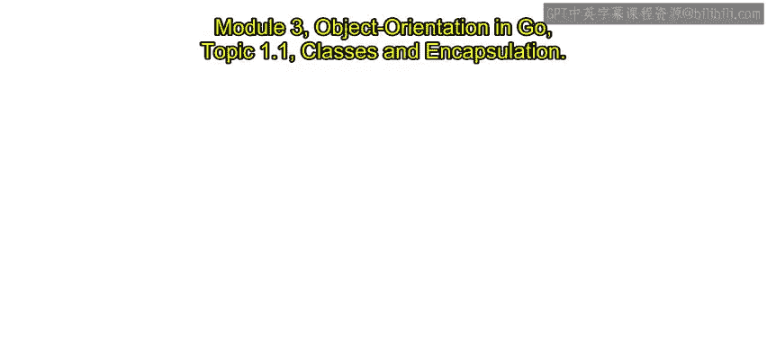
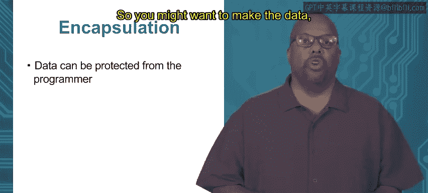

# 044：类与封装 🧱

在本节中，我们将学习面向对象编程中的两个核心概念：**类**与**封装**。我们将探讨它们在传统编程语言中的定义，并了解Go语言如何以独特的方式实现这些概念。

---

## 什么是类？

类属于面向对象编程范式的一部分。本课程面向中级学习者，因此假设你已经具备一定的编程基础。你很可能已经理解什么是面向对象编程，但这里我们将重新定义，以确保我们有一致的理解。

一个常见的问题是：Go语言是否支持面向对象编程？答案是肯定的。Go语言虽然没有传统意义上的“类”，但它提供了等效的功能，支持大多数相同的特性。

那么，什么是传统意义上的类呢？在众多其他编程语言中，类本质上是一个**数据字段**和**函数**的集合，这些数据与函数共同承担一个明确定义的职责。数据字段和函数（在类中通常称为**方法**）被组合在一起。因此，类就是**数据**和**方法**的结合体。

例如，假设我们想要一个表示二维空间中某个点的`Point`类。那么，数据可能包括点的**x坐标**和**y坐标**。函数则可能包括多种操作，例如计算到原点的距离、返回点所在的象限、设置或获取x/y坐标值等。关键在于，这些数据和方法都与同一个概念——二维点——相关。

需要记住的是，类实际上是一个**模板**。类定义了数据字段，但并不包含具体的数据。这意味着，当你创建`Point`类时，你是在提供一个如何创建点的模板：它规定了点应包含哪些数据，以及应对这些数据执行哪些操作，但并未提供实际的数据值。

---

## 对象：类的实例

一个**对象**是类的一个**实例化**或**实例**。它包含实际的数据。

继续上面的例子，假设在我的几何程序中，我有一个三角形，它包含三个点坐标：(0,0)、(5,5)和(6,0)。这里，我想创建三个点**对象**。这些对象基于`Point`类模板创建，因此它们拥有模板所规定的x坐标和y坐标字段，并且这些字段被赋予了具体的数值。所以，点(0,0)的x和y值就是0和0，点(5,5)的值就是5和5，依此类推。

对于一个类，你可以创建许多个该类的对象，每个对象都实例化了该类，并用具体数据填充了数据字段。

---

## 什么是封装？

**封装**是另一个通常与面向对象编程相关联的概念。更广义地说，它与**抽象**的使用有关。在面向对象编程的语境下，封装背后的思想是：你可能希望**保护数据**，或者对使用你类的程序员**隐藏数据**。

这里“程序员”指的是**使用**你类的人，而不是定义类的人（你无法对定义者隐藏任何东西）。你可能希望数据只能通过类中提供的方法来访问，而不是允许程序员直接进入并修改数据。

例如，对于一个点，我们不希望程序员直接修改其x和y值，而是强制他们通过类中提供的方法来修改。为什么要这样做？主要原因是我们可能希望确保数据的**内部一致性**。程序员可能因为需要考虑很多事情而犯错，我们希望减轻他们维护数据一致性的负担。通过封装，我们（类的创建者）可以保证：只要程序员使用我们提供的方法来修改内部数据，数据就能保持一致性。这样，程序员就不必担心这一点，只需使用我们的方法即可。

封装意味着内部数据不能直接从外部访问（或至少部分不能），你建立了一堵墙——一个由访问数据的方法构成的**抽象屏障**。

---

## 封装示例

假设我们有一个点，我们想对它执行一个操作：使其到原点的距离**加倍**。也就是说，我们需要将其x和y坐标都乘以2。

以下是两种实现方式：

*   **选项一（使用封装方法）**：创建一个名为`doubleDistance`的方法，该方法精确地执行将x和y都加倍的操作。这是一种更安全的方式。
*   **选项二（直接访问）**：不创建特定方法，允许程序员直接访问x和y，让他们在需要时自己去加倍。

第二种方式的问题在于，如果程序员犯了一个小错误，比如只加倍了x而忘记了加倍y，或者加倍了x却将y乘以了三倍等等，那么对象内部的x和y值就会变得不一致。而如果你强制他们使用你编写并正确调试过的`doubleDistance`函数，他们就不可能犯这样的错误。

---

## 本节总结

在本节中，我们一起学习了面向对象编程的两个基础概念。我们明确了**类**是数据和方法的模板，而**对象**是类的具体实例。我们还探讨了**封装**的重要性，它通过限制对数据的直接访问、强制使用方法操作数据，来保证数据的内部一致性并降低使用者的出错风险。虽然Go语言没有传统的“类”，但它通过其他机制支持这些概念，我们将在后续课程中详细探讨。