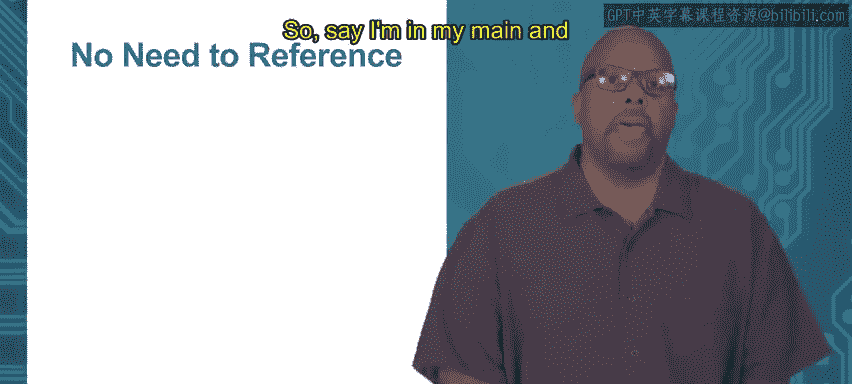

# 049：指针接收器的引用与解引用


在本节中，我们将学习Go语言中指针接收器的一个便利特性：编译器会自动处理引用和解引用操作，从而简化代码编写。我们将通过具体示例来理解这一机制，并了解相关的编程最佳实践。

---

上一节我们介绍了指针接收器的基本概念，本节中我们来看看使用指针接收器时，Go语言如何自动处理引用和解引用。

使用指针接收器时，无需在方法内部手动解引用指针。这意味着，在方法中可以直接通过接收器变量访问字段，而不需要使用`*`操作符。

以下是一个示例，其中`offsetX`方法使用指针接收器来修改`Point`类型的`X`坐标：

```go
func (p *Point) offsetX(v int) {
    p.x = p.x + v  // 直接使用 p.x，无需写成 (*p).x
}
```

在这个例子中，接收器`p`是一个`*Point`类型的指针。然而，在方法内部，我们直接使用`p.x`来访问和修改字段，而不是`(*p).x`。这是因为Go编译器会自动识别并处理解引用，这是一种方便的语法糖。

---



同样地，在调用方法时也无需手动取引用。即使方法定义要求指针接收器，我们也可以直接通过值类型的变量来调用它。

以下是在`main`函数中调用`offsetX`方法的示例：

```go
func main() {
    p := Point{3, 4}  // p 是值类型，不是指针
    p.offsetX(5)       // 直接调用，无需写成 (&p).offsetX(5)
}
```

这里，变量`p`是`Point`类型的值，而不是指针。然而，当我们调用`offsetX`方法时，可以直接使用`p.offsetX(5)`，而不需要写成`(&p).offsetX(5)`。Go编译器会自动处理取引用操作，使得代码更加简洁。

---

关于指针接收器的使用，有一个重要的编程实践建议。

以下是相关的指导原则：

*   对于一个特定的类型，其所有方法应统一使用指针接收器，或统一不使用指针接收器。
*   这种做法可以避免混淆，提高代码的可读性和一致性。
*   虽然语言本身允许混合使用，但遵循此约定是良好的编程习惯。

---

本节课中我们一起学习了Go语言指针接收器的便利特性：编译器会自动处理方法的引用和解引用操作，从而简化代码。我们还了解了统一使用指针或非指针接收器的最佳实践，这有助于保持代码的清晰和一致。