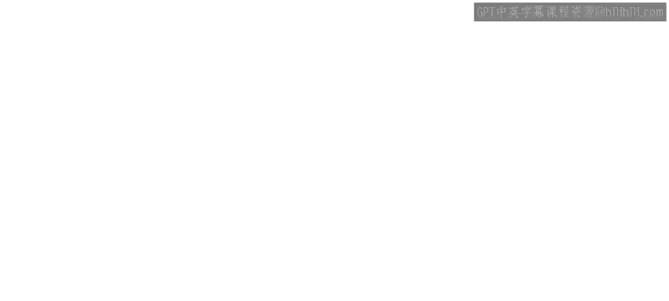
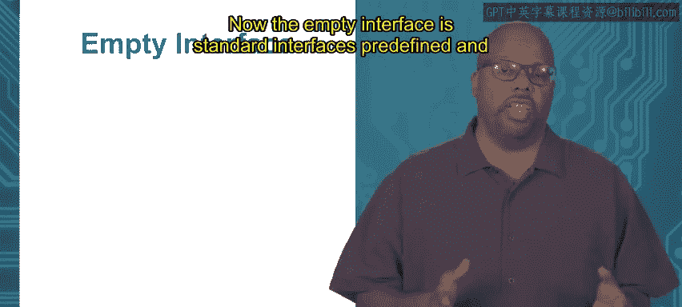

# 053：使用接口



## 概述
在本节课中，我们将学习Go语言中接口的具体使用方法。接口是Go语言实现抽象和多态的核心机制，它允许我们定义一组方法签名，任何实现了这些方法的类型都自动满足该接口。我们将通过一个具体的例子，理解如何利用接口编写能够处理多种类型的函数。

---

## 接口的作用与概念

上一节我们介绍了接口的基本概念。本节中，我们来看看接口在语言层面的具体用途。

接口用于表达不同类型之间的某种概念上的相似性。如果两个类型都满足同一个接口，那么它们必然在应用程序关心的某个方面是相似的。

一个常见且实用的接口使用场景是：当你需要编写一个函数，且该函数需要接受多种类型作为参数时。

通常，一个函数只能接受特定类型的参数。例如，一个接收`int`类型参数的函数，就只能传入`int`值。但如果你希望函数能处理`int`、`float`或`string`等多种类型，并根据不同类型执行不同操作，就可以使用接口来实现。

让我们通过一个抽象的例子来说明：
假设有一个函数 `foo`，它需要接收一个参数，这个参数可以是类型 `X` 或类型 `Y`。我们可以定义一个名为 `Z` 的接口，并让类型 `X` 和 `Y` 都满足接口 `Z`。然后，将 `foo` 函数的参数类型声明为接口 `Z`。这样，`foo` 函数就能接受任何满足接口 `Z` 的类型作为参数，包括 `X` 和 `Y`。

这种方式是使用接口的常见模式。本质上，接口在此处起到**泛化**的作用。它隐藏了不同类型之间的具体差异，只强调它们在某些重要方面的相似性。因此，你的函数只需接收接口类型，就意味着它能处理所有具备这种相似性的类型。

---

## 具体示例：庭院泳池问题

为了让概念更具体，我们虚构一个关于庭院泳池的问题。

假设我有一个后院，想在里面建一个泳池。在选择泳池形状时，我需要考虑两个限制条件：
1.  **面积限制**：泳池的总面积必须小于我院子的面积。
2.  **周长限制**：泳池的周长必须小于我能负担得起的围栏长度。

因此，我需要一个函数来判断某个特定形状的泳池是否满足这些条件。我会遍历一系列不同的泳池形状，并挑选出同时满足面积和周长限制的那一个。

我将编写一个名为 `fitInYard` 的函数，它返回一个布尔值。这个函数接收一个“形状”作为参数，比如三角形或矩形。如果该形状的面积和周长都足够小，函数就返回 `true`；否则返回 `false`。

关键点在于：`fitInYard` 函数需要接收一个“形状”作为参数，但我希望它能接收**任何**形状，无论是三角形、圆形、正方形还是矩形。不过，并非所有“形状”都有效。为了进行计算，这个形状必须能计算出面积和周长。因此，一个有效的形状必须拥有 `area` 和 `perimeter` 这两个方法。

所以，任何具有面积和周长的形状对我来说都是可接受的。

以下是实现步骤：

1.  **定义接口**：首先，我定义一个名为 `shape2D` 的接口，它规定了 `area` 和 `perimeter` 这两个方法，它们都返回 `float64` 类型。
    ```go
    type shape2D interface {
        area() float64
        perimeter() float64
    }
    ```

2.  **定义具体类型**：接着，我定义各种具体的类型，比如 `triangle` 和 `rectangle`。我不关心这些类型内部具体有哪些数据字段，只要它们拥有以自身为接收者类型的 `area` 和 `perimeter` 方法即可。
    ```go
    type triangle struct {
        // ... 三角形所需的字段
    }
    func (t triangle) area() float64 {
        // 计算三角形面积的逻辑
    }
    func (t triangle) perimeter() float64 {
        // 计算三角形周长的逻辑
    }

    type rectangle struct {
        // ... 矩形所需的字段
    }
    func (r rectangle) area() float64 {
        // 计算矩形面积的逻辑
    }
    func (r rectangle) perimeter() float64 {
        // 计算矩形周长的逻辑
    }
    ```
    只要 `triangle` 和 `rectangle` 类型实现了 `area` 和 `perimeter` 方法，它们就自动满足了 `shape2D` 接口。

3.  **实现通用函数**：现在，我可以实现 `fitInYard` 函数。它的参数 `s` 的类型就是接口类型 `shape2D`。
    ```go
    func fitInYard(s shape2D) bool {
        if s.area() < 100 && s.perimeter() < 100 {
            return true
        }
        return false
    }
    ```
    这意味着，`fitInYard` 函数可以接受任何满足 `shape2D` 接口的类型作为参数，比如 `rectangle` 或 `triangle`。函数内部通过调用接口方法 `s.area()` 和 `s.perimeter()` 来进行计算和判断。

---

## 空接口

Go语言预定义了一个特殊的接口，称为**空接口**。它不包含任何方法声明。

以下是空接口的定义方式：
```go
interface{}
```

由于空接口没有指定任何方法，因此**任何类型**都自动满足空接口。

空接口的用途是：当你希望一个函数参数能够接受**任意类型**，而不想施加任何类型限制时，就可以使用空接口作为参数类型。

例如，我们有一个 `printMe` 函数：
```go
func printMe(val interface{}) {
    fmt.Println(val)
}
```
参数 `val` 的类型是空接口 `interface{}`，这意味着 `val` 可以是任何类型。这个函数只是简单地打印传入的值，无论你传入的是 `int`、`float`、`string` 还是其他任何类型，它都能正常工作。

---



## 总结
本节课中，我们一起学习了Go语言接口的具体应用。我们了解到，接口的核心作用之一是定义类型之间的概念相似性，从而允许函数接收多种类型。通过“庭院泳池”的示例，我们实践了如何定义接口、让具体类型实现接口，并编写基于接口的通用函数。最后，我们还介绍了空接口的概念及其在需要完全泛型参数时的用途。掌握接口是编写灵活、可扩展Go程序的关键。