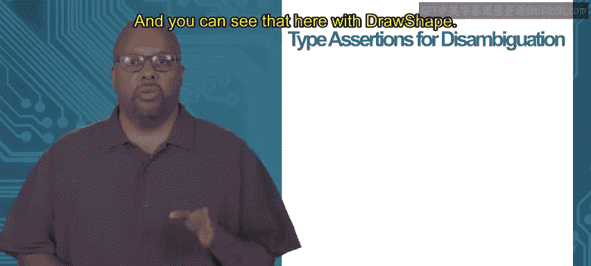

# 054：类型断言 🧩


在本节课中，我们将要学习Go语言中一个重要的概念：**类型断言**。接口的主要作用是隐藏类型之间的差异，但有时我们需要知道接口背后具体的类型是什么，这时就需要用到类型断言。

## 接口：隐藏差异，突出共性

上一节我们介绍了接口如何抽象不同类型。接口的核心在于**隐藏类型之间的差异**，同时**突出它们的共性**。

例如，在一个图形程序中，`Rectangle`（矩形）和`Triangle`（三角形）是不同的类型。但如果它们都实现了`Shape2D`接口（包含`Area()`和`Perimeter()`方法），那么我们就可以将它们都视为`Shape2D`类型来处理。

```go
// 接口允许我们以相同的方式处理具有相似方法的不同类型
func processShape(s Shape2D) {
    area := s.Area()
    perimeter := s.Perimeter()
    // 在这里，s的具体类型是矩形还是三角形并不重要
}
```

通过接口，我们统一调用了`Area()`和`Perimeter()`方法，而无需关心`s`背后具体是矩形还是三角形。接口有效地隐藏了具体类型的差异。

## 何时需要揭示差异？

然而，在某些场景下，我们**必须知道接口背后的具体类型**，以便进行不同的处理。这时，我们就需要“揭开”接口的面纱。

设想一个绘图函数`DrawShape`，它需要能绘制任何二维图形。

```go
func DrawShape(s Shape2D) {
    // 目标：根据s的具体类型（矩形、三角形等）调用不同的底层绘图API
}
```

虽然我们希望`DrawShape`能接收任何`Shape2D`，但底层的图形API可能提供了不同的具体函数，例如`DrawRect()`只接受`Rectangle`，`DrawTriangle()`只接受`Triangle`。

因此，在`DrawShape`函数内部，我们需要判断传入的`s`具体是哪种类型，然后调用对应的绘图函数。这就需要用到**类型断言**。

## 使用类型断言进行判断

类型断言用于**判断接口值背后的具体类型**，并获取该类型的值。

以下是使用类型断言实现`DrawShape`的一种方式：

```go
func DrawShape(s Shape2D) {
    // 尝试断言s是否为Rectangle类型
    rec, ok := s.(Rectangle)
    if ok {
        // 如果断言成功，ok为true，rec就是具体的Rectangle值
        DrawRect(rec)
        return
    }

    // 尝试断言s是否为Triangle类型
    tri, ok := s.(Triangle)
    if ok {
        DrawTriangle(tri)
        return
    }

    // 可以继续添加对其他类型（如Circle）的判断...
}
```

在上面的代码中：
*   `s.(Rectangle)` 是一个类型断言表达式。
*   如果接口值`s`背后确实是`Rectangle`类型，那么断言成功：
    *   `ok` 的值为 `true`。
    *   `rec` 被赋值为该`Rectangle`的具体值。
*   随后，我们调用`DrawRect(rec)`来绘制矩形。
*   如果断言失败（`s`不是`Rectangle`），则`ok`为`false`，`rec`为零值，我们继续尝试下一个类型断言。



## 更优雅的方式：类型开关（Type Switch）

如果需要判断的类型很多，使用多个`if`语句会显得冗长。Go语言提供了**类型开关**，这是一种更简洁的语法，专门用于基于接口值的具体类型进行多分支选择。

以下是使用类型开关重写的`DrawShape`函数：

```go
func DrawShape(s Shape2D) {
    switch sh := s.(type) {
    case Rectangle:
        // 在此分支中，sh的类型是Rectangle
        DrawRect(sh)
    case Triangle:
        // 在此分支中，sh的类型是Triangle
        DrawTriangle(sh)
    // 可以轻松地添加更多case来处理其他类型，如Circle
    default:
        // 可选的default分支，处理未匹配到的类型
        fmt.Println("未知形状")
    }
}
```

类型开关的语法 `s.(type)` 是固定的，它只能在`switch`语句中使用。
*   程序会根据接口值`s`背后的具体类型，跳转到对应的`case`分支。
*   在每个`case`分支中，变量`sh`已经被自动转换为该分支所声明的具体类型（如`Rectangle`或`Triangle`），我们可以直接使用。

类型开关让处理多种可能类型的代码变得更加清晰和易于维护。

## 总结

本节课中我们一起学习了：
1.  **接口的初衷**是隐藏类型差异，让我们能统一处理具有共同行为的不同类型。
2.  **现实需求**有时要求我们知道接口背后的具体类型，以便执行不同的操作（例如调用不同的特定函数）。
3.  **类型断言** (`value.(TypeName)`) 是揭示接口具体类型的基本工具，它返回一个值和一个表示是否成功的布尔值。
4.  **类型开关** (`switch v := i.(type) { ... }`) 是处理多种可能类型时的优雅方案，它简化了多分支类型判断的代码结构。

掌握类型断言和类型开关，你就能在享受接口带来的抽象和灵活性的同时，也能在必要时深入到具体类型进行精细化的控制。