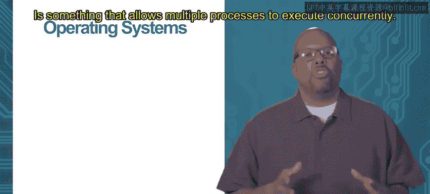
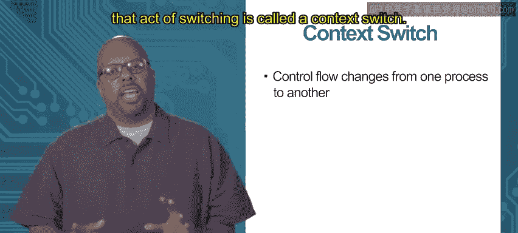
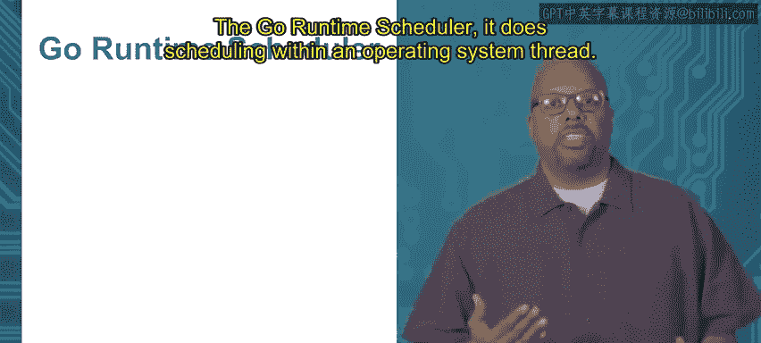

# 058：并发基础

在本模块中，我们将学习并发编程的基础概念。我们将从操作系统层面的进程和线程开始，逐步深入到Go语言特有的goroutine，理解它们如何实现并发执行。

## 2.1.1：进程 🖥️

上一节我们介绍了本模块的主题，本节中我们来看看并发的基础——进程。

进程本质上是一个正在运行的程序实例。每个进程都拥有一些独特的资源。

以下是每个进程独有的组成部分：
*   **内存空间**：每个进程拥有自己独立的虚拟内存地址空间。
*   **代码**：进程执行自己的程序代码。
*   **栈**：用于处理函数调用的内存区域。
*   **堆**：用于动态内存分配的内存区域。
*   **寄存器**：存储程序当前状态的小型高速存储器，例如：
    *   **程序计数器**：指向下一条要执行的指令。
    *   **数据寄存器**：存储计算中的临时数据。
    *   **栈指针**：指示当前栈的位置。

这些独特的资源集合被称为进程的**上下文**。操作系统的主要职责之一就是允许多个进程并发执行，同时确保它们互不干扰。例如，不同进程可能访问相同的虚拟地址（如地址1000），但操作系统必须确保它们访问的是各自物理内存中不同的位置。

此外，操作系统需要公平地为进程分配处理器时间。这个过程称为**调度**。在单核系统上，操作系统通过快速地在进程间切换（例如，每个进程运行20毫秒），给用户造成它们“同时”运行的假象。操作系统还需要管理其他资源，如内存和I/O设备，确保所有进程都能及时完成。

你可以通过系统工具查看正在运行的进程。在Windows上，可以通过任务管理器查看；在Linux或macOS上，可以在命令行中输入 `ps` 命令。

## 2.1.2：调度 ⏱️

上一节我们介绍了进程的概念，本节中我们来看看操作系统如何调度进程以实现并发。

操作系统的核心任务之一是**调度**，即决定在哪个时间点运行哪个进程。假设我们有三个进程需要运行。

以下是一个简化的调度过程图示（以时间片轮转算法为例）：
1.  进程1运行一个时间片。
2.  切换到进程2运行一个时间片。
3.  切换到进程3运行一个时间片。
4.  再次切换回进程1，如此循环。

这种让每个进程轮流获得相等时间片的算法称为**轮转调度**。然而，实际的调度算法可能更复杂，会考虑进程的优先级。例如，在汽车系统中，防抱死刹车进程的优先级远高于播放音乐的进程。当高优先级任务就绪时，操作系统会暂停低优先级任务。

当操作系统从一个进程切换到另一个进程时，会发生**上下文切换**。这个过程包括：
1.  保存当前运行进程的上下文（所有寄存器状态、内存映射信息等）到内存中。
2.  将下一个要运行进程的已保存上下文从内存加载到寄存器和系统中。
3.  开始执行下一个进程。

上下文切换由操作系统的内核代码执行。通常，操作系统会为每个进程设置一个计时器（如20毫秒）。当计时器中断触发时，内核接管，执行上下文切换，然后启动下一个进程。

## 2.1.3：线程与Goroutine 🧵

上一节我们介绍了进程调度，本节中我们来看看更轻量级的并发执行单元——线程，以及Go语言中的goroutine。

早期操作系统只有进程。进程间上下文切换开销较大，因为需要保存和恢复大量独享资源。为了提升效率，引入了**线程**，或称“轻量级进程”。

线程与进程的关键区别在于资源共享。一个进程可以包含多个线程。

以下是线程与进程上下文的对比：
*   **进程独有上下文**：虚拟内存空间、文件描述符等。
*   **线程独有上下文**：栈、程序计数器、数据寄存器等。
*   **线程共享上下文**：同一进程内的线程共享虚拟内存空间、文件描述符等。

由于线程间共享大量上下文，在同一进程内切换线程比在不同进程间切换要快得多。现代操作系统调度器通常直接调度线程，而非整个进程。

现在，我们来讨论Go语言。Go使用**goroutine**来实现并发。Goroutine本质上是Go语言层面的线程。

多个goroutine可以在单个操作系统线程中并发执行。从操作系统视角看，它只调度那个承载Go程序的“主线程”。而在Go程序内部，**Go运行时调度器**负责在这些goroutine之间进行切换，决定哪个goroutine在何时运行。

Go运行时使用**逻辑处理器**的概念。默认情况下，一个Go程序使用一个逻辑处理器，它映射到一个操作系统线程。所有goroutine在这个线程上并发运行。

然而，Go也支持利用多核进行真正的并行计算。程序员可以通过设置 `GOMAXPROCS` 环境变量或调用 `runtime.GOMAXPROCS(n)` 来指定使用的逻辑处理器数量。例如，在一个4核机器上，可以设置4个逻辑处理器。Go运行时调度器可以将goroutine映射到不同的逻辑处理器，每个逻辑处理器可以映射到不同的操作系统线程，最终由操作系统将这些线程调度到不同的物理核心上执行。

**总结**
本节课中我们一起学习了并发编程的基础。我们从操作系统层面的进程和线程开始，理解了上下文和调度的概念。最后，我们深入探讨了Go语言特有的goroutine，以及Go运行时调度器如何管理它们，并介绍了如何通过设置逻辑处理器来利用多核进行并行计算。这些概念是理解Go并发模型的核心基础。