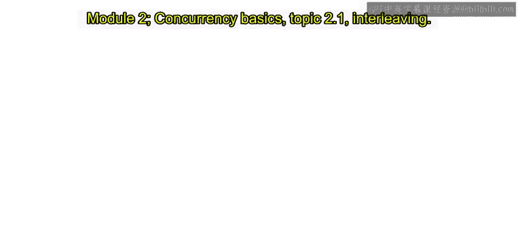
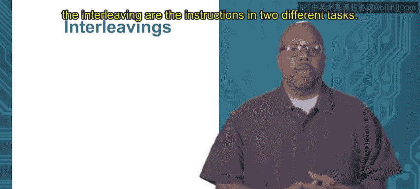
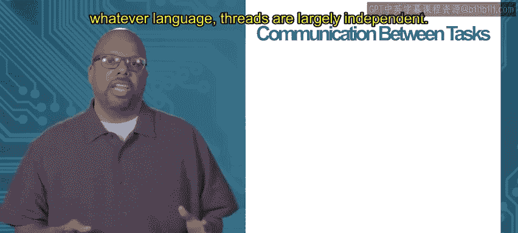

# 059：并发基础

## 概述
在本节课中，我们将要学习并发编程的基础概念，特别是**指令交错**和**竞态条件**。理解这些概念是编写正确、可靠的并发程序的关键。

---

## 2.1：指令交错 🧵

上一节我们介绍了并发的基本概念，本节中我们来看看为什么并发编程如此困难。核心原因在于，我们很难在脑海中构建程序在任意时刻的确切状态模型。

编写顺序代码时，如果程序在第10行崩溃，我们可以确定第9、8、7行等已经执行完毕。执行顺序是明确的，这有助于我们推断程序崩溃时的状态，从而进行调试。

然而，对于并发代码，要掌握机器的整体状态则困难得多。程序可能在任务1的第10行崩溃，但任务2、3、4、5可能处于不同的执行点。因此，机器的整体状态是**非确定性的**。即使每次都在任务1的同一行崩溃，任务2、3、4的进度也可能每次都不同，导致每次运行时的整体系统状态都不同。这使得我们难以在脑海中确定某个变量应该是什么值，因为不确定其他任务是否已经执行了某些操作。

为了展示这种复杂性，我们需要理解**指令交错**的概念。它指的是两个不同任务中指令的执行顺序。

每个任务内部的指令执行顺序是已知的。例如，任务1有三条指令，按1、2、3的顺序执行；任务2也有三条指令，按1、2、3的顺序执行。但是，**并发任务之间的执行顺序是未知的、非确定的**，每次运行都可能不同。

这意味着这些指令可以以多种方式交错执行。例如，可能先执行任务1的第一条指令，然后执行任务2的第一条指令，接着是任务1的第二条指令，以此类推。这只是一种可能的交错方式，但存在许多种可能性。

以下是几种可能的指令交错示例：

*   **交错方式A**：任务1指令1 -> 任务2指令1 -> 任务1指令2 -> 任务2指令2 -> 任务1指令3 -> 任务2指令3
*   **交错方式B**：任务1指令1 -> 任务1指令2 -> 任务1指令3 -> 任务2指令1 -> 任务2指令2 -> 任务2指令3

每次运行程序时，都可能得到不同的交错顺序。这使得程序员在思考系统正确性时，必须考虑所有这些可能的交错情况。虽然有一些技术可以最小化这种影响，但推理系统行为时仍需考虑多种不同的交错。

需要指出的另一点是，交错问题甚至更加复杂，因为交错并非发生在Go源代码的层面，而是发生在**机器代码指令**的层面。

例如，Go代码中的一条简单指令 `a = b + c`，在机器代码层面可能对应着多条指令：从内存加载`b`、加载`c`、将它们相加、然后将结果存储到`a`。交错可能发生在这四条机器指令之间。

这意味着，我们甚至不能保证任务1中的第一条指令（在源代码层面）会在任务2的第一条指令开始之前完全执行完毕。任务1可能只执行了其第一条指令对应的前两条机器指令，然后就被切换到任务2。因此，交错甚至发生在这些源代码指令的内部，这使得掌握所有可能性变得更加困难。

---

## 2.2：竞态条件 🏁

上一节我们介绍了指令交错带来的复杂性，本节中我们来看看由此引发的一个具体问题：**竞态条件**。

竞态条件是由于需要考虑所有可能的指令交错而产生的问题。从技术上讲，竞态条件通常被定义为：**程序的运行结果依赖于非确定的指令交错**。

请记住，指令交错是非确定的，它由操作系统和Go运行时决定，每次运行都可能改变。因此，如果程序的结果依赖于这种非确定的交错，那么程序本身就是非确定的。对于一个程序，给定一组输入，我们通常期望它总是产生相同的输出，这就是确定性。如果程序有时产生一个结果，有时产生另一个结果，这几乎总是一个错误，是我们不希望看到的。

由于指令交错是非确定的，我们必须确保程序的**结果不依赖于这些交错**。如果依赖，就产生了竞态条件。

这里有一个简单的示例：

*   **任务1**：
    1.  `x = 1`
    2.  `x = x + 1`
*   **任务2**：
    1.  `print(x)`

考虑两种不同的交错：

1.  **交错顺序A**：`x = 1` -> `print(x)` -> `x = x + 1`。此时打印出的 `x` 为 **1**。
2.  **交错顺序B**：`x = 1` -> `x = x + 1` -> `print(x)`。此时打印出的 `x` 为 **2**。

这就是一个竞态条件。程序的输出（打印1还是2）依赖于非确定的指令交错，导致输出是非确定的，这基本上意味着程序是有问题的。因此，我们需要避免竞态条件。

竞态条件源于**任务（或Go例程）之间的通信**。在上述例子中，两个任务通过共享变量 `x` 进行通信：任务1向 `x` 写入数据（赋值），任务2从 `x` 读取数据（打印）。如果两个任务之间没有通信，它们的执行顺序完全独立，那么就不会产生竞态条件，因为交错顺序不会影响各自的结果。

然而，当任务之间存在某种通信时，哪个任务先写入共享变量、哪个任务后读取共享变量就变得至关重要。因此，通信是竞态条件的根源。

在并发编程中，不同任务之间的通信非常普遍。线程（或在Go中称为goroutine）在很大程度上是独立的，这正是我们将任务拆分为不同线程的原因——我们认为它们可以并发执行，而不必关心谁先谁后。

但它们**并非完全独立**。如果多个线程属于同一个进程，它们会共享信息（如虚拟地址空间），因此线程之间通常存在某种程度的信息共享，这种共享就是通信。

以下是两个需要通信的并发应用示例：

**1. Web服务器**
Web服务器是一个典型的多线程应用。服务器为每个连接的客户端创建一个线程来处理请求。这些线程大部分是独立的（处理不同客户端的请求），但它们会共享数据，例如：
*   多个客户端可能请求同一个网页。
*   客户端可能向服务器提交数据（如表单），从而修改服务器状态（如网页访问计数器）。一个客户端写入（增加计数器），后续的客户端需要读取更新后的值。这就构成了线程间的通信。

**2. 图像处理**
图像处理任务通常是“令人尴尬的并行”任务。例如，对一个百万像素的图片进行模糊处理，可以将像素分块，由不同的线程并行处理每个块。
*   **核心公式/操作**：模糊处理通常涉及对每个像素及其周围像素值进行加权平均。
*   然而，处理一个像素的线程可能需要访问其邻居像素的值，而这些邻居像素可能正由其他线程处理。因此，线程之间需要共享边界像素的信息，这就产生了通信。

如果线程之间通信过于频繁，可能就不应该将它们拆分为独立的线程。但如果它们大部分时间独立，只是偶尔需要通信，那么使用多个goroutine就非常合理，因为它们大部分时间可以并发执行。

关键在于，如果通信处理不当，就可能成为竞态条件的源头。不同的指令交错可能导致不同的结果，这正是并发编程具有挑战性的部分原因。

---

## 总结
本节课中我们一起学习了并发编程的两个核心基础概念：
1.  **指令交错**：并发任务中指令的执行顺序是非确定的，可以多种方式交织，这增加了理解和推理程序状态的难度。
2.  **竞态条件**：当程序的正确性依赖于非确定的指令交错时，就会发生竞态条件，导致程序产生非确定性的、通常是错误的结果。竞态条件源于并发任务之间通过共享数据进行的通信。

理解这些概念是后续学习如何使用Go语言提供的机制（如通道和互斥锁）来安全地管理并发和避免竞态条件的基础。