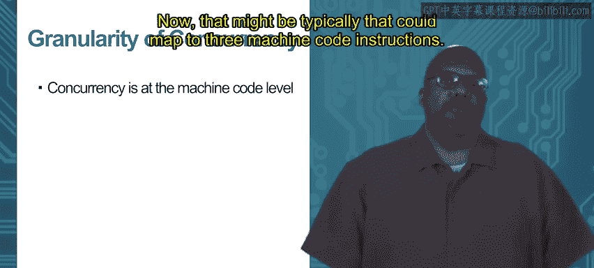

# 064：线程与Go

## 概述
在本节课中，我们将要学习Go语言中并发编程的一个重要概念：**互斥**。我们将探讨当多个Go协程共享变量时可能遇到的问题，并学习如何使用互斥锁来确保数据访问的安全性。

---

## 4.2.1：互斥 🛡️

上一节我们介绍了通过通道在Go协程间传递数据。本节中我们来看看共享变量。

在Go协程之间共享变量可能导致问题。两个Go协程向同一个共享变量写入数据时，可能会相互干扰。例如，一个协程尝试写入一个数字，另一个协程尝试写入另一个数字，这可能导致数据状态不一致。稍后我们将给出一个更具体的例子。

如果一个线程程序能够与其他Go协程并发执行，且不会以不当方式干扰其他Go协程，那么这个程序就被称为**并发安全**的。这意味着，当一个协程运行时，它不会以破坏其他协程的方式修改它们的变量。

具体来说，一个Go协程可能会干扰另一个Go协程的执行。例如，一个Go协程正在使用变量X，而另一个Go协程在第一个协程使用期间写入该变量X。第二个协程可能本意并非让第一个协程写入该变量。因此，第一个Go协程可能会干扰其他Go协程。

如果一个Go函数不会发生这种不安全的干扰，那么它就是**并发安全**的。

### 共享变量的问题示例
以下是变量共享的一个示例。这个程序的功能是递增一个变量I。

变量I初始化为0。在main函数中，我们创建两个线程（Go协程），每个线程都将I递增一次。因此，当它们执行完毕后，I应该等于2。

以下是代码结构：
*   在顶部声明全局变量I和一个等待组。
*   `increment`函数执行`i = i + 1`，然后调用`wg.Done()`。
*   `main`函数中，调用`wg.Add(2)`，然后启动两个执行`increment`的Go协程，接着调用`wg.Wait()`等待它们完成，最后打印I。

我们期望打印出2，因为I从0开始，被递增了两次。但这并不总是发生。

### 问题根源：指令交错
初看之下，似乎没有问题，因为不同的执行顺序看起来都是合理的。但问题在于，并发发生在**机器代码**级别，而非源代码级别。

源代码中的一条指令（如`i = i + 1`）通常对应多条机器指令。例如：
1.  **读取I**：从内存中将I的值读入寄存器。
2.  **递增**：将寄存器中的值加1。
3.  **写入I**：将寄存器中的新值写回内存。

并发交错实际上发生在这些更细粒度的机器指令之间，而不是完整的Go源代码指令之间。程序员通常在源代码层面思考，这可能导致他们忽略潜在的并发问题。

### 一个出错的交错示例
考虑以下机器指令级别的交错执行顺序：

| 步骤 | 协程1 (T1) | 协程2 (T2) | I的值 |
| :--- | :--- | :--- | :--- |
| 1 | **读取 I** (得到 0) | | 0 |
| 2 | | **读取 I** (得到 0) | 0 |
| 3 | 递增 (0 -> 1) | | 0 |
| 4 | **写入 I** (写入 1) | | **1** |
| 5 | | 递增 (0 -> 1) | 1 |
| 6 | | **写入 I** (写入 1) | **1** |

在这个交错中：
1.  T1和T2都**读取**了I的初始值0。
2.  T1将0递增为1并**写入**内存，此时I变为1。
3.  T2将其读取的旧值0递增为1并**写入**内存，此时I被覆盖为1。

最终结果是I等于1，而不是预期的2。问题的关键在于，当两个Go协程共享并写入同一个变量I时，在机器代码级别的细粒度交错可能引入程序员未曾预料到的复杂性。

---

## 4.2.2：互斥锁 🧱

上一节我们看到了共享数据可能导致的并发问题。本节中我们来看看如何正确地在Go协程间共享数据。

一个经验法则是：**不要让两个Go协程同时写入一个共享变量**，因为这可能导致我们刚刚看到的问题。

我们需要限制这些Go协程可能的执行交错。如果有两个Go协程都要写入共享变量I，我们必须以某种方式限制它们的交错，确保它们不能同时写入。

对共享变量的访问不能交错。程序员必须确保它们不能同时进行写入操作。这被称为**互斥**。程序员需要声明一些代码段，这些代码段在不同的Go协程中不能并发执行，即它们不能被交错。

例如，两个Go协程都执行`i = i + 1`，我们必须确保一个协程中写入I的代码段与另一个协程中写入I的代码段是**互斥**的。

Go语言在`sync`包中提供了实现互斥的构造。我们将使用**Mutex**（互斥锁）对象。Mutex确保互斥访问。

### 互斥锁的概念：信号量
Mutex通常使用一种称为**二元信号量**的机制。可以将其想象为邮箱上的标志旗。
*   当标志旗**升起**时，表示共享变量正在被使用。这意味着某个Go协程正在写入共享变量I。
*   当标志旗**降下**时，表示共享变量可用。

规则如下：
*   如果一个Go协程想使用共享变量，它必须首先检查标志旗。
*   如果标志旗降下，它可以升起标志旗（声明使用权），然后使用共享变量，使用完毕后降下标志旗。
*   如果标志旗已经升起，它必须等待，直到标志旗被降下。

所有Go协程都必须遵守这个协议，该机制才能正常工作。

---

## 4.2.3：Mutex 方法 🔐

上一节我们介绍了互斥锁和信号量的概念。本节中我们来看看Go语言中Mutex的具体方法。

在Mutex内部，升起和降下标志旗的操作通过一组方法实现：`Lock`和`Unlock`。
*   `Lock`：相当于升起标志旗。
*   `Unlock`：相当于降下标志旗。

Go协程在即将使用共享数据前应调用`Lock`。其工作原理如下：
*   如果当前没有协程持有锁（即标志旗降下），那么第一个调用`Lock`的协程将成功获得锁。它会将内部标志从0设为1，然后继续执行其互斥区内的代码，访问共享变量。此时`Lock`调用**不会阻塞**。
*   如果在此过程中，另一个Go协程也调用了`Lock`，而此时标志旗已经升起，那么这个`Lock`调用将**阻塞**。第二个协程会被阻止继续执行并访问共享数据。
*   先调用`Lock`的协程获得锁，其他协程必须等待。这个机制可以扩展到任意数量的Go协程。

当Go协程完成对共享数据的使用后，它必须调用`Unlock`。这会降下标志旗。随后，在等待队列中阻塞的某个Go协程（通常是第一个调用`Lock`的）将被允许继续执行，获得锁并访问共享变量。

只要每个Go协程在其互斥代码段的开始处调用`Lock`，在结束处调用`Unlock`，就能确保同一时间只有一个Go协程位于该互斥区域内（即写入共享变量的代码段）。

### 修复递增问题的示例
以下是如何使用Mutex修复之前递增问题的示例。

我们对`increment`函数做了几处修改：
1.  创建了一个Mutex，命名为`mut`。
2.  在`i = i + 1`操作之前调用`mut.Lock()`。
3.  在`i = i + 1`操作之后调用`mut.Unlock()`。

现在，位于`Lock`和`Unlock`之间的区域与任何其他`Lock`/`Unlock`区域是互斥的。在这个例子中，两个Go协程都执行`increment`函数，因此它们都有`Lock`和`Unlock`调用。这样就能确保同一时间只有一个Go协程在执行`i = i + 1`。当一个协程获得锁并进入该区域时，另一个协程会在其`Lock`调用处被阻塞，直到第一个协程调用`Unlock`释放锁。

## 总结
本节课中我们一起学习了Go语言并发编程中的互斥概念。我们首先看到了多个Go协程并发写入共享变量时，由于机器指令级别的交错执行可能导致的数据不一致问题。接着，我们引入了**互斥锁**作为解决方案，它通过`Lock`和`Unlock`方法确保同一时间只有一个协程能访问临界区（共享数据）。正确使用互斥锁是编写并发安全Go程序的关键之一。