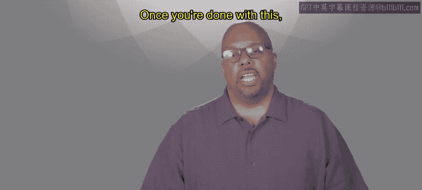
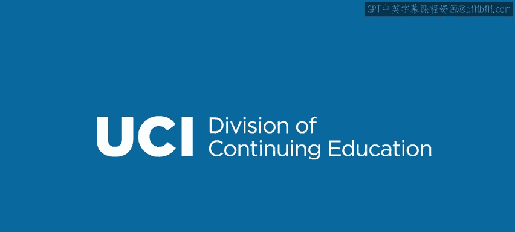

# 加州大学尔湾分校《Go语言编程｜Programming with Google Go》中英字幕 - P11：10_模块2概述.zh_en - GPT中英字幕课程资源 - BV1ggpcevEJf

🎼。

🎼う。🎼Yeah。Welcome to second module。 We're going to start talking a little bit more detail about the go language。

 We'll talk about data types and go， the basic data types。 That's what this module is really about。

 We'll go over data types you've seen in other languages， integers， floats， Boolean strings。

 variations on those so you can change the length of the integer， length of the float。

 things like this。So we'll talk about those data types we'll talk specifically about how to declare them。

 how to create them。And what functions are available for them。

 So what functions can you apply to integers， what functions can you apply to strings and booles and floats？

And once you're done with this， you'll be able to use basic data types inside your go code。

