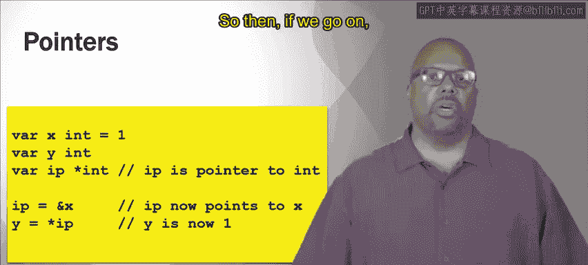

# 加州大学尔湾分校《Go语言编程｜Programming with Google Go》中英字幕 - P12：11_模块2 1 1 指针.zh_en - GPT中英字幕课程资源 - BV1ggpcevEJf

🎼。

🎼う。🎼Yeah。So in this module we're going to talk about basic data types and we're going to start with pointers。

 which maybe is an unusual place to start the discussion of data types。

 but that's where we're starting because people who are taking these courses generally already know something about programming so let's go straight to these pointers and talk about them。

APoer is an address to some data in memory。 so I was saying every variable is located in memory somewhere is some data sting in memory somewhere。

 also functions and so on。 they're all in memory somewhere。

 A pointer is the address of that in memory。Typically a virtual address。

 but that doesn't matter to us too much right now。So with pointers， there are two operators。

 two main operators that are associated with pointers， the ampersant operator right there。

 that returns the address of the variable or the function。

 whatever the name is referring to and the star operator which is dereferencing does the opposite the ampersant。

 it returns the data at the address， so the ampersand operator。

If you put that in front of a variable， the name of a variable。

 that will return you the address of that variable。

The star operator goes the other way if you put that in front of a pointer。To some address。

 put that in front of an address， it will return you the data at that address。

So it's important to understand this ampersand operator and the star operator are opposites of one another。

So give you an example。Take a look at this code， little piece of code we define our variable x is an integer。

 it's equal to 1。And then why it's an integer and it's not initialized。

 so that would mean it would be by default， initialized as zero。Then a R IP。

 so IP is is not declared to be an int， it's a star int right so that means IP is actually a pointer since it's a star operate in front of the int。

 IP is declared to be a pointer to an integer， so IP is the pointer。

 but it is not an actual integer is a point to an integer。So then if we go on， IP equals 0% x。

X is actually an integer， right， integer whose value is one。

 So there is a number one sitting in memory somewhere， and x is a reference to it， the name of that。

Amperscent X is the address in memory where I can find that value1。

So IP is now equal to that address， so whatever the address of I of that one is rather of x。

 whatever that address is， IP is point to that address， it is the address。Now then in the next line。

 I say y equals star IP。So remember that in this little example。

 I is actually a pointer and the data at that address that I is pointing to is a value1。

 Now star I star does dereencing star says star returns the value， the data at that address。

 So y is now equal to the data at the address that I is pointing to。

 Now if you remember from the line 4 I is pointing to what x is pointing to right So I is pointing to the value 1。

 that data in memory， So y is if y is equal to star I y is equal to1。 So this now sets y equal to1。

It's just a little example here just trying to show how the amet and the star operators work opposite to one another。

So these are pointers and pointers exist。 These pointers are basically。If you know， C。

 same type of implementation。Now there's another function called new。

 it's another way to create a variable。And new returns instead of returning a variable。

 it returns a pointer to the variable。 So the new function creates a variable and it returns a pointer to that variable。

 So this is unlike if we were just declaring a variable， right， that also creates a variable。

 but new explicitly returns a pointer to a variable。

 So the variable is initialized to0 by default with new。 So for instance， here。😊。

That' if I say pointer equals new int and then star pointer equals 3。

 right pointer equals new int that returns new int returns me a pointer to an integer。

And that PTR is equal to that pointer， then I can set the value of that integer by referring to star point。

 star PTR right because star PTR is the value that PTR is pointing to if I say star PTR equals3。

 then the value 3 is placed at the address specified by PTR。

