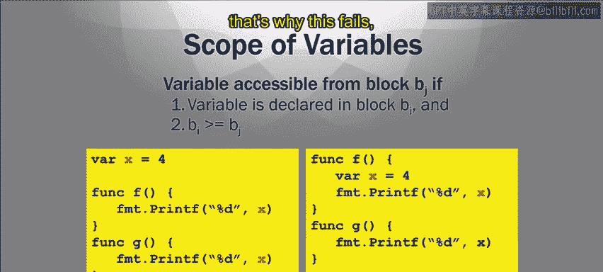
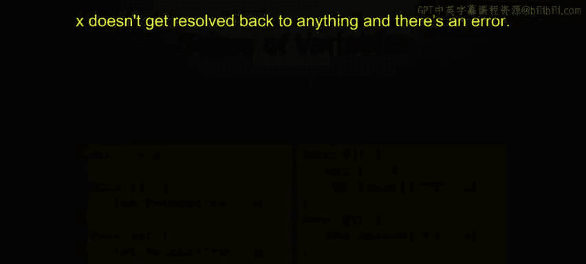

# 加州大学尔湾分校《Go语言编程｜Programming with Google Go》中英字幕 - P13：12_模块2 1 2 变量作用域.zh_en - GPT中英字幕课程资源 - BV1ggpcevEJf

🎼。

🎼う。🎼Yeah。So we're going to talk about what the scope of a variable is。

Roughly the scope of a variable is the places in the code where a variable can be accessed。 Okay。

 so variable scope defines how a variable reference is resolved in the code。

 So if you reference a variable X， how does the does the program figure out where which variable X you're talking about Okay。

 that's basically what variable scope is。So。😊，And these little examples just to show you an example of scope。

 If we look at the first block of code， we've got this variable X that I'm highlighting in red and this variable x is defined outside of these two functions。

 I've got these two functions defined function f and function G but outside of both of them。

 I've defined this variable X So R x equals whatever is one。

 then I define my function F and function G。 Now if you look inside function f and G。

 they're very simple。 All they're doing is they're printing printing X。 they're both printing X。

 this's all they're doing。😊，So。Inside function F and inside function G。

 when you call these functions， they've got to figure out where to find the value for X。 Now。

 in this case， they're going find the value that I've defined outside。 So where I say x equals1。

 they're going when they print out X， they're going to print out one for x because because the scoping rules allow that So basically because it's defined outside of either one of these functions。

 both of them will have access to it。 we'll define the formal rules for that in a few slides。

Now the next block of code， you get a problem。Because the next block of code again。

 you've got function F and function G。 but this time variable x is defined inside function F。

 but not inside function G， It's only inside F。So function F will print print properly because it'll look at x and resolve it since it's defined locally right there inside its function will'll say oh。

 x is equal to1， it'll be happy， But function G will have no reference to X。

 It won't be able to see that and it'll throw an error when you try to run that because it won't know what X is。

So this is the type of problem that needs to be resolved。

 You don't want to run into this type of problem。 You want to be able to know where your variables get resolved to so that you don't have problems like this。

 So we're going to talk about variable scoping right now。 So how does a compiler figure out。

You know where a variable reference should be resolved to， you know， which x are you talking about。

 Is it this x or is it that x。So and go。Variable scoping is done using blocks now block。

It's a sequence of declarations and statements within matching curly brackets。

 so those curly brackets right there， you have an open curly bracket， closed curly bracket。

 everything in between is called a block。So that's how you explicitly define blocks and you notice how these blocks can be hierarchical right。

 you can have curly brackets and then within that you can have some other curly brackets and within that you can have some more so you can have this hierarchy of blocks。

And these are explicit blocks when you put the curly brackets in your own code。

 those are explicit blocks that you as a programmer included function definitions notice are defined by curly brackets。

 right we haven't gotten to functions， we'll talk about it more later。

 but every function definition you define the function， you give the name of the function。

 and then you have open curly brackets， closed curly brackets， every function。

 you've got curly brackets。So there's a hierarchy of these curly brackets and a hierarchy of these blocks。

Now， also there are implicit blocks inside this hierarchy。

There are blocks that are implicitly defined without the curly brackets。

 So just to list those blocks。 First is the universe block， right， That's all go source code。

 That is the biggest block， the universe block。 There's a package block。 So every package。

 even though you don't put curly brackets around every package at all the source code in a particular package that's all within one block。

 which is inside the universe block。😊，Then there's a file block right file block every old source code in a single file is within the file block and remember that package can be composed of many files right so there can be one package block that has many file block if you've got a lot of files inside the package。

😊，Now， then other implicit blocks include the if statement，4 statement and switch statements。

All these have curly brackets that define their own blocks。

 also the clauses inside a switch are select。 we'll get to these in more detail later。

 but these are all the ones I'm listed here are these implicit blocks that you don't have to put explicit curly brackets for well。

So you can。 so for instance an inter statement you can use if Curly B is too。

 but like the universeverse block， the package block file block。

 these are all implicit blocks and there's a hierarchy of these。 so this's my point。

There's these hierarchy of these blocks and each block can have its own environment of variables associated with it。

Okay， so lexical scoping。This defines how variable references are resolved。

So go is aically scoped language using blocks。So when we talk about lexocoing we've got to talk about this relationship of being defined one block being defined inside another block。

 so I'm using this terminology here， I'm saying B is greater than equal to Bj if Bj B is a block if Bj is defined inside B。

 then then B is greater than equal to Bj so I would say that Bj。

 if it's defined inside B Bj would be you refer to it as an inner scope where the outer scope that includes Bj is B so just as an example of this。

It's a transit relationship， but just as an example of this， look at the code。

 we got we've seen this code before， got variable X。We initialize that to one。

Then you got function F and function G。Now， if we look the blocks inside here。

First you've got this is all in one file right so all of this is inside the file block and I'm calling that B1 so B1 is my file block and everything is inside the file block。

 but in addition to the file block， I'm defining two functions F and G and each one of these function blocks functions gets its own function block so B2 is a function block F for F and B3 is a function block for G。

So if I were to look at how these blocks are related。😡，B2 and B3 are both defined inside B1。

 So I say B1 is greater than B2 and B1 is greater than B3 by my definition。

 because B2 and B3 are defined inside B1， but notice that there's no relationship between B2 and B3 because they're not defined within each other。

So we need to know this because。The scoping， the scoping rules， when you're resolving a variable。

 you go to the greater， including scope。 So， for instance， if inside B1。

 the function F right inside that block， you're referring to variable X。

 Then it's going to look for that variable X inside B2 itself inside its local block。

 but then it looks for the next bigger block that is defined inside。

 So it starts in B2 looks for the block， if it looks for variable X。 if it doesn't see it there。

 which is not defined there in this case， then it says， okay， what is the next bigger block。

 then I'm defined inside， it would get B1， and would look inside B1 and say。

 there is a definition of x here， And that's the definition of X that it would use。 Sam goes for B3。

 right if you look at the function G。😊，It uses variable X， it acts as variable X。

 first it looks inside its local block， B3， it doesn't see it。

 so it looks inside the next bigger block that's defined inside B1 and it sees it there。

So that's why this works， thats why this code will work。

 the x will be resolved properly to that x equals 1， that variable that we define inside B1。So。😊。

When you're talking about scope of variables， a variable is accessible from a block。BJ。

 if the variable is declared in some block B。And block BI is greater than equal to BJ。

 so it either the variable is either declared right there in BJ or it's declared in some outer block that's greater than BJ。

So that's why in the first block of code， first block the first code sequence。

 you can see where x is defined inside the file block， both of those functions。

 which are also inside the same file block， they can both properly access the x variable because their blocks。

 their function blocks are within the file block， but in the next block of code。

 sequence of code the x is defined inside the function block of F but it's not inside the function block of G。

 so when G tries to reference x x， the variable x， it doesn't see it in its local block。

 it also doesn't see it in its file block because now the definition is inside the function block for function F so that's why this this fails。

 x doesn't get resolved back to anything and there's an error。

