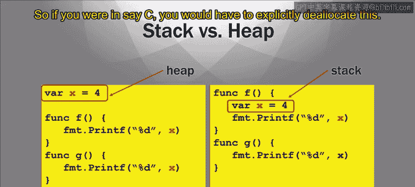

# 加州大学尔湾分校《Go语言编程｜Programming with Google Go》中英字幕 - P14：13_模块2 1 3 内存释放.zh_en - GPT中英字幕课程资源 - BV1ggpcevEJf

🎼。

🎼う。🎼Yeah。So we've been talking about variables and how they're referenced variables。

 they're all referring to some data that's somewhere in memory。

So the variables eventually have to be delocated in a memory， so allocated and delocd。

 So what I mean is once you declare a variable and your code is running。

 space needs to be allocated somewhere in memory for that variable， if it's an integer。

 there has to be some allocated space dedicated to holding that integer。And at some point。

 that space has to be delocated when you're done using it so when you're done using your variable x。

 you want to be able to say， oh， that space is now free and it can be used for other purposes。

So that's delocation when you make memory space available for other purposes。

You have to do this in a timely fashion， so otherwise you eventually will run out of memory in your machine。

 so for an example， if you look at this piece of code， it declares a variable x of R x equals 1。

So the process when it runs， it has to allocate a memory location just for X to hold it。 Now。

 say you call in your program you call this function F 100 times right then it's going to allocate 100 different spaces for this variable X because the x goes away after the function complete。

 the X goes away it's going allocate it again it should go away， you want it to go away。

 but every time if you don't delocate it， you'll execute every time you execute this function F。

 you'll get a new variable x allocated and so you'll have all these spaces allocated in memory and really you don't need them anymore right I mean。

 once a particular function call and you no longer need the space for x for the X that it was using So at some point you have to deallocate this memory。

 you have to say look， this memory is now free。Because otherwise。

 you would eventually use up all your space and you might think， well。

 you know how am I going to use it my space， I've got you know X number a gig on in my memory system。

 You can eat that up very quickly right believe it， this is called a memory leak。

 This is a thing that happens in C a lot You can eat up all your space very quickly So you have to decate this space in a timely fashion。

😊，Now， in order to talk about how space is delocated。

 we got to talk a little bit about where the space is stored in memory。So memory is a big thing。

 but there are two big hunks of memory that are relevant to us right now， the stack and the heap。

Now the stack is an area of memory that is dedicated to function calls。

 primarily dedicated to function calls。 So one of the things stored in the stack are the local variables for a function。

 So every time you call a function， there can be variables that you define in that function。

 and generally they go into the stack。 They are allocated in the stack area of the memory。

And they're delocated， if they're allocated in the stack。

 they are delocd automatically when the function completes。Now this this is different。

 a little bit different for go。 this is traditional。

 What I'm talking about now is how it works in regular languages。

 go changes this a little bit but normally the stack is the area of these local variables where when the function is done。

 the variables are deated automatically。Now the heap， on the other hand。

 is a persistent region of memory where when you allocate something on the heap。

 it doesn't go away just because the function that allocated it is complete that heap memory you have to explicitly deallocate it somehow in another language。

 so if you were in say C， you would have to explicitly delocate this。

Now， go does a tweak on this， but it is still important to understand that memory variables can be in the stack。

 which will， for the most part automatically go away when the variable it will be deated automatically when the function is done or in the heap where it's persistent。

Now， if you're in another language， like C。Then you have to manually delocate things on the heap on the stuff that's on the stack。

 You don't have to manually delocate it。 it'll go away when the function completes。

 but the stuff that's on the heap， you have to manually explicitly delocate it。

 So like say you are working in C。 If you want to allocate in memory on the heap。

 you would call a function called malloc and say I say x equals malloc 32 It'll allocate 32 bys of memory and X will be appointed to that。

 And then later when that's how you allocate it later when I want to free it。

 I can say free X and it will free that space deallocating it。😊，So errorprome but fast。

 So what I mean by that is。It's errorprone because it's easy to make a mistake in your allocationation and delocation。

 delocating it the wrong time or forgetting to delocate it stuff like this。

 it can cause you headaches ands error so this error pro in that sense， but it's fast。

 right the implementation is very fast。 You don't have to see what happens with deallocation like in an interpreter language is that the interpreter does it and that can take time。

😡，SoBut in a compiled language like a C， you would have to do that manually。

