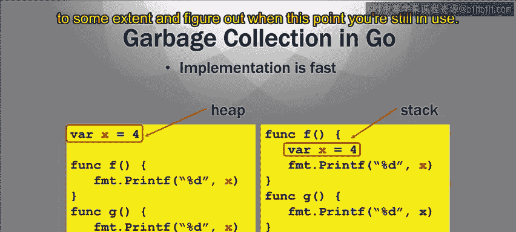

# Go语言编程：模块2.1.4：垃圾回收 🗑️


在本节课中，我们将要学习Go语言中的一个重要特性：**垃圾回收**。我们将探讨为什么内存释放是一个难题，以及Go语言如何通过内置的垃圾回收机制优雅地解决这个问题。

## 内存释放的难题

上一节我们介绍了指针和内存地址。本节中我们来看看内存释放的挑战。

释放内存可能很困难，因为需要确定何时释放变量是合适的。原因在于，你只能在确定变量不再被使用时才能释放它。你不希望释放一个变量后，又需要用到它，因为那时它已经不存在了。有时很难判断变量何时在使用，何时不在使用。

以下是一个Go语言的例子，它在Go中是合法的，但在某些其他语言中则不合法：

```go
func f() *int {
    x := 5
    return &x // 返回x的地址
}

func main() {
    var p *int = f()
    // 此时，main函数持有一个指向f函数局部变量x的指针
}
```

在这个例子中，函数`f`声明了一个局部变量`x`。通常，当函数结束时，其局部变量应该被释放。但这里的情况不同，因为函数返回了一个指向`x`的指针。由于`main`函数现在持有这个指针，它可能仍会使用变量`x`。因此，你不能简单地在`f`函数结束时释放`x`。

这个例子说明了指针如何使得判断释放内存的时机变得复杂。

## 垃圾回收：自动化的解决方案

由于手动释放内存很复杂，人们采用的一种方法是使用**垃圾回收**。

垃圾回收本质上是一个自动化的工具，用于处理内存释放。这在解释型语言（如Java、Python）中很常见，由解释器（如Java虚拟机、Python解释器）来执行。

以下是垃圾回收的工作原理：
*   垃圾回收器会跟踪指针和引用。
*   它判断一个变量何时不再被使用。
*   一旦确定某个变量**绝对不再被使用**（即没有任何指针或引用指向它），垃圾回收器就会释放它。

垃圾回收对程序员来说非常方便。程序员无需担心何时释放内存、何时不释放。在其他语言（如C语言）中，手动管理内存是一个巨大的难题。

## Go语言的独特之处

但是，垃圾回收通常需要一个解释器。因此，像C++这样的编译型语言一般无法实现它。

Go语言在这方面与众不同，也更出色。Go是一种**编译型语言**，但它**内置了垃圾回收机制**。这是一个非常棒的独特功能。



因此，Go编译器可以在一定程度上跟踪这些指针，判断它们是否仍在使用。它基本上会跟踪指向特定对象的所有指针。一旦所有指针都消失了，它就知道该对象可以被释放了。我们不会深入探讨Go垃圾回收的具体实现，因为那很复杂，方法也很多。

## 垃圾回收的优势与权衡

Go语言的垃圾回收机制带来了两个好处：
1.  它会自动决定将数据分配在**堆**上还是**栈**上。作为程序员，你无需自己决定“我想把这个放在堆上”或“我想把这个放在栈上”。Go编译器在编译时会插入代码来判断，并相应地执行垃圾回收。
2.  如果数据在堆上，垃圾回收器会适当地进行回收。它会查看所有指针是否都已消失，并决定何时可以进行垃圾回收（释放内存）。这是一个非常有用的功能。

当然，也存在一个权衡。主动的垃圾回收确实会占用一些时间，因此会带来一定的性能损耗。但Go的实现非常高效，而且垃圾回收极其有用，将其纳入Go语言中可能是值得的。这就是Go语言做出的权衡：它稍微降低了一点速度，但带来了巨大的优势，因为它使编程变得容易得多，并且你无需像使用解释型语言那样依赖一个完整的解释器。

## 总结


本节课中我们一起学习了Go语言的垃圾回收机制。我们了解到手动内存管理的困难，以及Go如何通过内置的、高效的垃圾回收器来自动管理内存，从而极大地简化了程序员的工作。虽然这会带来微小的性能开销，但其带来的开发便利性和安全性使得这一特性成为Go语言的核心优势之一。