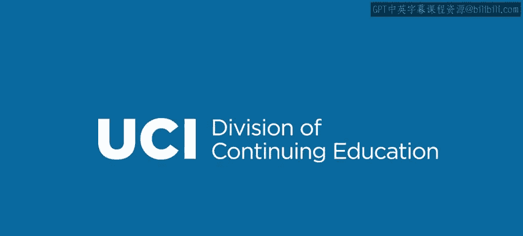

# Go语言编程：模块2.2.1：注释与整数打印 📝


在本节课中，我们将学习Go语言中的两个基础但至关重要的概念：代码注释和打印输出。同时，我们也会深入了解整数类型及其相关操作。掌握这些知识是编写清晰、可调试代码的第一步。

---

## 注释

上一节我们介绍了变量的基本概念，本节中我们来看看如何通过注释让代码更易于理解。注释是写给程序员看的说明文字，编译器会完全忽略它们。

Go语言的注释风格与C语言类似，主要分为两种：

以下是单行注释的写法：
*   使用双斜杠 `//`。从 `//` 开始，直到该行结束的所有内容都是注释。
*   例如：
    ```go
    // 这是一个完整的注释行
    var x int // 这是一个行内注释，只有“//”右侧的内容是注释
    ```

以下是多行注释（块注释）的写法：
*   使用 `/*` 开始，`*/` 结束。这两个符号之间的所有内容都是注释。
*   例如：
    ```go
    /* 这是一个
       多行注释块，
       可以跨越多行。 */
    ```

---

## 打印语句

为了查看程序运行的结果，我们需要使用打印语句。在Go语言中，这主要通过 `fmt` 包实现。

首先，你需要在程序顶部导入这个包：
```go
import "fmt"
```

最基本的打印函数是 `fmt.Printf`。它接收一个字符串作为参数并打印出来。

以下是打印的基本用法：
*   直接打印字符串：`fmt.Printf("Hello")`
*   使用 `+` 运算符连接字符串后打印：`fmt.Printf("Hello " + name)`

然而，更常用和强大的方式是使用**格式化字符串**。

---

## 格式化字符串

格式化字符串允许我们更灵活、美观地控制输出格式。其核心是在字符串中插入“转换字符”，然后用变量的值替换它们。

格式化字符串的通用格式是：
```go
fmt.Printf("格式化字符串", 参数1, 参数2, ...)
```
在“格式化字符串”中，使用 `%` 加一个字母作为占位符。例如，`%s` 表示此处将替换为一个字符串。

以下是一个具体示例：
```go
name := "Joe"
fmt.Printf("Hi %s", name) // 输出：Hi Joe
```
在这个例子中，`%s` 被变量 `name` 的值 “Joe” 所替换。

---

## 整数类型

现在，让我们把注意力转向整数。整数是编程中最基本的数据类型之一，用于表示没有小数部分的数字。

最通用的声明方式是 `var x int`。通常，我们只需这样声明，让编译器自动决定使用哪种具体长度的整数。

但Go语言也提供了不同位宽的整数类型，以满足对数值范围和内存占用的精确控制需求。

以下是不同位宽的整数类型：
*   **有符号整数**：`int8`, `int16`, `int32`, `int64`
*   **无符号整数**：`uint8`, `uint16`, `uint32`, `uint64`

**核心概念**：
*   **位宽**（如8, 16, 32, 64）决定了该类型在内存中占用多少比特（位），也决定了它能表示的数字范围。例如，一个 `uint8`（无符号8位整数）可以表示 **0 到 255** 之间的数字。
*   **有符号 vs 无符号**：有符号整数（`int`）可以表示负数、零和正数；无符号整数（`uint`）只能表示零和正数，但因为省去了符号位，在相同位宽下能表示的最大正数更大。

---

## 整数运算符

整数支持丰富的运算符，用于进行数学和逻辑运算。

以下是主要的整数运算符分类：
*   **算术运算符**：`+`（加）, `-`（减）, `*`（乘）, `/`（除）, `%`（取模/求余数）
*   **比较运算符**：`==`（等于）, `!=`（不等于）, `>`（大于）, `<`（小于）, `>=`（大于等于）, `<=`（小于等于）
*   **位运算符**：`&`（按位与）, `|`（按位或）, `^`（按位异或）, `&^`（按位清空）, `<<`（左移）, `>>`（右移）
*   **逻辑运算符**（通常用于布尔表达式，但操作数可以是整数）：`&&`（逻辑与）, `||`（逻辑或）

这些运算符的行为与其他主流编程语言基本一致。

---



本节课中我们一起学习了Go语言的代码注释写法、如何使用 `fmt.Printf` 进行基本打印和格式化输出，并深入探讨了整数类型的分类、位宽概念以及可用的运算符。理解这些基础知识，是构建更复杂程序的坚实起点。