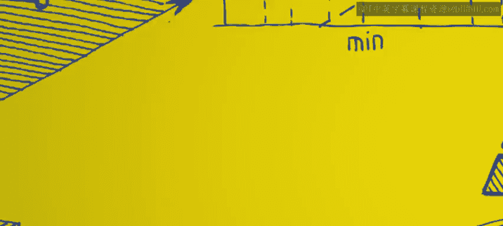
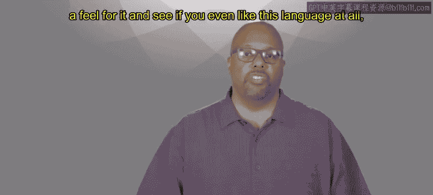
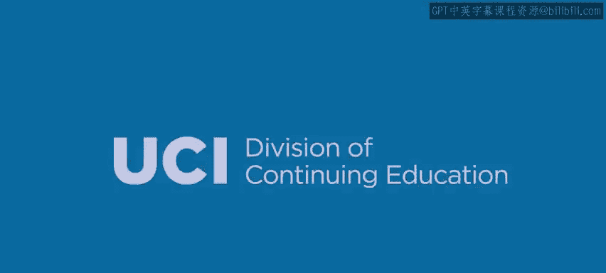

# Go语言编程：1：课程欢迎 🎉

在本节课中，我们将介绍这门课程的目标、前提假设以及Go语言的定位，帮助你了解接下来将要学习的内容。

欢迎来到这门课程，课程1。本课程的目标是让你获得关于Go语言及其使用方法的第一手工作知识。

我假设你已经具备使用其他编程语言的经验。因此，我不会从零开始讲解。我假设你已经了解许多编程概念，例如数据类型等。你可能熟悉C、Python、Java等语言，现在想转向Go语言。

也许你想开始进行系统或设备编程，希望做一些更底层的开发，但又不想直接使用C语言。或者，你长期使用C语言，希望让编程工作变得更轻松。

事实上，Go语言整体上是一个“甜点区”。它效率高，接近C语言，同时也像Python或Java一样易于使用。它介于两者之间。

在本课程中，我们将涵盖所有基础知识。你应该能够编写一些程序，感受这门语言，并判断自己是否喜欢它、能否适应它。

本节课中，我们一起学习了本课程的欢迎部分，明确了课程目标是为有经验的开发者提供Go语言的入门实践知识，并了解了Go语言在高效与易用性之间的平衡定位。接下来，我们将开始深入Go语言的具体语法和特性。