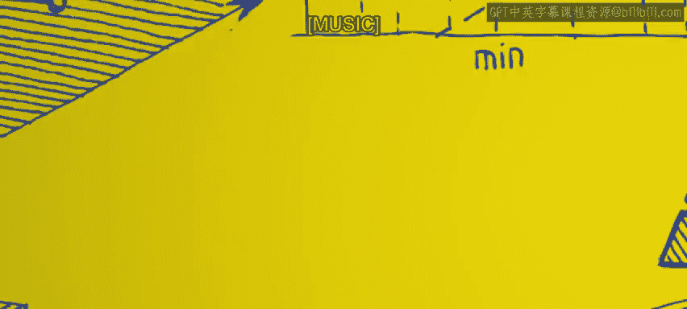

# 加州大学尔湾分校《Go语言编程｜Programming with Google Go》中英字幕 - P20：19_模块2 3 2 控制流.zh_en - GPT中英字幕课程资源 - BV1ggpcevEJf

🎼。

🎼う。🎼Yeah。So Controlflow describes the order in which statements are executed inside a program。

Now basic control flow， the most basic control flow is just executing one statement at a time。

 one after the other， right， procedural control flow just top down。Now the control flow changes。

For a lot of reasons。 But the first reason why control flow changes is because the programmer inserts control flow structures into their code。

 which changes the sequence in which statements are executed。 So the main control flow structure。

 the first one as an if statement。Basically within a statement。

 you can conditionally execute certain sequences of code， so if this condition is true。

 then you execute sequence of code， if not， then you don't right and this what we're showing here is the sort of the most straightforward if statement without an else clause。

 you can also have an else clause， but let's start with the basic one first。

So the structure is just if condition， you write some condition in there， x greater than 5。

 something like that， and this condition has to evaluate to a boolean right if that condition is true。

 then whatever is inside the curly brackets label consequent there that's executed and you can have any number of statements inside there and that'll be executed if the condition evaluates it true。

So this changes control flow because instead of just definitely executing the next statement one after the other。

 it checks this condition if the conditions false and that cons those statements in the conequ are not executed at all and so we can see at the bottom we got you know if x greater than 5。

 then it prints it just it performs a print statement right and if it's not then it just skips that entirely。

Now this if statement， this is a very vanilla statement。

 you can also have an else clause after that right so if the condition is true。

 it executes what's inside the curly brackets， then you can have a next clause the else clause。

 it would execute whatever is inside the next set a curly bracket the next block for the else right we didn't include one here but this is a straightforward extension and you see this in every major language。

So four loops， they're another form of control flow。Control flow statement。Again， so four loops。

 what they do， they basically they their loops， so the control flow rather than just going top down when you hit the bottom of the loop。

 you come back to the top of the loop and you do it again and again until a certain condition is met or not met。

So that's how they alter control flow is just and these are extremely common in programming using loops。

So they just iterate over a block of code as long as the condition is true。

Now there are several forms of four statements， we're looking at one right here。

Probably the main the most common form you see it similarly in C and things like this。

 If you look at the keyword 4 right after that， there are three3 statements， really。

 there's the initialization statement and it is a condition and there's the update and separated by semicolons So the in is executed once at the beginning of the loop。

 So the first time you hit the for the for loop， It executes the in just to initialize things right at the top。

 then the next block， that condition。 that is checked on each iteration。

 So at the beginning of each iteration， that condition is checked。 has to result。

 it has to be an expression that results to a boolean。 If that condition is true。

 then it executes all the statements inside the loop。 Otherwise it doesn't。

 otherwise is done with the loop， and it continues past the loop。

 So that condition is a termination condition。 It determines when you stop executing this loop because assumes that condition is not true。

 you skip the loop and you're done。Now the update that third block there。

The update is what is executed at the end of each iteration and it's used to update some element of the state so very common way in which you use this is you'll have some index variable for I I equals 0。

 maybe start off with I equals0 and you want to do this iterate through this 10 times so the condition might say I less than 10。

😡，And then the update would be I plus plus or I equals I plus one and then every time every pass through it updates that I value that element of the state。

 So and one thing about these four loops is unless you want an infinite four loop。

 which which you typically do not want you got to make sure that that condition is at some point false because if the condition is always true then you never leave the loop So way one of the ways the most common way to make sure that condition is always false。

 is to make sure that update changes the state in such a way that eventually the updates cause the condition to be false So for instance。

 if I say I is equal to 0， I start off at equal to0 and my update is I equals i plus1。

 then eventually I will be greater than 10 excuse me it will be greater than 10 So so the update guarantees that the condition is eventually false and that you eventually drop out of the loop。

So here are some forms of four loops， these are basically the three most common forms of four loop。

 top one is what we've already seen right， you've got the initialization。

 you got the condition and you got the update。The next one。

The next one is if you look at the four keyword， there's only the condition check after it right。

 no initialization， no update， you don't have to have those Now instead what we did here to make it equivalent to this to the for loop before we had to put the initialization before the for loop it's another way of doing it and the update is now built into the for loop So if you look there's an i+ plus inside the loop right so it's actually inside the fours block instead of as you have in the first form where you actually put it in there right after the keyword。

But it's another way you can define a four， which is really just like a while loop inside another language。

And then the last form is just an infinite loop， it just it has nothing after the for loop。

 it just is an infinite loop， which is not typically what we're going to be doing。

 You do that maybe to an embedded system， but it's not common to do in a regular program。

 you usually don't want an infinite loop。All right， so another type of control flow is a switch。

Switch is paired with case， right So a switch is a multiway if statement。

 So you often get case situations where you want to say if this is true you do this。

 if this is true you do that， if this is true， you do that， sort of you do one of a set of cases。

 sort of an elsesif， if elsesif is another way to write this type of thing。

 So a switch is like theres set of cases， and only one of them is going to be executed。

 whichever one matches。 So the switch may contain typically contains a tag。

 which is a variable to be checked So maybe I say switch X。 So that's the variable I'm going check。

 then each case is associated with some constant value that x is compared to that the tag is compared to。

 So tag is compared to the constant defined right after the case keyword， And then whichever case。

 whichever case constant matches the value of x。 that's the case is executed and none of the rest are。

😊，So in this example， you can see we've got switch X inside you've got two cases， case 1 case 2。

 So if x is a 1， it lets execute case 1， if x is a 2， it lets execute case2。

 and then the bottom one is default， default is executed if none of the cases are hit。

 So you don't it's an optional thing， you don't have to have a default， but you can have a default。

 So if it falls through， it'll end up executing something。 So this is typical form for a case。

 And one thing to note just if you're used to C。In comparison to see。

It automatically the case automatically breaks at the end of the case。 So in C。

 if you were to execute case1， say x was equal to1， you hit case1， you execute case1。

 it would also fall through and execute case2 that's what C would do unless you put a break statement in there at the end of case1 right after the format print F。

 you put a brake statement， then it would skip the other case in the default in switch in switch and go lay。

 you don't have to do that。 it just automatically breaks， which is a good， good thing。

