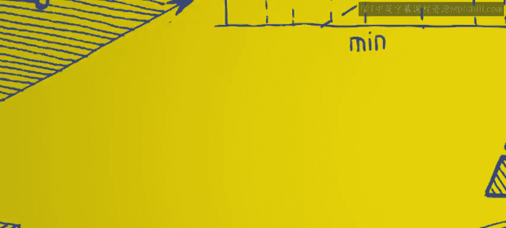
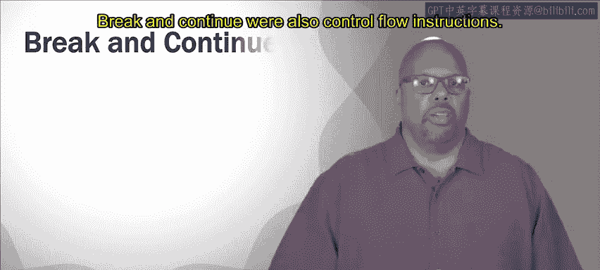

# 加州大学尔湾分校《Go语言编程｜Programming with Google Go》中英字幕 - P21：20_模块2 3 3 控制流和扫描.zh_en - GPT中英字幕课程资源 - BV1ggpcevEJf

🎼う。🎼Yeah。To continue with the control flow， we were looking at a switch。

 let's talk about a tagless switch as a variant on the regular switch。So normal switches。

 they have a tag right switch X， let's say， and that's a tag that X。

 and that's a variable that's going to be compared to constants that are right after the cases So case 1。

 case 2， case 3， x is compared to those constants 1，2， and 3。So sometimes that's not what you want。

Sometimes you can have it switch without a tag and when you do that。

 then what happens is the case that actually gets executed is the first case whose expression is true。

 So what I mean by this is when you don't have a tag in the switch。

 then each case is going to have to have instead of having a constant after it will' have some expression that resolves to a boolean true or false。

And if that bullolean is true， then that's the case is' executed。

 and it'll execute the first case whose condition is actually true。So here's an example of that。

This case we have switch， there's no variable， no tag right， And we just have these cases。

 two cases plus a default， So case x greater than1 case x less than negative 1 and then default。

So in this situation， since there's no tag， it just looks to the right of the case case key word。

 looks the condition x greater than one， evaluates that。 if it's true。

 then that's the case that gets executed and we're done to switch。 If it's false。

 it goes and checks the next case to see if his condition is true and so on until you're done with all your cases。

 and then if none of them happen， then the default is executed if you've included a default。

 So that's a tagless switch and you can use that as well。 instead of if Els if， Els if。

 you would use a switch like this tag with switch。

Break and continue are also control flow instructions。They sometimes they are're considered bad form。

 but they definitely exist and they're used。So break and continue for loops。

So a break exits the containing loop。So say you're inside a loop and that loop， so in this case。

 we got a four loop。And you I equals 0 i less than 10， and there's an I plus plus inside the loop。

 so this is supposed to happen， whatever this is it's supposed to iterate through 10 times conceivably。

 but notice inside the loop， it says if x equal equals5 then break。

So when if it hits that brake and it will in this case， when it hits that brake。

 it will exit the loop， so if this thing will only execute for I equals 0，1，2，3，4 and 5。

 it'll go into the loop and it'll hit the brake on the fifth pass through the loop so it won't finish the loop。

 so brake just jumps out of whatever the containing loop is and quit the loop。

Now continue on the other hand。It's also used in loops， it doesn't quit you out of the loop。

 it just skips the current iteration of the loop。So if we look at the continue example， same code。

 except instead of a break， it calls a continue。If I equal equal 5， then it calls continue。

 So in this case， if without that if statement and that continue。

 it would execute this loop 10 times right because I starts at zero。

 it goes up to the condition is I less less than 10， so it would execute 10 times。But for this loop。

 it says if I equal equal5 continues， so that one iteration where I is equal to 5。

 it will continue through that， it'll continue and just jump right past that iteration of the loop。

 it won't so itll still the code will still the loop will execute。

 but it won't execute as many times it'll skip one iteration of the loop。So scan。

Is scans a function to read a user's input， this isn't a control flow function。

 but we need to hit this because Read a user input is something that you're going to use in the code examples that you write。

It's sort of a common thing to do。 you want to read input that a user types into the keyboard。

 So this is in the format package。What scan does is it takes a pointer as an argument so what you do is you make a pointer to some value that you expect a user to type in so if the user is going type in an integer。

 you would make an integer and you would pass a pointer to that integer to the scan function you call scan and when you execute the scan function。

 it blocks the program waits until a user types in something and hits enter。😡，And when they hit En。

 the scan function will take whatever they typed in and put will place it wherever the pointer is pointing okay。

 so it will take what they typed in and put it into say an integer。

 if you pass a point it to an integer， it will take it。

 turn to an integer point and and put it into that integer。😡。

So and what it returns is the number of scanned items， it returns actually two things。

 the number of scanned items， the number of tokens that a person typed in， so space separated tokens。

 that's returned， also an error， the second thing's returned as an error。

 if there's an error it'll return something other than nil。

 there's no error it'll just return nil for that error。

 but if there's an error it'll return an error code and we could investigate that。

So we can look at this example code。Let's say we make a variable aome。And it's an integer。

Then we print out number of apples question， you expecting to user it to type in how many apples。

 So we expect them to type in some integer 5， let's say right So the next line。

 it executes the scan function。 the code will actually stop the code will stop running there and wait until the user types in something and hits enter。

 So say the user types in a5 hits enter Now notice that the argument to scan the argument pass is ampers and Appleome。

 which means the address of the Appleome variable。 So when they type when the user types in5 scan and hits enter that scan function takes that number5 puts it into the Apple variable。

 So on the next line， when I say print f Appleome， it'll print5 or whatever integer they typed in。

