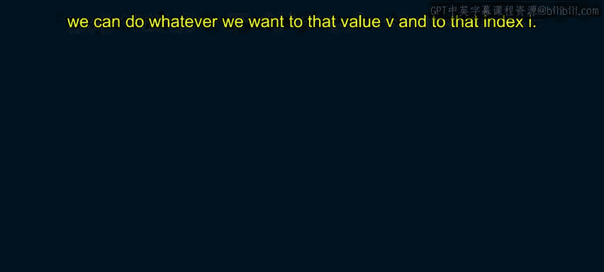

# 加州大学尔湾分校《Go语言编程｜Programming with Google Go》中英字幕 - P23：22_模块3 1 1 数组.zh_en - GPT中英字幕课程资源 - BV1ggpcevEJf

🎼。

🎼う。🎼Yeah。So now we're moving on to composite data types。

 composite data types are beyond the basic data types。

 they are data types that put together that aggregate other data types。So so unlike a string。

 a string， just a string actually even a string， you can think of actually a string is a sort of a special case because you can think of it as aggregating these different bytes。

 So a string is somewhat of now I think about it a string sort of is a composite data type。

 but we're going to talk more generally about arrays right now。 So an array in general。

 is just where you take a bunch of a fixed length series of elements of a chosen type。

 So you can make an array of bytes。 you can make an array of integers and array of floats and so on。

 but it's fixed length。 it's a key thing about arrays They are fixed length。

 It is known to compile time how big theyre going to be。

 So the compiler can tell how much space and memory it needs to allocate for these。

 And just in general。😊，Let me say that these composite data types are important。

 that is in any kind of complicated program you're going to need to use composite data types。

 it's not enough to use the fundamental data types。

 yeah you need to bring together types of different data types and group them and aggregate them into some kind of a composite data type。

So。So you have different array elements， right， each one is some chosen type。

 maybe it's an integer array， you've got a set of each array element would be an integer。

Elements of the array， each element is indexed by using subscript notation， so square brackets。

 you put the index right in the middle of the square brackets。

 so we're going to have an example here， but this is a similar notation to what you see in lots of different languages indice start to 0 because we computer science we start counting as 091。

Elements are initialized to a zero value and actually this is not always the case in other languages。

 say and C you make an array， that array is not initialized at all unless you actually write code to initialize it when you create it's not initialized but in going the array is initialized to zero value and when I say zero value I mean the zero value of the type that the array is composed of so if it's integer is the zero value is just zero if it' strings the zero value is empty string right。

So in this example。We're showing how you can declare an array So you say see at the top var x and then in brackets 5 int and the fact that it has a brackets 5 tells you this is supposed to be an array of five integers。

 So that's how you declare it in array and that would be initialized to zeros by default。

 then next line I refer to a particular element x0 x bracket is 0 so I'm looking at the zero element。

 and I'm setting that equal to 2。 So now I've changed that that only equal to 2。

 And then if in the next line I'm doing a print f so do a print f x of bracket1 and since bracket1。

 I didn't actually explicitly initialized that it would have been initialized to0 so that'll print to 0。

 So that's an array and you've seen that in other language as most likely。An array literal。

Is a predefined set of values that go into that make up an array。

 So you use this to initialize arrays if you want to。So for instance， here。

 we say a var x bracket 5 int， So it's an array of five integers。

 we say equals and we say square bracket 5 and we give within the curly bracket there are actually five integers so that's actually a way of initializing the array to a set of values to an array of five integers。

 So that array of five integerss inside the curly brackets that's actually called an array literal and we're defining x to be equal to that array literal The length of the literal has to be the same as the length of the array。

 So if you declare x to be5， you better have five literals inside the array literal。😊。

Now then there's this operation that dot dot dot that's actually a that's actually a key word。

 So dot dot dot is used to express the size。 you can use dot dot dot to express the size of an array literal。

You can do that because because basically if you have an array literal and inside the curly brackets。

 you have four elements in there， then it's clear that you want this array literal to be size 4 right you don't have to say explicitly four so you can just put a dot dot dot in there and it will infer the size of the array from the number of elements inside the array literal so in this example。

 x colon equals brackets we have dot dot dot we don't specify explicitly what the size is。

 this says int1 comma 2 comma 3 comm of 4 since it's four elements in there clearly you want x to be size 4。

The most common operation programming operation that you do to arrays is to iterate through the array。

 You know， you look through each element of the array and you do something with the element of the array。

 maybe you add it to a Psm or you check to see if it's greater than 5 or something like that。

 but it is extremely common in programming to iterate through an array and check out each element in the array。

So so the way you do that and going is with a four loop so you can see in the code here we've got some sample array1。

2，3 right it's just three elements in it， one，2，3 now we want to iterate through this array maybe we want to print out each element to the array。

So we make a for loop。Now notice that I have highlighted in there that range keyword right to the right of the range keyword is the name of the array that we want to iterate through。

 so range X。To the left， we say four Ia V， weve got two variables here。

 I and V I is the index of the array element that we're looking through in this particular pass。

 and V is going to be bound to the value of the array element that we're looking at in this pass。

 So the idea here is that in this loop， if you look inside the curly brackets is a print statement。

That print statement is going to get iterated once each pass through the loop。

So every pass of the loop， I and V are bound to different values。

 I is the index of the element that we're looking at and v is the value。 So in this case。

 with this array the first pass through the loop I is going to be 0 next pass is going to be1 next pass is going to be twoll increment each time and V is going to be the i value in the array So the first pass through when I is equal to 0 v is going to be equal to1 because the first element。

 that array is the number one so the0th element is the number one then in next pass I is going to be1 and v is going to be2 because the first element from 01 first element in that count is the value2 and so on and all this loop does its very simple just prints out the I and the V together but that's the idea this allows me to iterate through the array So I and V get bound to an index and a value inside inside this array on each pass and so inside the loop inside。

The curly bracket of the loop， we can do whatever we want to that value V and to that index I。

