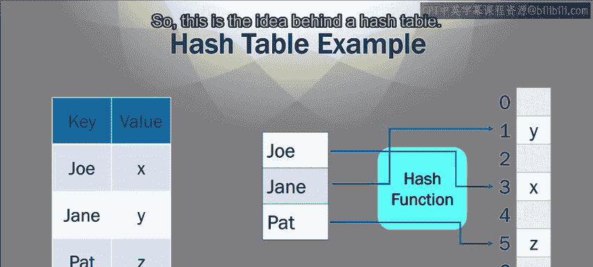

# 加州大学尔湾分校《Go语言编程｜Programming with Google Go》中英字幕 - P26：25_模块3 2 1 哈希表.zh_en - GPT中英字幕课程资源 - BV1ggpcevEJf

🎼。

🎼う。🎼Yeah。A hash table is a data structure used in a lot of different languages。

And it's a very useful data structure， it allows you fast access to large bodies of data。

A hash table generally contains key value pairs， so there are a lot of values inside this hash table。

 but each value is associated with a unique key。So for instance。

Maybe social security numbers and emails right so the social security number might be the unique key of the person and so that might be the key and then the value might be the email address of the person。

😊，So that's a pair， right， key， unique key and value。 and the key has to be unique。

 That's actually completely important。 Also maybe like a GPS coordinates and address。

 right so every address has a unique set of GPS coordinate coordinates associated with it。

 So GPS coordinates might be used as a key and then the address might be you know your house address right which may or may not be unique right where you live。

 there are a lot of different street main streets in the world and there can be a lot of different one main streets。

 So that might not be unique， but the GPS coordinates have to be unique or the key has to be unique in this case。

 GPS coordinates So so a hash tables meant to store these key value pairs and it is important that each key is unique。

😊，So a hash function is defined and it's used to take a key and compute a slot in the hash table to insert the value according to the key。

 so you can think of a hash table is something like I hate to say it。

 but think of like a big array got a lot of slots where you can put values in there right Now which value which which slot it puts a value in is based on the key。

 a hash function is used to process the key and generate this number of the slot that you want to insert the value into。

So a hash function is a function that takes as its argument。

the key and it returns the slot where you want to put the value。 Now， by the way， this hash function。

 you never call this hash function explicitly。 This is something goes on behind the scenes inside the go language。

 but just understand there is such a hash function that does this。

So here's an example of what a hash table might look like。So at the top， we got this little table。

 a bunch of keys and values。 So my keys are Joe， Jane and Pat， they're all unique keys。

 as strings are unique。 and here's some values X， Y and Z。 They're arbitrary。 Okay。

 so Joe' is associated with X， Jane's associated with Y。 Pat associated with Z。

And I want to put these three key value pairs into my hash table。So。😊。

If you look at the bottom you got on the right， you got this basically an array of some size and this is a small one。

 but you know this is just an example。 So you got some array and the values x。

 y and z are all placed in different slots inside this structure and I just place them arbitrarily Y is was it in location 1 and X is in location 3。

 Z is in location5 So they're in some arbitrary location， some slots inside the structure。

Now then over on the left， you can see the keys， Jane， Joe， Jane and Pat。

Now in between theres is hash function and the hash function。

 it takes the key and general it determines which slot is going to place the corresponding value in。

 So I drew this with the line。 So if you look at Joe there's a blue arrow that goes into the hash function and then points to location 3 slot3。

 So Joe is associated with slot 3， which has the value X。 and then Jane。

 the hash function will compute a1 in this case。 And so slot1 has J's value Y and then likewise with Pat Pat is associated through the hash function with slot 5 and you put its value Z inside slot 5。

 So this is the idea behind a hash table。

So the reason why this is good is something like an array or slice。

 you can access things in constant time， but you don't have to use indices to access them。

 You can use arbitrary keys as long as the key is the keys are all unique and constant。

 then you can use the key So I can so normally if this were an array if I want to access in entry1 element1。

 I'd have to say the name of the array and than brackets1 In this case I can say brackets Joe or bracket Jane or bracket Pat or something like that So that's actually useful the naming is useful for several reasons。

 One reason is it's easier for a programmer to remember Joe and Jane and Pat rather than arbitrary numbers the numbers have no particular meaning with respect to the particular application you're writing where Joe and Jane and Pat。

 they are people and they have some sort of a meaning in the mind of the programmer。

 So it makes it easier to code。So advantages。Advent is a faster lookup table than list。

 so this is an adventure is compared to like a list that you'd find in another language。

It fast to look up table look up than list because in a list iss linear time lookup。

 So that means if you want to find an element in a list。

 you have to start the beginning of the list and go to the next and next and next and keep comparing until you find the one you want。

 find one that matches That's linear time。 the longer the list is。

 the longer it takes to find things in the list on average where this is constant times。

 It's much more like an array basically you take the index the key rather， you use the hash function。

 which takes some constant amount of time。 and it gives you the index and you go straight to that index。

 So it's a constant time look up rather than linear time like you would find in a list。Now。

 another thing about it is that you can use arbitrary keys。

 so this is better than say slices or arrays where you would have to use integers。

 you can use arbitrary keys and those keys can have some sort of a meaning to them。

So disadvantages is that you may have what are called collisions inside hash table so collision。

Is when two keys hash to the same slot。 So Joe and Jane， if they both。

 if the hash function maps both of those to slot 2， then you have a collision。

 then Joe's value and Jane's value both have to go into the same slot。

 Now there are ways to handle these collisions， rights you can put them both in there and put them in a linked list or something like this。

 but when you get collisions， the speed gets a little slower。

 right because those collisions have to be handled in some way。

 So you don't have to worry about how they're handled that's built into go。

 But that can slow you down， but I'll say this that collisions are rare。

 because the hash function is made in such a way that collisions are very rare。

 so this is a possible disadvantages with collisions， but it's not likely to cause you many problems。

