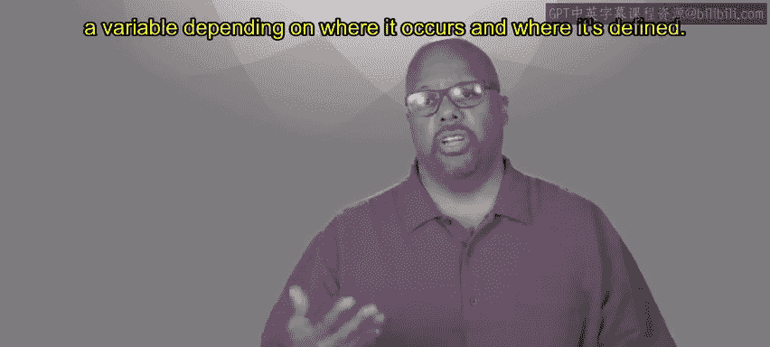
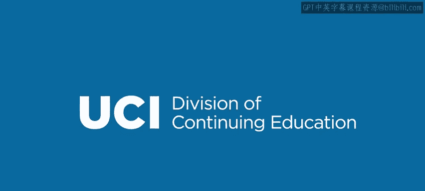

# 加州大学尔湾分校《Go语言编程｜Programming with Google Go》中英字幕 - P2：1_模块1概述.zh_en - GPT中英字幕课程资源 - BV1ggpcevEJf

🎼。

🎼う。🎼Yeah。The point of this first module is to talk about well really four things first thing is we want to talk about go。

 why it's good， why it's unique we want to motivate you to just tell you why do you need to even learn this in the first place as compared to existing languages because there are many So we'll talk about that we'll have you start using go So this specifically means installing the go environment and compiling your first program you need to get through that before you can go on with the rest of the course so we'll sort of walk you through the installation process and show you how to just compile a program and see that it works。

As a sanity check for the whole setup。Then we'll start talking about the code organization。

 the recommended code organization， so workspace， so how how you define your workspace。

 how it should be organized。How go code is organized into packages to allow you to share so a big point of go is sharing with other people right because if you want to think about any real software you write。

 it's always big right you work with other people now almost never just you alone and so you got to share and packages help to make that easy and to organize the code so you can trade your code with other people。

Then at the end of this module we'll start talking about variables。

 start talking about the language itself， so the variables。

 what types there are and how do you do scoping， how variable scoping happens。

 how you can determine how you basically resolve the value of a variable。

 depending on where it occurs and where it's defined。

