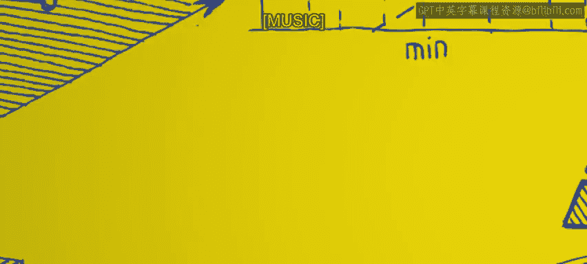
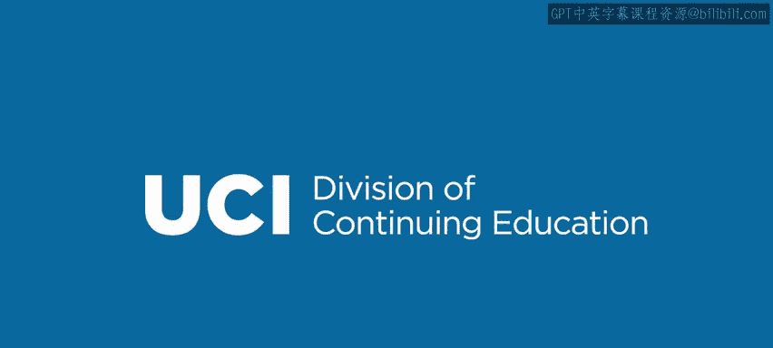

# Go语言编程：模块4.1.2：JSON处理 🗂️



在本节课中，我们将要学习Go语言中如何处理JSON数据。JSON是一种轻量级的数据交换格式，在Go语言中，我们可以方便地将数据结构与JSON格式进行相互转换。

## JSON格式的优势

JSON作为一种数据格式，具有几个显著的优势。

首先，JSON完全基于Unicode。这意味着任何JSON对象在转换后，都将以Unicode字符表示。这非常有益，因为Unicode是人类可理解的字符集。

事实上，这引出了它的另一个优点：JSON通常是人类可读的。人们可以查看JSON格式的数据，并大致理解其内容。虽然有时可能略显复杂，但总体上对人类是友好的。

此外，JSON是一种相当紧凑的表示形式。之所以说“相当紧凑”，是因为它并非完全极致压缩。如果我们追求极致的紧凑性，那么数据将不再具备可读性。例如，如果你压缩一个JSON对象，你会得到一个更小的文件，但你也无法直接阅读它。因此，JSON是在保持人类可读性的前提下，尽可能紧凑的一种格式。

JSON中的数据类型可以递归组合。这里所说的“类型”指的是你组合在一起的不同类型的数据。请记住，在JSON中，我们希望能够表示Go语言中的各种数据结构，即我们拥有的对象。我们希望将它们表示为JSON对象。

这些类型可以递归组合。因此，你可以拥有一个整数数组、一个结构体数组、一个内部包含结构体的结构体，或者一个内部包含数组、整数和字符串的结构体。你可以将它们全部按层次结构组合起来。例如，一个结构体内部包含其他结构体，而这些内部结构体又包含更多的结构体，依此类推。这样，你可以将任意复杂的Go语言对象转换为JSON。这是一个相当不错的优势。

## JSON编组（Marshalling）

“编组”（Marshalling）这个术语，在JSON编组的上下文中，意味着从对象（在我们的例子中是Go对象）生成JSON表示。我们有一个任意复杂的Go对象，我们希望将其转换为符合JSON格式的内容，这个过程就称为JSON编组。

在这个示例中，我们将从我们的`person`结构体开始。以下是其基本结构：

```go
type person struct {
    name    string
    address string
    phone   string
}
```

这是一个结构体类型，包含`name`、`address`和`phone`字段，它们都是字符串类型。

假设我们创建了一个实际的`person`对象，即这个特定类型的结构体实例。这个`person`对象`p1`具有特定的值：`name`为“Joe”，`address`为“a street”，`phone`为“123”。我们之前已经见过类似的例子。

现在，我们想要将这个`person`结构体转换为一个JSON对象。我们调用函数`json.Marshal`。

请注意，我们传递一个参数`p1`，即我们想要转换的Go语言结构体，将其作为参数传递给`json.Marshal`。

它返回两个值。在这个例子中，他们称第一个返回值为`b`（一个数组），第二个为`err`（错误）。如果没有错误，`err`将是`nil`。如果转换正常进行，那么这里应该是`nil`，表示没有错误。

真正返回的`b`数组实际上是一个字节数组（`[]byte`）。它包含了JSON表示。请记住，JSON完全是Unicode，这个字节数组基本上就是一堆符文（runes）的数组，它们构成了JSON表示。因此，`json.Marshal`所做的工作就是：接收一个Go对象，并返回其JSON表示。

## JSON解组（Unmarshalling）

JSON解组是相反方向的操作。你试图获取一个表示JSON对象的字节数组，并将其转换为存储相同信息的Go语言对象。

接续上一张幻灯片的内容，我们再次讨论这个`person`结构体。假设我们已经生成了字节数组`bArr`，它包含了一个人的JSON表示。

现在，我们想要解组它。我们希望获取这个JSON表示，并创建一个包含相同信息的Go结构体。

我们这样做：首先，我们在顶部声明那个Go语言结构体。我们写`var p2 person`，称它为`p2`，类型是`person`。但此时我们还没有创建它，还没有填充`name`、`address`和`phone`字段。所以我们只是有一个基本上是空的`person`变量。

然后，我们调用`json.Unmarshal`。请注意，`json.Unmarshal`需要两个参数。第一个参数是字节数组`b`，它包含了实际的JSON对象。第二个参数是我们希望将结果放入的Go结构体的地址，即`&p2`。因为请记住，这个`b`数组包含了关于一个人的信息。我们希望将这些信息放入我们创建的、目前还是空的`p2`中。

当你调用它时，它基本上会解包字节数组`b`，并将各个字段的属性值放入`person`结构体`p2`的相应字段中。

关于这一点有一个约束：`p2`，即`Unmarshal`的第二个参数，必须与JSON数据（JSON字节数组）相匹配。这里所说的“匹配”，是指JSON对象将有一组属性和这些属性的值。第二个参数`p2`必须具有相同的属性。如果它是一个结构体（就像本例中一样），它必须具有相同的字段名。因此，如果JSON对象有一个名为`name`的属性，那么Go对象`p2`最好有一个名为`name`的字段。这就是基本要求，它必须匹配。

但如果匹配，那么当你调用`Unmarshal`后，`p2`将成为一个包含JSON对象中所有信息的结构体。而`json.Unmarshal`返回的错误值`err`，如果一切正常、一切匹配，它将是`nil`。如果不匹配，它将返回一个错误。

## 总结



本节课中，我们一起学习了Go语言中JSON处理的核心概念。我们了解了JSON格式的优势，包括其Unicode特性、人类可读性和紧凑性。我们重点学习了两个关键操作：**JSON编组**（使用`json.Marshal`将Go对象转换为JSON字节数组）和**JSON解组**（使用`json.Unmarshal`将JSON字节数组转换回Go对象）。记住，在解组时，目标Go结构体的字段必须与JSON数据的键名相匹配，才能成功解析数据。