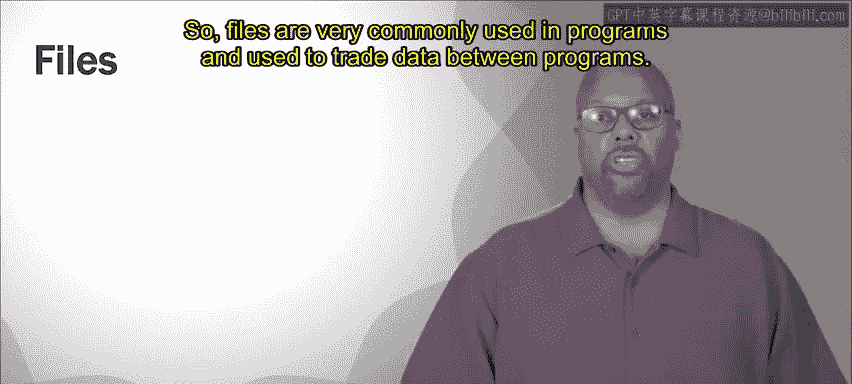
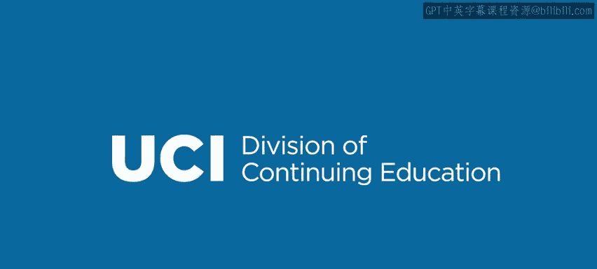

# 加州大学尔湾分校《Go语言编程｜Programming with Google Go》中英字幕 - P32：31_模块4 2 1 文件访问：ioutil.zh_en - GPT中英字幕课程资源 - BV1ggpcevEJf

🎼。

🎼う。🎼Yeah。So files are very commonly used in programs and used to trade data between programs。

 so we're going to talk about how Going allows us to access files， we'll give an overview anyway。

Now fileile access， and this is true in all languages。 file access is linear access。

 not random access。 So the reason for this is because files when they were originally defined。

 came from they were actually stored on tapes， right physical tapes。And when you access a tape。

You remember， depends how old you are， but you know， I used to have cassette tapes， right。

 So or big old tape。 you've seen him in movies， Science fiction。 movies use the big old tapes， right。

 They turn this physical tape that is on as linear access。

 meaningan the beginning of the file is at one point in the tape。

 The end of the file is way over here at the other point of the tape。And so if you want to access it。

 you got to start you read one point of the tape， then you got to turn the tape and read the next point。

 turn the tape， read the next part and so on。 So it's always linear access wherever the turning limits it right theres this mechanical operation of physically turning the tape to access the next piece of the next piece of the file So so it's always linear access。

 if you want to just access something at the beginning。

 then something at the end that would waste a lot of time。 the beginnings here。

 then you got to take a lot of time turning to get to the end instead you read it linearly。

 you say okay I'm at the beginning I I read everything in that vicinity。

 you read from the beginning to the end。So that's how file access still is today。

 even though you don't necessarily have this linear access constraint。 I mean。

 if you look at physical disks， they still have linear access， right。

 You still tracks and you have to go through the whole track。

 So there's still some linear access to that。 But， you know， for all we know， a file might be。

Might be in a random access device， so for instance， a flash memory or something like that。

 So I'll stay dry right that's actually a random access device。

 but still the way that we access files in programs is as if it's a linear access device。

So normally when you access files， you get in other languages too。

 you get these set of basic operations that are sort of common for file access。So first one is open。

 it's getting a handle test start accessing the file， you have to open the file first。

 then you always get a read function or some variety of read functions where you can read bytes from the file。

And read them into like say a bitete array。Write where you write data from a byteer array and move that into a file。

😡，Close is when you're done， you close the file because you're done reading it or accessing it and then See is another thing a common thing to have See basically moves your read head。

 So what that means is it's linear access right so you read from the beginning to the end。

 but sometimes you really do need to skip to a certain point and See does that。

So these are very common functions that you see basically in any language to access files。

So there is more than one package and go that allows you to access files that has functions in it that allow file access。

 We'll start with the IOU till package。 IOU till package has some has some sort of basic file access functions basic they're easy。

 they're nice to use if the basics are enough for you IU Ti is great。

So the first function you get there is a read file Now read file you'll notice it I'll utilize till that read file。

 it takes as an argument， the name of the file you want to read。

 that can be arbitrary know testt text or whatever you want to call it and it returns two things。

 data basically say a byte array and then an E is an error so it returns two things an error is only if there's some kind of error reading。

 but if there isn't an error， It main job is to return this byte array which is the first thing that it returns。

So and what it does is pretty simple。It just reads the whole file and returns the contents of the whole file into a by array。

 and then you can manipulate the by array。Now， when you use Read fileile。

 you don't have to do an explicit open to close， you don't have to open the file at the beginning。

 close it at the end， that's all built into the read file function， so it'll just open the file。

 read the whole thing and then close it。So it's nice。

 One issue with it is that large files can be an issue。 So when I say causes a problem。

 it's not going to cause an error， but files can be gigantic。 you can have， I mean。

 if you think about the size of a disk， you can have the disk can be a disk can be terabytes I mean have a terabyte disk in my machine and that's not it's normal So you can have giant sized files。

 you can have files that really take up most of your memory because when you read a file。

 it takes it off of whatever the storage devices， let's assume you're using disk for a second。

 say I put it on disk， but it could be solidy storage too。

 it takes it and it reads it into Ram into into its main memory。Now。

 main memory is much more limited。 So my disk， I might have， you know a couple of terabytes。

 but my Ram， I might only have 8 gigab。 so I could have a file。

 an 8 gigab long file on in my disk because I try to read into main memory。

 if I read that whole file， I'm using it up my whole Ram and my machine will will choke Okay。

 I can't run anything because I've used up all my memory so。When you have large files。

 read file is you can't use it Okay so but if your files are smaller。

 small enough so that it doesn't hog up all the memory， then re file is fine。

 you can just read the whole thing in at once。Now IOU till also has a write file function。

 which is complementary to the read file and if you look at write file。

 it takes actually it takes three arguments。 first argument is the name of the file you're going to write to。

The second argument is the byte array or is the string。And then the third argument is the permission。

 So remember right file it's actually creating a new file。 So when I call right file here。

 I'm going create a new file called out file text， and it's gonna to write the data hello world into that into that file when it creates that file。

 it has to give that file permissions read and write access permissions。

 So it's using Uni style permission byte。 So 777 means permissions for everybody everybody can do everything basically but you can adjust the permissions as you see fit。

 but those are the arguments to a right file。 So again， it writes remember with right file。

 it's not flexible。 you can't append to a file or something。 You can't say。

 oh let me just add on the file right file， it just creates a file dumps everything the whole string or the whole byte array into that file and then close the file。

😊。

