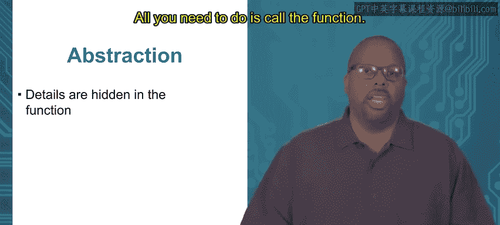

# 加州大学尔湾分校《Go语言编程｜Programming with Google Go》中英字幕 - P34：0_模块1 1 1 为什么使用函数.zh_en - GPT中英字幕课程资源 - BV1ggpcevEJf

Module 1 functions in organization， topic 1。1 why Use functions。

So we're going to talk a little bit about functions right now。

 we've been using functions since the start because you basically have to you can't write code。

 at least in going without a function， so we've been using functions already in passing。

 but now focus a little bit more on how they're used， how you define them， how you use them。

And be a little bit more specific about the meaning of a function。 So what is a function， a function。

Is really just a set of instructions with a name and and the name is actually optional。

 as we'll see later in a few more lectures。 we'll see that you don't actually need the name。

 but it's a bunch of instructions that are grouped together。 and usually with a name。

 We're certainly for now with a name。 So we can see first we got this first function over here。

 main right fun main。 we defining function。 and that's this name main and we all of our programs so far。

 they all have a main。 In fact， all programs in go have to have a main function。

 right that's where execution starts。 We already said that， but I'll just remind you again。

 So there's always at least this function main。😊，Now。

 if you look at the way the way we define that function， says funk main， open print closed print。

 and then there's a curly bracket right so and then between the curly bracket。

 So there's open curly bracket， then this bottom lower curly closed curly bracket between that is the contents of the function。

 So those instructions in there are the instructions that are part of the function。

 Now this main on top it's a very simple main All it has is one line of code format print F hello world。

 But you could put any number of lines of code in there and it would be they would be all grouped together in this function called main。

😊，So this is really the simplest way you can define a function at all。

Now a function now the main function is actually a special function in the sense that you never call this function。

 So when you run your program from the command line， say when you run the program。

 the main function gets called and invoked immediately。

 So calling a function means to execute that function and that happens automatically with main。

 as soon as you run it， it goes straight to main calls that function。

 but for any other function you define。You have to call that code explicitly。

 you have to call the function explicitly。 So take a look at the example on the bottom。

 Weve got two functions here。 the top one is called print hello and the bottom one's called main So let's look at the main for a second。

 the main if you look at main， all it has is one line calls print hello。 So it says print hello。

 open print close print。 that is a function call。 So that's where we call print hello and at that point in execution。

 it'll go to print hello and execute whatever print hello whatever instructions。

 print hello contains Now if you look above at print hello。

 you can see that it's just one's instruction， just hello world right just print hello world So the two programs that we have the top main and then the bottom program with with the main and then the print hello。

 they do the same thing It's just that the bottom function actually the bottom program has a function call in it an explicit function call inside main it calls print hello So this is really what you're seeing here is really this simplest kind of function can。

So a function declaration is where you define the function。

 So a function declaration and Golang starts with that keyword funk F UNC。

 And then then you have the name of the function after that in the line。

 you have opra and closed peren you might have arguments in there we'll talk about that soon。

 and you can also have return values。 we'll talk about that too and then this curly brackets inside the curly brackets。

 So the contents of the function。😊，And functions can also be called， in fact。

 they have to be called except for the main， which doesn't get called。

 it just gets executed automatically。So why use a function？

There are there are a lot of reasons one reason right off the top is reusability so what that means is you don't have to rewrite the same code over and over again。

 so if you have a function， you define a function you only need to define that function or declare that function one time and then you can call it and run it as many times as you want so maybe you write this function once。

😡，And then you need to invoke it 100 times。 maybe you need to do this operation 100 different times。

 So then you can write it once， but you only write it once。 Then you call it 100 times。

 and it saves you it basically syntheize your source code so and you can reuse it。

 You can actually reuse it across projects too so people can use your function。

 They can import the library and use your function in their code too。

 So it's good for reuse good for commonly used operations in this way right so。

Things that you do a lot。 You might want to make them a function give them a name so that you don't have to keep rewriting that code over and over。

 you can just call the code。 So as a few examples of functions you might make say you write some kind of graphics editing program you might have a function called threshold image So not to go too much in the graphic editing。

 but there are a lot of a lot of operations in graphics so you got an image it is often it's common to threshold and image So basically if the brightness is above a threshold then you make it black it's below a threshold you make it white common operation you do it a lot so you might write a function just for that purpose and then you can call it 100 times whenever in your code you need to do it。

 you call it say you got a database program you might have a query de function querying a database is probably the main thing you do with a database you got a database you want to get some data out of it。

 you query the database So that type of thing you might want to write it as a function because you know you're gonna to do it over and over again and then you just call the function。

 Also another little example say you got some music。or music editing program change key。

 just a function I thought of。 There are many functions you can do with music， but change a key。

 maybe you want to change the key from A to C。 So maybe you have a function for that purpose because you do it a lot。

 These function titles is that they're specific to the application。 So in graphics。

 your function might threshold an image which is specific to graphics database program you might query a database specific to that domain。

 also changing key is specific to music。 So this is something you're gonna have to think about when you make bigger pieces of code and we'll talk more about this in later in the module but when you're organizing your code your code will usually have lots of functions and they'll be organized some sort of a calling hierarchy and you'll have to think about how you want to what you want to put together in a function and what you don't。

😊，So another reason， another very important reason to use functions is for the purposes of abstraction。

 so abstraction。Abstraction is the designer's friend and not just in computer science。

 but just all over the place， any kind of design， certainly for engineers but I don't even think it's limited engineering abstraction is just hiding details that are less important。

 I don't want to say unimportant because details count but hiding details are less important so you don't have to focus on them all the time because generally the problem with big designs is that there's so many details that a human can't keep all these details in his or her mind so you' got to do something to simplify it。

 you got to work with a lot with complicated code， but it's got to be simple or else your mind just can't hold it。

So abstraction is the way you do that abstraction is you group things and you hide the details and functions are exactly for this。

So with a function， you have some complicated behavior， maybe written in the function。

 And then you give that function a name。 And once you've written that function and you've debugged it。

 you know it works。 you don't have to worry about all the details of what goes on inside that function。

 All you need to do is call the function。 So as long as you understand the input output behavior。

 So you understand that a particular function does a particular if it gets these inputs and produces these outputs。

 you know， then you don't have to worry about how。 So for instance。

 sorting right So I want to make a sort function of sort some slice or something like that。

I I don't care how I sort it。 There are many algorithms for sorting， right， I could do a bubble sort。

 I could do insertion sort。 I could do all kinds of sorts。 Who cares， right。

 I could just say oh there are reasons why you would care， but but generally you don't care。

 you just want it sorted。 So you just call this sort function and you don't have to think about exactly what it's doing inside there to do the sort。

 you just know given a slice。 the result is a sorted slice。😊。

So so this so functions allow you to use abstraction they're a way to implement abstraction and improves understand of the code。

 so for instance，'ve got this example I got some function called fine pupil。

 I bring this up because I'm actually working on a function that does something like this。

 It basically looks at an eye a close up picture of an eye and it has to find the pupil。

 find the center of the pupil So this function， fine pupil actually is quite complicated。

But you to hold to understand every single step at one so say I showed you the full on code。

 it is very nasty looking。 it would take you a while to figure out what the heck is going on。

 But if I write it in the way that I have here where I've grouped things into a set of functions with nice names grabab image。

 filter image find ellipses right each one of those functions， you have an idea what that does。

 So at a glance， you can look at this function and get some understanding of how it works。 Now。

 of course you won't get a full understanding just at a glance。

 but you can you get some part of an understanding right there。

 So this helps understandingability and understandingability is key in design。 Now。

 also I should note that the naming is important for this for this understandability right you need a good name。

 grab image， filter image， find ellipses。 the name has to be good。 if I just call those X， Y and z。

 you would have no idea what those were。 But if they have good names and you group things appropriately。

 it's easier to understand the code when you need to。Thank you。

