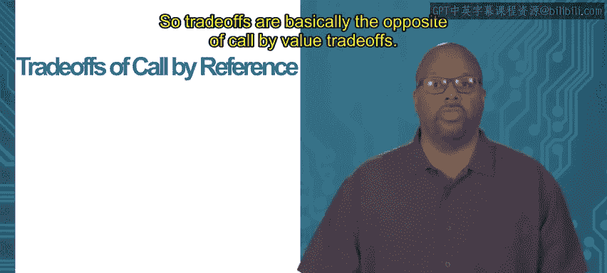

# 加州大学尔湾分校《Go语言编程｜Programming with Google Go》中英字幕 - P36：2_模块1 1 3 值传递和引用传递.zh_en - GPT中英字幕课程资源 - BV1ggpcevEJf

Module 1 functions and organization， topic 1。3， Co by value and reference。

So call by value describes how arguments are passed to parameters during a function call。

 So in a function call， when you call a function， you get to pass it a set of arguments that are bound to the parameters inside the function when you execute to function。

But different languages can pass arguments in different ways， Co by value is how it's done in go。

So what co by value means is that the arguments that are passed as parameters。

 they are copied to the parameters， so the data that the function is using。

From you know when it's using the data that's assigned to the parameters， right。

 what the data that it uses is a copy of the original， it's not the original。So。😊。

That matters because that means that the function that's being called can't interfere with the original variables in the calling function。

😡，So so modifying parameters has no effect on the outside function on the calling function。

 So easier if we show an example。 So say we got this function F。 this function fo。

 it takes one argument y y y is this parameter as's an integer and it just it says y equals y plus 1。

 So all it does is take y add1 to it。 Now this is admittedly a dumb procedure because it's going to have no effect。

 but let's just imagine for argument's sake that this is the function that we want to write。

 So it takes y as1 to it。 Now main， what it does is it has a variable x says it's equal to2。

 then it calls P with x。 Now what will happen is that2 will get past to So x is equal to22 gets past to fo。

But it gets copied to fo。 So y， when you're executing fo， that parameter y is equal to2。

 it's a copy of two， though it is not the same two that x is pointing at The x defined in main is a completely separate variable。

 then the y defined inside fo。 So when fo takes y， which is equal to2 and as one to it。

 it is changing y， but it is not changing x from the main so that's the point to make the called function cannot change the variables inside the calling function like x in this case So if you go back to the main after I say x。

 when I print out the x， it prints out what x originally was。

 which is two because x has not been changed even though the function said y equal y plus1。

 that in no way touch x because y was only a copy of what x is So that's called by value that that the calling the called function can't effect it just gets a copy of the variable the parameters。

 So tradeoff of call by value。Advantage is a data encapsulation so the fact that the function cannot alter the variables inside the call is often considered a good thing because because it limits the propagation of errors so the called function it can make a mistake it can do something wrong。

 but it can't change the call or environment it can't go and change mess up the variables of the function that called it and that would just allow bugs to spread out more fully across the different functions inside the code so function function errors are more localize and encapsulated when you're using call by value。

Now disadvantage is copying time。 so what that means is call by value you have to actually copy the arguments into the parameters。

 so for instance in the last example， this fo， it took had a parameter y so this value for x which was equal to 2 that 2 had to get copied into y so that the function has a copy of the argument right so that tick time that took some amount of time to copy now if it's just an integer who cares。

 but if the argument is something big like some gigantic slice or something like that。

 then it's a serious problem so that's a disadvantage of call by value。

So an alternative to that is called call by reference。

 Now call by reference is not built in this language。

 meaning there is no there's no feature built into it。

 but you can do it manually all you have to do is pass a pointer。

 So instead of passing the argument that you want to pass。 you pass a pointer。

 Now remember what I mean by this so a reference is a pointer right What I mean by this is let's say you want the function to actually alter the variables that are passed to it。

 so in the last example， there was that variable x in the main and the ph could not alter that。

 but let's say I wanted the main I wanted to alter that variable。 So let's just look at this example。

' see if I show it again。 we got this function and it's basically saying y equal y plus1。

 but this time notice that it doesn't take an integer as an argument。

 Y is now a point to an integer start So it assumes that y is a point to an integer。

 and then it says star y。Equals star y plus one。 So that means the it takes the contents of what y is pointing to。

And adds one to that。So it still does same thing， but it takes an a point to y instead of an actual y。

 so it takes a point to an integer instead of an actual integer。😡，Now， in the main。

 if I look at the main， what I call it instead of saying fo X passing it a copy of x。

 I say P and percent x。 So what that does is it passes a pointer of x。

 a point to 2 x passes that to F so now P has a pointer to x so P has a copy of the location and memory where x is so when foo modifies says star y equals star y plus1。

 it's modifying the data at that location， so it's modifying the actual x。

 and then when you print out in the bottom of the main when it prints out x。

 x would actually be equal to 3 after this。So this is a call by reference because you're not passing the actual integer or the actual data to F to the function。

 you're passing a reference to it， a pointer to it。

 and when you pass the pointer when P gets a copy of the pointer。

 it knows where that value is in memory， so it can directly go into that location of memory and alter it。

 so then P now has the ability to alter this variable x。

 even though x wasn't initially defined inside the scope of P it was defined inside the scope of main。

So tradeoffs are basically the opposite of call by value tradeoffs， so the advantage is copying time。

 so you don't need to copy the arguments， so you still need to copy the pointer that you're passing and that takes a certain amount of time。

 but if your argument is some big slice with 100000 elements in it。

 you don't have to copy that whole slice， you don't have to copy that whole structure。

 whatever it is。 so that can save you a lot of time。

A disadvantage is data encapsulation， so actually the advantage of call by value is the disadvantage by reference now if there's a bug inside F。

 it can alter the variables inside main or whichever variables you pass to it anyway by reference so that may be what you want but it may not be what you want and you just have have to pay attention to that when you're writing your code。

 you only pass by reference if you definitely want the function to modify the variables in the calling function。

😡，Thank you。