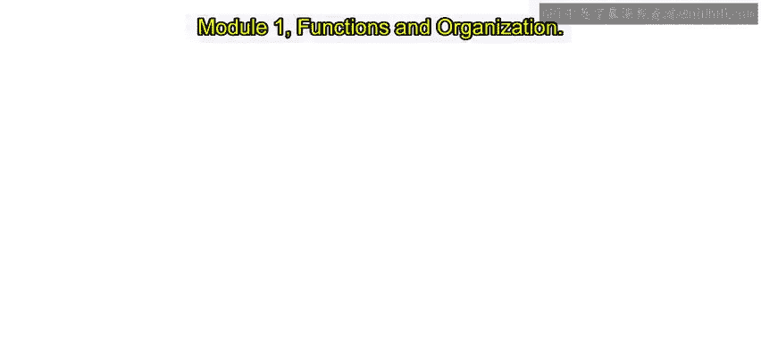

# Go语言编程：模块1.4：传递数组与切片 🚀



在本节课中，我们将学习如何在Go语言的函数中传递数组和切片。理解这两者的区别对于编写高效、清晰的代码至关重要。

## 概述 📋

当我们需要在函数间传递一组数据时，通常会考虑使用数组或切片。然而，由于Go语言“按值传递”的特性，直接传递大型数组会带来性能问题。本节将探讨这个问题，并介绍如何使用切片作为更优的解决方案。

## 传递数组的问题 ⚠️

在Go语言中，函数的所有参数都是通过“值传递”的方式复制的。这意味着，当你将一个数组作为参数传递给函数时，整个数组都会被复制一份给函数的形参。

如果数组非常大，这将导致两个问题：
1.  复制过程会消耗大量时间。
2.  复制操作会占用额外的内存空间。

以下是一个示例代码，展示了传递数组的情况：

```go
func foo(x [3]int) int {
    return x[0]
}

func main() {
    a := [3]int{1, 2, 3}
    fmt.Println(foo(a)) // 输出：1
}
```

在上面的例子中，函数`foo`接收一个包含3个整数的数组。当`main`函数调用`foo(a)`时，整个数组`a`会被复制到形参`x`中。虽然这里的数组很小，但如果数组包含30万个元素，这种复制就会成为性能瓶颈。

## 使用数组指针的解决方案 🔗

为了解决数组复制带来的开销，一种方法是使用“按引用传递”，即传递指向数组的指针。这样，函数接收的是数组的地址，而不是数组本身的副本。

以下是使用指针的示例：

```go
func foo(x *[3]int) {
    (*x)[0]++ // 通过指针修改原数组的第一个元素
}

func main() {
    a := [3]int{1, 2, 3}
    foo(&a) // 传递数组a的地址
    fmt.Println(a) // 输出：[2 2 3]
}
```

在这个例子中，`foo`函数接收一个指向`[3]int`类型数组的指针。在函数内部，通过解引用指针`(*x)`来访问并修改原数组。调用时，使用`&a`将数组`a`的地址传入。最终，数组`a`的第一个元素从1被修改为2。


然而，这种方法需要显式地使用取地址符`&`和解引用操作`*`，代码显得不够简洁，也并非Go语言推荐的惯用做法。

## 使用切片：更优雅的方案 ✨

在Go语言中，处理这类问题的标准且优雅的方式是使用**切片**。事实上，在大多数情况下，你都应该优先考虑使用切片而非数组。

切片可以被看作是一个数组的“视图”或“窗口”。当你创建一个切片时，Go会在背后自动创建一个支撑数组。切片本身是一个包含三个部分的数据结构：
1.  **指针**：指向底层数组中切片起始位置的元素。
2.  **长度**：切片当前包含的元素数量。
3.  **容量**：从切片起始位置到底层数组末尾的元素数量。

当传递一个切片给函数时，虽然Go仍然是“按值传递”（即复制切片这个数据结构），但复制的数据中包含了指向底层数组的**指针**。因此，函数内部可以通过这个指针直接访问和修改原始数组的数据，而无需复制整个数组。

以下是使用切片的示例：

```go
func foo(sl []int) {
    sl[0]++ // 直接修改切片指向的底层数组元素
}

func main() {
    a := []int{1, 2, 3} // 声明一个切片，注意方括号内没有数字
    foo(a) // 直接传递切片
    fmt.Println(a) // 输出：[2 2 3]
}
```

请注意声明切片与数组的区别：
*   数组声明：`a := [3]int{1, 2, 3}` （方括号内有长度）
*   切片声明：`a := []int{1, 2, 3}` （方括号内为空）

函数`foo`的参数类型是`[]int`，表示一个整数切片。当`main`函数调用`foo(a)`时，切片`a`被复制给形参`sl`，但两者共享同一个底层数组。因此，在`foo`中对`sl[0]`的修改，直接反映在了`main`函数的`a`上。

## 总结 🎯

本节课我们一起学习了在Go函数中传递数组和切片的区别与最佳实践：

1.  **传递数组**：会导致整个数组被复制，对于大型数组存在性能和内存开销。
2.  **传递数组指针**：可以避免复制，但代码需要显式的指针操作，不够简洁。
3.  **传递切片**：是Go语言中的推荐做法。切片数据结构包含指向底层数组的指针，传递切片时仅复制指针、长度和容量，效率高且代码清晰。

因此，在Go编程中，应养成优先使用切片的习惯，特别是在需要将数据集合传递给函数时。这不仅能提升程序性能，也能使代码更符合Go语言的风格。