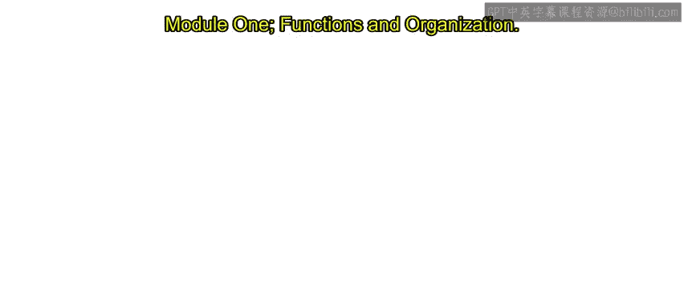
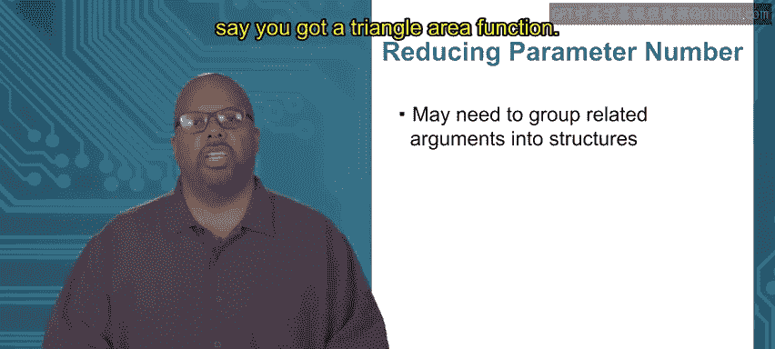

# 加州大学尔湾分校《Go语言编程｜Programming with Google Go》中英字幕 - P39：5_模块1 2 2 函数编写指南.zh_en - GPT中英字幕课程资源 - BV1ggpcevEJf

Module 1 functions and organization， topicic 2。2 guidelines are functions。

So I'm going to give a few tips on making good functions okay functions that are understandable to facilitate debugging and you know other people understand your code。

 working together with people and so forth， modification later。

 you know maybe you want to update your code you need to understand what you wrote so to facilitate that there are a few tips function naming really important。

Give functions a good name for goodness sake。 some kind of name that describes the behavior of the function。

 So you what you want， your goal in the naming， if at all possible。

 is that the behavior can be understood at a glance。

 So you just look at the name and you know what this thing does。 Now， parameter naming counts， too。

 So you also want parameter that are well named， too。 So you understand what they mean。

 So as an example。😊，I'm showing two functions， just the first line of the declaration declaration。

 right The first functions is called process array， it takes a。

 which is an integer slice and it returns a floatat and that's all I know about it right now now if instead let's look at the bottom one which actually these two functions。

 these can do exactly the same thing but they're defined differently。

 They're declared a little bit differently。 So the second one its called compute RMS it takes a slice called samples af floatats and it returns af floatat。

😊，So these two notice that these two are compatible。

 these two are probably doing exactly the same say they do exactly the same thing。

 that first line is declared the same way， but their names are different。

So process array versus compute RMS。 Now RMS， remember， these names are always domain dependent。

 Okay， RMS stands for root mean square。 If you look at a time varying signal。

 it is something like an average。 Okay， now I don't want to go into what RMS is。

 But if you know this type of stuff if you're working in this domain， you would know what RMS is。

 So compute RMS has a distinct meaning to anybody working in this domain。

 So you look at that and you know instantly what that is processces array could mean anything right。

 process how right， Who knows。Now then also look at the name of the argument for process array。

 the argument is called a that's completely generic， who knows what that is where compute RMS。

 I call it samples because guess what it's a bunch of samples of a time varying signal right so the naming gives you some kind of an idea of what type of data is being passed and I can look at it and understand what it's doing without knowing anything about the actual code inside the function about how it's implemented I could just look at the name and say oh that's what it is so that's what you want。

😡，Now， notice that these names they're going to be domain dependent right So compute RMS that's going to be you know you have to know what RMS is。

 but that's a shorthand that anybody who does this type of work who does who works on time vary signals they're going to know what an RMS is so that's a good name Now another thing about names I sort of skippped here is that you don't want it to be too long start people can go overboard right they can make them so descriptive there just。

Burdensome， okay， you don't want it to be too long。 Now， how long is too long。 I don't know。

 process array is getting there as long as I want it to be， maybe a little longer than that。

 There's no hard limit on that， but you don't want to put too many words together。 right。

 It gets ridiculous。So anyway， that's naming is really important and you know， in my classes。

 you I teach Python。Here at this at UCI。 And， you know， I tell students this and they don't listen。

 They still name these variables X。 And I'm like， what the heck， you know， then they're like， oh。

 Princes Harris， what's wrong with the code， I have no idea。 I don't know what X and Y and Z R。

 how am I supposed to know， know， and nobody can know that。

 And sure maybe you don't care what the professor thinks。

 but you will one day work with a group of people， and your boss will be like， okay。

 what is this And they will and he will get she will get upset， You know。

 I saying so you have to if you want to work with people。

 Naming is really important And you yourself， when you look at the code later， like a month later。

 it will be much easier for you to understand your own code， if you have good name。Al right。

 another thing that you want in functional definitions is you would like to have functional cohesion。

 So what that means is that the function should perform only one operation。

 And note I put operation in quotes， because what is an operation I don't mean one instruction plus mine is something like that。

 and operation， the size of it， the complexity of it really depends on the context。

 on what the application is that you're making。 So give you an example。

 So you got some geometry application。 I don't know。

 it's doing things with points in three dimensions maybe you got some functions like point point disk for point distance tells you between two points。

 common thing you might do。 draw circle， triangle area。

 These names are all things that are in the domain。

 geometry and these names are all good names meaning you can look at the name and figure out what it does in not too long。

 So just from the name you can look you don't have to look inside the code。

 You can just look at the name。😊，Now。What I mean by functional cohesion is you would like it if each function did basically one thing。

 so point distance， point disk， it computes one thing， the distance between two points。

 draws a circle。 it draws a circle。 you know， it does one thing that makes sense in the domain of geometry applications in this case。

Now， let's say， though， that you want it， let's say inside you making this geometry application。

 and there's some case， some instance where under some conditions you need to draw a circle and then you need to compute the area of a triangle。

 Okay you might have to do that do do the one thing and then the next。

 So it would be a bad idea to put both of those functions into the same both those operations into the same function。

 You might say， well， I'm going need to do both， I'll just put them into the same function and it can draw a circle and it can compute triangles area。

 one function that can do either or let's say that would be a bad mistake because now you got a function that does two things。

 And the reason why that's a bad mistake is because it doesn't make sense。To the human， meaning。

 how would you name such a function。Drs circle compute triangle area， it doesn't， you know。

 it's much cleaner in your mind if the operations that the function performs are。Are separate。

 you know， you know， so drawing a circle and computing a triangle area。

 they are two separate functions to most people who think about geometry。

 right they're two separate things。 So you'd want to keep them in separate functions。

 If you start putting them together， then it just doesn't make sense to the human and you want it to make sense You basically when you define this when you write this code。

 you want to be idiot proof。 you got to expect that a bunch of idiots are working with you and they're gonna to be looking at your code and they don't understand a thing。

 So you got to make this code so easy and obvious for them that they can't help but understand what you're doing。

 that's sort of what I'm going for here。 right you want it to be obvious and putting together different functions。

 different operations into the same function is a confusing thing。

 So you want to separate these functions， these operations into different functions if you can。

So another thing to do with functions。To make them simpler is to reduce the number of parameters。

 Okay， limit the number of parameters that you take。 So more parameters。

 it just means more complication because if you try to understand what a function does。

 say it goes wrong， say it takes has 20 parameters。

 you got to look at all 20 of these parameters right and which one could it be。

 it's much easier if you have fewer parameters that you can keep track of。

 So because debugging generally requires tracing the data and which of the parameters So if to trace that back。

 you don't want to have to trace back 20 different pieces of data。

 you'd like to trace back five or something like that or look through five pieces of data rather than 20 So the fewer the better。

Now。So debugggings is generally harder when you have more parameters。 So a function。 Now。

 you got to think of why it happens。 Like， say you do make a function that does have a lot of parameters。

 Okay， Why did that happen。It may be that the function， as you wrote， had bad functional cohesion。

So let's say， for instance， you made the mistake I talked about before。

 you want a function that can draw a circle or it can also compute a triangles area。

These two operations require entirely different arguments。

 drawing a circle requires information about the circle。

 Its center is radius basically drawing a triangle computing a triangles area requires information about the triangle。

 maybe it's points as coordinates or something like that。

 So if you make a function that does both of these operations it's got to take all the arguments for both different things And so you would to get more arguments。

 more parameters so you want to reduce the number of parameters。

 you may want to look at the code and say， oh wait a minute。

 I'm putting these two operations together。 I can separate them and reduce the number of arguments to each the number of parameters required to pass to each individual function。

Okay， so another way to reduce the parameter number， to reduce a number of parameters。

 say say you can't split it the way I just said， say you know， these parameters they are。

 say this function does have good cohesion。 Okay， so that's not a thing you can do is just split it。

One thing you might look into。Is grouping related arguments into structures。So as an example。

 say you got a triangle area function。

A bad solution for this when I say bad solution， a solution for passing it is parameters。

 you could say is parameters are three points okay because you need three points to define a triangle right so you got to give it three points。

And each point， let's say， is in three dimensional， three dimensional space we're working in it。

 So each point is going to have three floats associated with， right， X， Y， Z。So in total。

 I could say this triangle area could take nine different arguments， right， X， Y。

 Z for the first point， X， Y， Z， for the next， X， Y， Z for the next。 it's a lot of arguments， right。

 a better solution， good solution， I'll say better solution， let's say， not the best。

 but better solution。Is instead I define a new structure called point right and this structure called point。

 it has x and Y and Z has three floats， X， Y， z。Then once I define that。

 instead of passing to my triangle area， nine different values for x， and y and z， X， Y， z， X， Y， z。

 I can pass it three things， three points。 Now each point inside it has three floats。

 but when I'm looking at my definite my declaration for triangle area， I only see three things01。2。

3 that makes more sense it's easier to understand in my mind Now an even better solution that didn't put up here is I could say triangle area takes one argument。

 which is a triangle， so I can make another structure。

 which is a triangle class triangle type rather and this triangle it could have three points associated with it and each point has three floats so I could make a triangle area that just takes one argument。

 which is a triangle structure that's even better。So anyway。

 this type of thing by grouping related pieces of data into structures。

 you can reduce the amount of arguments that you have to pass a function。Now， remember。

 don't force this， meaning only group pieces of data if they are actually related， right。

 you don't want to group completely random pieces of data into one structure because then you get a structure that makes no logical sense。

 you don't want that but often you can find ones that are related and put them together。Thank you。

