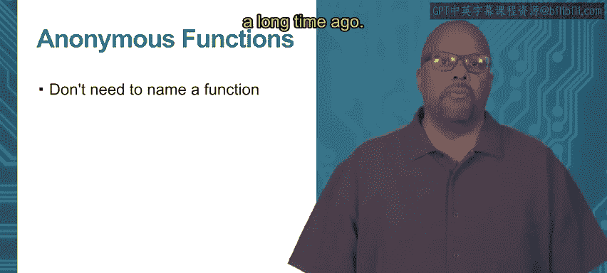

# Go语言编程：模块2：函数类型：一等值 🎯


在本节课中，我们将要学习Go语言中一个重要的概念：**一等值**。具体来说，我们将探讨如何像处理整数、字符串等普通数据类型一样，来处理函数。这包括将函数赋值给变量、动态创建函数、将函数作为参数传递或作为返回值，以及将函数存储在数据结构中。掌握这些概念，将帮助你编写更灵活、更强大的Go程序。

---

## 变量作为函数 🧩

上一节我们介绍了函数作为一等值的概念。本节中，我们来看看如何将函数赋值给变量。

在Go语言中，你可以声明一个变量，其类型为函数签名。这意味着这个变量可以指向一个具体的函数，并像调用普通函数一样使用它。

以下是实现步骤：

1.  声明一个变量，并指定其类型为函数签名。函数签名定义了参数类型和返回值类型。
2.  将一个已定义的函数赋值给这个变量。注意，赋值时**不**使用括号 `()`。
3.  之后，你就可以通过这个变量名来调用函数了。

**代码示例：**
```go
// 1. 声明一个函数类型的变量
var funcVar func(int) int

// 2. 定义一个实际的函数
func incFn(x int) int {
    return x + 1
}

func main() {
    // 3. 将函数赋值给变量（注意没有括号）
    funcVar = incFn

    // 4. 通过变量调用函数
    fmt.Println(funcVar(1)) // 输出：2
}
```
在这个例子中，`funcVar` 变量成为了 `incFn` 函数的一个别名，调用 `funcVar(1)` 与调用 `incFn(1)` 效果完全相同。

---

## 函数作为参数 📤

我们已经学会了如何将函数赋值给变量。接下来，我们将探讨如何将函数作为参数传递给另一个函数。

这允许你编写更通用的高阶函数。例如，你可以创建一个“应用”函数，它接受一个操作函数和一个值，然后将这个操作应用到该值上。

**代码示例：**
```go
// 定义一个高阶函数，它接受一个函数 `f` 和一个整数值 `val`
func applyIt(f func(int) int, val int) int {
    return f(val) // 调用传入的函数 `f`，并传入参数 `val`
}

// 定义两个具体的操作函数
func incFn(x int) int { return x + 1 }
func decFn(x int) int { return x - 1 }

func main() {
    // 将 `incFn` 函数作为参数传递给 `applyIt`
    fmt.Println(applyIt(incFn, 2)) // 输出：3
    // 将 `decFn` 函数作为参数传递给 `applyIt`
    fmt.Println(applyIt(decFn, 2)) // 输出：1
}
```
`applyIt` 函数本身并不关心你传入的是 `incFn` 还是 `decFn`，它只是忠实地执行你给它的任何函数。这使得代码的复用性大大提高。

---

## 匿名函数 🎭

上一节我们传递了有名字的函数作为参数。然而，有时为了一次性使用的函数专门起个名字并不方便。本节中，我们来看看**匿名函数**。

匿名函数就是没有名字的函数定义。你可以在需要函数的地方直接定义它，特别是在作为参数传递时，这能让代码更简洁。

以下是使用匿名函数重写上一节例子的方式：

**代码示例：**
```go
func applyIt(f func(int) int, val int) int {
    return f(val)
}

func main() {
    // 直接定义一个匿名函数作为参数传入
    fmt.Println(applyIt(
        func(x int) int { return x + 1 }, // 匿名递增函数
        2,
    )) // 输出：3

    fmt.Println(applyIt(
        func(x int) int { return x - 1 }, // 匿名递减函数
        2,
    )) // 输出：1
}
```
如你所见，我们直接在 `applyIt` 的调用中定义了函数逻辑 `func(x int) int { return x + 1 }`，而无需事先通过 `func incFn...` 来声明。这种方式在函数逻辑简单且只使用一次时非常便捷。

---



## 总结 📝

本节课中我们一起学习了Go语言中将函数视为**一等值**的核心特性。我们掌握了三个关键技能：
1.  **将函数赋值给变量**，让变量成为函数的引用。
2.  **将函数作为参数传递**，从而编写出能接受不同操作的高阶函数，提升代码的抽象能力和复用性。
3.  **使用匿名函数**，在需要的地方直接定义函数逻辑，使代码更加紧凑。

这些特性源自函数式编程思想，虽然Go不是纯函数式语言，但合理利用这些一等函数特性，能让你写出更清晰、更灵活的代码。在接下来的学习中，你会看到这些概念如何被应用于更复杂的场景，例如闭包和回调函数。