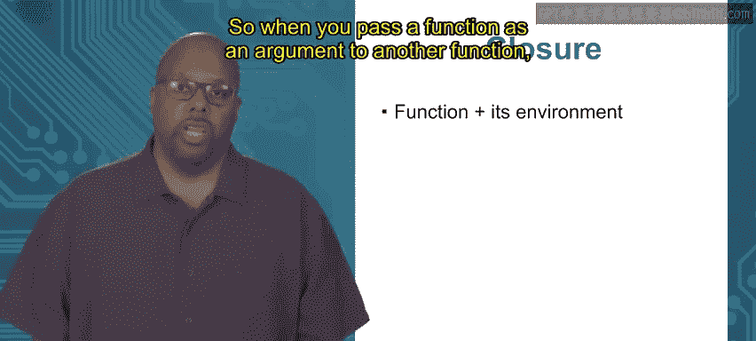

# Go语言编程：模块2：函数类型


## 概述
在本节课中，我们将要学习Go语言中一个高级但强大的概念：函数可以作为其他函数的返回值。我们将探讨为何需要这样做，并通过一个具体的例子来理解其工作原理。此外，我们还将介绍与函数密切相关的两个重要概念：**环境**和**闭包**。

---

## 章节 2.1.2：返回函数 🧩

函数也可以将其他函数作为其返回值。那么，为何要这样做呢？

一个主要原因是，当你希望创建一个具有特定目的、且可参数化的新函数时，这非常有用。你希望根据某些输入数据来改变函数的行为，从而创建一个功能不同的新函数。通过这种方式，你可以让一个函数生成另一个具有不同参数集的新函数。

为了更清晰地说明，让我们来看一个具体的例子。

### 示例：创建可自定义原点的距离计算函数

假设我们想要一个计算点到原点距离的函数。它接收一个点的X、Y坐标，并返回到原点的距离。本质上，它执行的是勾股定理。

但是，如果我们希望原点可以移动呢？例如，在物理学中，原点可能会根据问题情境（如一个移动的汽车）而改变。我们希望距离计算函数能适应不同的原点位置。

我们可以将原点的位置视为这个函数的参数，并为每个不同的原点创建一个新的距离计算函数。

以下是实现方法：

```go
func makeDistOrigin(ox, oy float64) func(float64, float64) float64 {
    fn := func(x, y float64) float64 {
        return math.Sqrt(math.Pow(x-ox, 2) + math.Pow(y-oy, 2))
    }
    return fn
}
```

让我们详细解析这段代码：
*   `makeDistOrigin` 函数接收两个 `float64` 参数 `ox` 和 `oy`，它们代表原点的坐标。
*   它的返回值类型是 `func(float64, float64) float64`，即一个接收两个 `float64` 并返回一个 `float64` 的函数。
*   在函数体内，我们定义了一个名为 `fn` 的新函数。这个 `fn` 函数接收点的坐标 `(x, y)`，并使用勾股定理计算该点到固定原点 `(ox, oy)` 的距离。
*   最后，`makeDistOrigin` 函数返回这个新创建的 `fn` 函数。

**关键点**：`makeDistOrigin` 函数本身并不计算距离，它的职责是**生成**一个专门用于计算到特定原点距离的新函数。

现在，让我们看看如何在主函数中使用它：

```go
func main() {
    // 创建计算到原点 (0,0) 距离的函数
    Dist1 := makeDistOrigin(0, 0)
    // 创建计算到原点 (2,2) 距离的函数
    Dist2 := makeDistOrigin(2, 2)

    // 计算点 (2,2) 到原点 (0,0) 的距离
    fmt.Println(Dist1(2, 2))
    // 计算点 (2,2) 到原点 (2,2) 的距离
    fmt.Println(Dist2(2, 2))
}
```

运行结果将首先打印出点 `(2,2)` 到原点 `(0,0)` 的距离（约2.828），然后打印出到原点 `(2,2)` 的距离（为0）。

通过这种方式，我们利用 `makeDistOrigin` 函数创建了两个具有特殊用途的函数，它们的“内置”原点参数各不相同。

---

上一节我们介绍了如何返回一个函数，并看到了一个实际应用的例子。本节中，我们来深入理解支撑这一机制的两个核心概念：**环境**和**闭包**。

### 函数的环境

每个函数都有一个**环境**。环境是指在函数内部有效的所有名称（变量、常量等）的集合。这包括：
1.  在函数内部**局部定义**的所有名称。
2.  根据**词法作用域**规则，函数可以访问其**定义所在代码块**中的变量。

Go语言采用词法作用域。请看以下示例代码块：

```go
x := 10 // 外部变量

func fo(y int) int {
    z := 5 // 局部变量
    return x + y + z // fo可以访问x, y, z
}
```

对于函数 `fo` 来说，其环境（即可访问的变量）包括：
*   局部变量 `z`。
*   参数 `y`。
*   定义在同一外层代码块中的变量 `x`。

### 闭包

当我们将函数作为值（例如，作为参数传递或作为返回值）进行处理时，**环境会与函数绑定在一起**。这个“函数加上其环境”的组合体，就称为**闭包**。

在Go语言的实现中，闭包可以被理解为一个结构体，它包含一个指向函数代码的指针和一个指向其环境的指针。

这意味着，当你传递一个函数时，你同时传递了它定义时所处的环境。当这个函数在别处被调用执行时，它仍然能够访问和操作其原始环境中的变量。

### 闭包在示例中的应用

让我们回到 `makeDistOrigin` 的例子：



```go
func makeDistOrigin(ox, oy float64) func(float64, float64) float64 {
    fn := func(x, y float64) float64 {
        // 这里可以访问 ox, oy, x, y
        return math.Sqrt(math.Pow(x-ox, 2) + math.Pow(y-oy, 2))
    }
    return fn // 返回闭包（函数fn + 环境{ox, oy}）
}
```

内部函数 `fn` 形成了一个闭包。它的环境包含了外部函数 `makeDistOrigin` 的参数 `ox` 和 `oy`。

当我们调用 `makeDistOrigin(0, 0)` 时，它创建并返回了一个闭包。这个闭包中的函数 `fn` **“记住”**了此时 `ox=0`, `oy=0` 的环境。因此，之后无论在哪里调用 `Dist1(2, 2)`，它计算的都是到原点 `(0,0)` 的距离。

同理，`makeDistOrigin(2, 2)` 创建了另一个独立的闭包，其函数 `fn` 记住了 `ox=2`, `oy=2` 的环境。

这就是闭包的力量：它允许函数“携带”其诞生时的数据，并在未来的任何调用中持续使用这些数据。

---

## 总结
本节课中我们一起学习了Go语言中函数作为返回值的用法。我们通过构建一个可自定义原点的距离计算生成器，理解了创建具有特定行为的函数的价值。更重要的是，我们深入探讨了**环境**和**闭包**这两个核心概念。闭包是“函数及其环境的结合体”，它确保了当函数被传递到其他作用域执行时，依然能访问其定义时的变量。掌握闭包对于理解Go中高阶函数的行为至关重要。