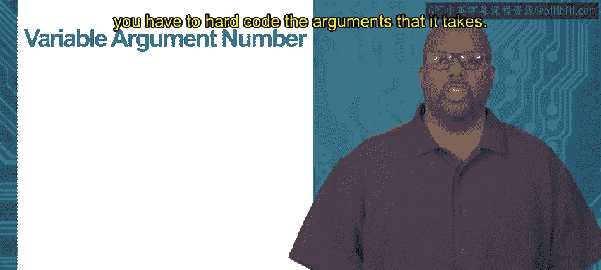
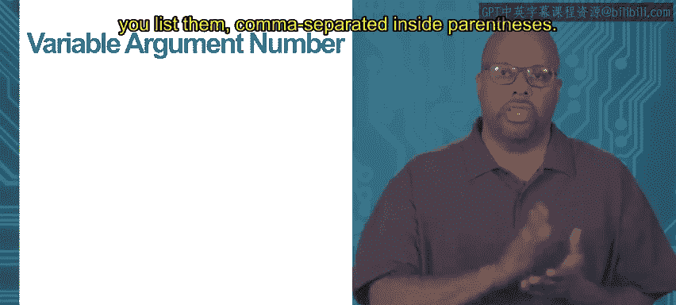
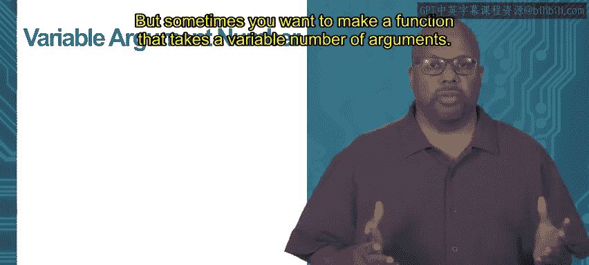
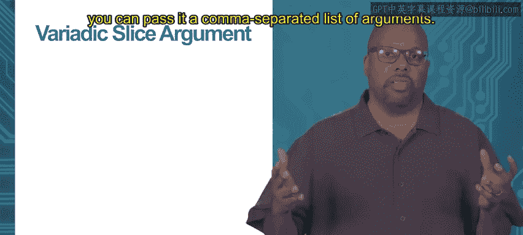
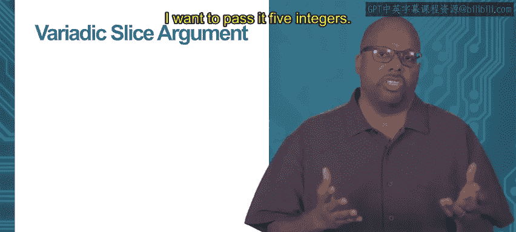
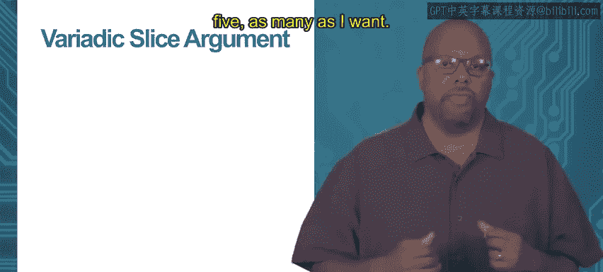
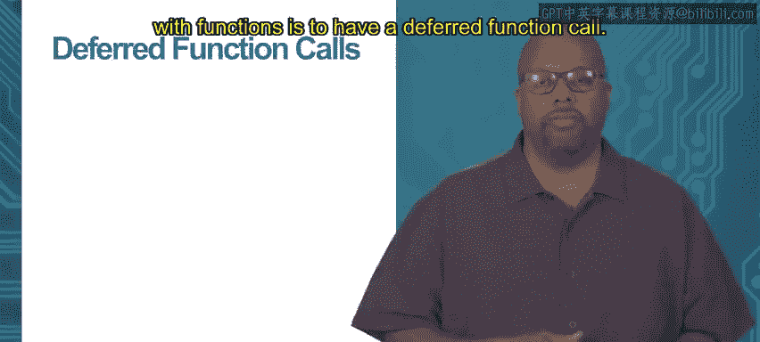
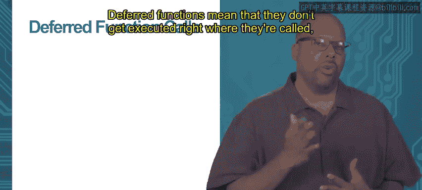
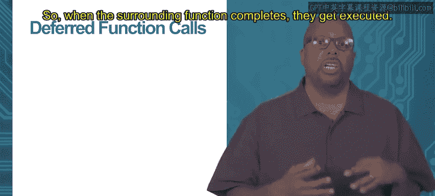
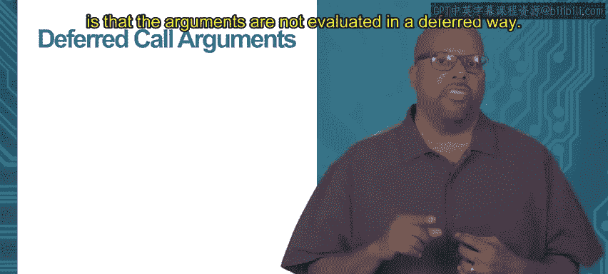

# 加州大学尔湾分校《Go语言编程｜Programming with Google Go》中英字幕 - P43：9_模块2 2 2 可变参数和延迟执行.zh_en - GPT中英字幕课程资源 - BV1ggpcevEJf

Module 2 functions in organization， topic 2。1， veryatic and deferred。

So we've been talking about functions generally， we're going to talk about a few more variations on functions about how you can pass the arguments and how you can get them to execute at different times。

One useful tool is to be able to pass a variable number of arguments to the function。

So normally when you define a function， you have to hard code the arguments that it takes。

 so if it takes three arguments， you list them， comma separated inside parentheses。

 but sometimes you want to make a function that takes a variable number of arguments。

So and there are a lot of functions like this， maybe you want to take a number of integers and you don't know how many integers。

 if you take two， you take 10， you can still work with them and do the same thing with the whole set of integers regardless of how many is taken。

So in that case， you would like to be able to pass it a variable number of arguments。

 you can do that using this e ellipsis character， not character really。

 but ellipsis it's just three dots， three period dots in a row。

 and you put that there inside the argument list to specify that you want to have a variable number of arguments。

😊，And inside the function， when you get this argument， it looks like a slice。

So if we look at the function there it called get max and it's supposed to get the maximum integer out of a set of integers that you pass it as an argument。

 so if you pass it， two integers or 10 integers or whatever it is。

 it should go through all those integers， find the greatest one and return that。

So we want to be able to take a variable number of arguments， so you can see highlighted in red。

 I say vows， dot dot dot int。 so it takes an integer。

 but that dot dot dot before integer means it can take as many integers as you want to take。

So then inside the function。This vowel's argument is treated like a slice of integers。

So the function just basically you can see what it does。

 it just goes through this whole actually you can see the for loop right。

 it goes through the range of valves so it just iterates through these all the integers inside valveels。

 finds the biggest one， sets max V to whichever one is the biggest。

 and then in the end it returns max V。So so this is just a useful tool。

 You can take a variable number of arguments。 Just use this ellipses as dot dot dot inside the argument list。

 and you can treat the the argument， the parameter just like a just like a slice。 Now。

 another variation on that。😊，Is let's say rather than say you got some one of these verytic functions。

 It takes a variable number of arguments。 You can pass it a comma separated list of arguments。

 So say say for my get max， I want to pass it55 integers。

 I could pass it1 comma 2 comm 3 comm4 of 5 know as many as I want right which is what I do actually in this example right here。

 you can see get max 1 3 6 of 4。 and I can make that list as long as I want。

 But another way to pass a variable number of arguments is just to just pass it a slice。

 So that one comma 3 6 of 4。 that could already be prepackaged in a slice。

 And then you could pass the slice to this get max function。 So that's what I'm doing below v slice。

 my slice is equal to slice of 1，3，6，4。😊。

And then I pass that in the last line where I do the print line。 I say。

 I call getm and I pass it V slice， which is my slice。 Now notice。

When I do that that right after the word v slice， I have the ellipses again。 So period dot dot dot。

 you have to put that there so so that it knows it instead of passing a comma separated sequence of arguments。

re this v slice is meant to be a slice of all the arguments put together。 But once you do that。

 you can just pass the entire slice to the function and it works fine。

 So another thing that is sometimes useful with functions is to have a deferred function call。😊。

Deferred functions mean that they don't get called。

 they don't get executed right where they're called。 They get executed later。

So when the surrounding function completes， they get executed。

 So typically you use this for cleanup activities。 So say you're doing something opening files or doing whatever you're doing。

 maybe you'll have a deferred function， which closes all the files at the end or something like that。

 So this function doesn't actually get called until the surrounding function is done and say you're done with all the files that you're interested in。

 Then it gets called as you're exiting and closes all the files。

 So it does some kind of cleanup activity。 So this is a common common thing to use it for for this type of cleanups afterwards。

 So as an example， we got our main function right here。😊。

First thing we do is we call， oh all you do to do the defer is just put the keyword defer in front of the function call。

 So here we got defer print line， so defer FMT print line by。

Now it and then the next line is just FMT print line Ho。 Now。

 if they were executed in the order that they're written， you would print by and then hello。 But。

 of course， since we since we deferred it， whatll happen is hello willll get executed first。

 Then defer will not be executed until the main function。

 The surrounding function actually completes。 So what'll actually get printed is hello and then by。

 So one thing to remember about these deferred arguments。 Def function calls。😊。

Is that the arguments are not evaluated in a deferred way。 The arguments are evaluated immediately。

 but the call is deferred。 So what does that mean， sometimes it doesn't mean anything。 you know。

 if you just pass it pass the function some kind of a fixed argument that can't change doesn't need evaluation that doesn't mean anything。

 but if you pass it an argument that needs to be evaluated。

 you have to note that that argument is evaluated right there where the deferred statement is。

 not later when the call actually happens。 so as to show this， you got a main。

And then this main， you can see in there there's a defer print line and then there's a format that print line at the end。

But there is also a variable called I I set it equal to1。 Now， when I do the defer。

 I say print line I plus 1。 Now at the point where that defer statement is I equals 1。

 so I plus1 equals 2， so a 2 should get printed。But then notice that the line after that。

 I say I plus plus， and then I say I print hello。😡。

And remember the def will not be executed until later after the whole main is complete。

 So by the time that deferred statement that deferred print line executes。

 the value of I will actually be 2， right because I starts off at one as one。

 it gets incremented plus plus So it should be two by the time you actually execute that deferred statement。

 And then if you were to evaluate the argument at that time， you would say I plus1，2 plus1。

3 or 3 would get printed。 What actually gets printed is a two。

Because that i plus1 is evaluated right there when the deferred statement。

 when it hits the deferred statement， the i plus1 is evaluated， and at that time， I is a1。

 so I plus1 is a two。 So later when the deferred statement actually gets executed。

 it still printeds2。Thank you。