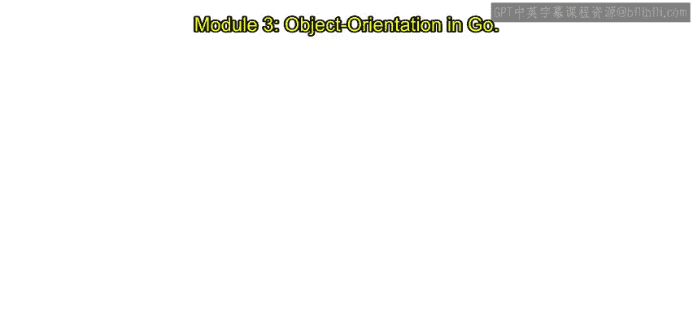
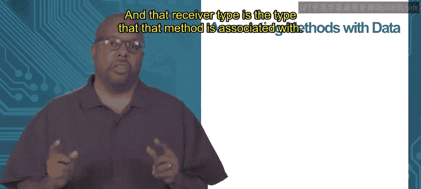

# Go语言编程：3.1.2：类的支持（上） 🧩



在本节课中，我们将要学习Go语言如何实现面向对象编程中的“类”概念。Go语言没有`class`关键字，但它通过独特的方式将数据和方法关联起来，实现了类似的功能。我们将重点介绍**接收者类型**的概念，以及如何通过它来定义和调用方法。

---

## 没有`class`关键字

Go语言没有`class`关键字，因此它没有官方定义的“类”。然而，它通过其他机制实现了类似的功能。

在其他面向对象语言（如Python）中，通常会使用`class`关键字来定义一个类，并在其代码块内定义数据字段和关联的方法。例如，在Python中定义一个`Point`类：

```python
class Point:
    def __init__(self, x, y):
        self.x = x
        self.y = y
```

在这个例子中，`__init__`是构造函数，`self.x`和`self.y`是与`Point`类关联的数据字段。Go语言不采用这种方式，但它可以通过**接收者类型**来达到类似的效果。

---

## 通过接收者类型关联方法与数据



一个“类”本质上是一组数据以及与这些数据相关联的一组方法。在Go语言中，我们通过**接收者类型**来将方法与特定类型的数据关联起来。

当你定义一个函数时，可以为其指定一个接收者类型，这个类型就是该方法所关联的数据类型。调用该方法时，使用标准的点号（`.`）表示法。

以下是定义和使用接收者类型的步骤：

1.  **定义新类型**：首先，定义一个自定义类型。
2.  **定义方法**：在函数名前，用括号指定接收者类型。
3.  **调用方法**：使用该类型的变量，通过点号表示法调用方法。

让我们通过一个例子来具体说明。

---

## 示例：为自定义类型添加方法

假设我们定义一个新类型`MyInt`，它本质上是`int`类型：

```go
type MyInt int
```

现在，我们想为`MyInt`类型添加一个`Double`方法，该方法将整数值翻倍并返回。

以下是定义和调用该方法的代码：

```go
// 为MyInt类型定义Double方法
func (mi MyInt) Double() int {
    return int(mi * 2)
}

func main() {
    var v MyInt = 3 // v是MyInt类型
    fmt.Println(v.Double()) // 输出: 6
}
```

**代码解析**：
*   `func (mi MyInt) Double() int`：这里`(mi MyInt)`就是接收者声明。它表示`Double`方法是与`MyInt`类型关联的。`mi`是接收者变量，在方法内部代表调用该方法的`MyInt`值。
*   `v.Double()`：当调用`v.Double()`时，Go语言会查找与`v`的类型（即`MyInt`）关联的`Double`方法并执行。

**重要限制**：你只能为**同一包内定义的类型**添加方法。这意味着你不能为内置类型（如`int`、`string`）或其他包中定义的类型直接添加新方法。

---

## 隐式的方法参数

虽然`Double`方法的定义看起来没有参数，但实际上它有一个**隐式参数**——接收者本身。

当调用`v.Double()`时，变量`v`会作为隐式参数传递给`Double`方法。在方法内部，我们通过接收者变量`mi`来访问这个值。

这一点非常重要，因为Go语言中所有的参数传递都是**按值传递**。这意味着：

*   当`v`被传递给`Double`方法时，传递的是`v`的一个**副本**。
*   方法内部对接收者变量`mi`的修改，**不会**影响原始的变量`v`。

理解这个机制对于编写正确操作数据的方法至关重要。

---

## 总结

本节课中我们一起学习了Go语言对“类”概念的支持方式：

1.  Go语言没有`class`关键字，但通过**接收者类型**实现了数据与方法的关联。
2.  使用`func (receiver Type) MethodName() returnType { ... }`的语法来定义方法。
3.  通过`variable.MethodName()`的点号表示法来调用方法。
4.  接收者会作为**隐式参数**按值传递给方法，这意味着方法接收的是原始数据的副本。

在下一节中，我们将进一步探讨如何利用这种机制来模拟更复杂的类行为，例如定义操作结构体的方法。