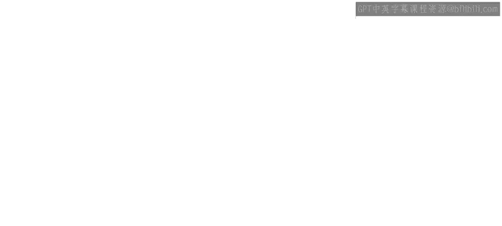
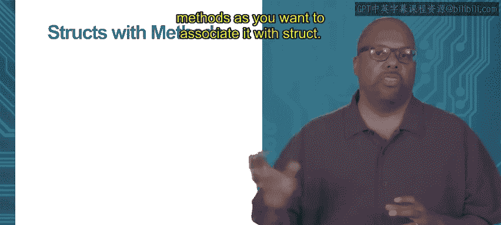

# 加州大学尔湾分校《Go语言编程｜Programming with Google Go》中英字幕 - P46：12_模块3 1 3 类的支持（下）.zh_en - GPT中英字幕课程资源 - BV1ggpcevEJf

Module 3， object orientation and Go topic 1。3 support for classes。

Now in a normal object oriented language， a class is defined。

 it's data associated with some kind of methods。And usually you can you can associate lots of different data。

 you can roll up lots of different variables， maybe an in to float， whatever type of data。

 you can put a lot of it as much as you want together and then associate that with any number of methods。

And you can do the same thing and go。 Of course you're gonna use a receiver type。

 just like we talked about。 you don't have class。 you have receiver types。

 but you can just use a type that has lots of data in it。

 So before we were using examples where the type was just an ant， my ant it was just an int。

 one piece of data。 But you can make it's very common to use a struct as as a receiver type。

 a struct of some kind。 So becausestructs basically allow you to compose all kinds of different data fields right So in this case。

 my point struct， I'm just composing two numbers， an x and a y both floats。

 So two floating point numbers， they're composing one struct。 So remember with a struct。😊，You can。

 can compose arbitrary。An arbitrary amount of information you can put together。 Okay。

 so sos so it's very common to see type a receiver type be a struct of some kind with lots of different data。

And it's a traditional feature class to be able to just roll lots of different data together。

Now thesestructs with methods， you can take a struct and define it as a type。

 like we just did with that point type， and then you can associate methods with that type。

 and then you get what you would normally think of as a class in another language you get this struct with lots of different data and with lots of different as many methods as you want associated with the struct。

So we got an example of that right here。We're using the point that I defined just in the last slide。

 So this point， I want to make a function called dis to origin。And I'm defining right there。

 notice that to the left of the name of the function dista origin。

 I pass it a point P point right when I say I pass it。

 it's an implicit pass right so it doesn't have any explicit arguments but its receiver type is a point called P and that will be implicitly passed to disISta origin。

Now then if you look at the function， the insides of it。

 the internals is just doing Pythagorean theorem right it's taking the squaring the x。

 squaring the y， adding together， then it returns the square root。

 So it just does Pythagorean theorem nothing sophisticated。 And then in my main。

I can make a point P1 is3 comm 4， and then I can just call p1。Dta originig。

And that P1 together with its x and Y coordinates， will be implicitly past to dista origin。

 dista origin will then compute z Pythagorean theorem and return the distance。

 which is five in this case。Thanks。