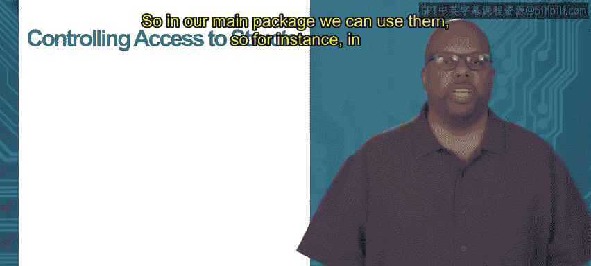

# 加州大学尔湾分校《Go语言编程｜Programming with Google Go》中英字幕 - P47：13_模块3 2 1 封装.zh_en - GPT中英字幕课程资源 - BV1ggpcevEJf

Module 3 or object orientation in go topic 2。1 encapsulation。

 So go provides a lot of different support for encapsulation and keeping private data。

But you want to be able to have controlled access to the data so typically even if you have private data in some package。

 you probably don't want to hide it completely or else why are you even importing it in the package importing it anyway you hide it but you want to have controlled access to it So what that means is you want people to be able to use that data but only in the way that you define using your methods so or functions so what you want to do what you can do is you can define a set of functions。

 public functions that allow somebody allow another package an external package to access the hidden data。

So as an example， say I got my data package right there， package data。

 got my hidden variable x x and equals 1。Now then I can define inside that same package a function called print X and print X just print X。

 okay， it does exactly what it says。 Now print X notice it starts with a capital letter。

 so that means it gets exported。So if my main package decides to import the data package。

 will the main package will be able to access this printex method。

 even though it can't directly access the X and so now what happens is I can access the main method。

 the main function can access the X variable only through this print X function。

 so if I want to see the x value， I have to call print X。So if I look in in my main code。

 I import the data and then in my main I can call data dot print X and then I can see the value of x。

 even though I couldn't directly access x from my main。

 I can indirectly access it through these these public functions So this is generally how we're going control access to data that we want to hide you know you want to give access。

 but only in a control fashion， we let them see what what we want them to see the idea also to modify code to modify X right I mean。

 as it is。X cannot be modified externally right， There's no。

 there's no way the main can directly see X or modify it。

 but if I wanted to allow the main to be able to modify X。

 I could make some kind of a function inside the package which started with the capital letter that main could call to access the variable。

So we can do this with structures too。Say there's some kind of you know。

 we have some kind of a type that's a structure。 like our point type。

 We put that in our data package again， right and maybe the x and the y at coordinates。

 we don't want the the outside user， the person who's using this type to be able to directly modify X and y。

 We want to be able to control their their observation and their control their modifications to X and y。

 So we call we give them lowercase names， lowercase X lowercase y。

 But we define a set of functions inside that package。

 the data package that allow them that are public and allow another package to use to X access X and y in some way。

 So， for instance， first one you might want to define is init me that I'm defining down here。

 And that notice it is associated with the with the point type。😊，The receiver type is point。

 So P star point I call a knit me and a ni me just allows me to initialize x and y， right。

 That's something clearly you're going to want to do。 You make a point。

 You want to initialize the x and y values。 So I do it through this a knit me a nime method that I'm defining。

 And it just sets P x equal to the first argument， P y equal to the second argument。

So so in this way using this function， this a nime function， I can modify X and y。

 even though I can't directly touch X and y， I can do it through this function then a few more functions that you might want to add to allow access to the X and Y they're hidden this is scale so scale again it is associated with a point it's a receiver type of point。

And scale， you pass it a floating point number V， and it just scales x and y together。

 so it multiplies p dot x times the scale factor， P dot y times the scale factor。Again。

 we're not trusting a user， the programmer to do this， we're scaling it。

 we're scaling both of them together， so if they want to scale， they have to call our scale function。

 they could scale them both。Also， print me。Maybe I want to be able to print the X and Y values and since since you another package can't directly access X and Y to call print line on it。

 we have to provide a function for that print me and it just goes in there and prints out the X and Y。

 print out P do to X P Y。 So now you define this set of functions set of methods really because they're all associated with the type point。

And these methods are all public because we started them with capital letters， Pri me scale。

 They're all capital。 so we can access them outside and say， our main package。

So in our main package we can use them so for instance。

 in this main we declare we declare we make a point date point P called P。

 then we call P dot and it me to initialize its x and y to3 and4 then we call P dot scale to scale it to multiply three and four times 2 so it should be 6 and8 then we call p dot print me it prints 6 and8 So if we ran this it would work and in this way。

Even though even though we can't from the main， we can't directly access x and y。

 we can't say P dot x equals B， P do y equals， but we can access them through these functions。

 these rather methods that are provided to us in a controlled way。Thank you。

