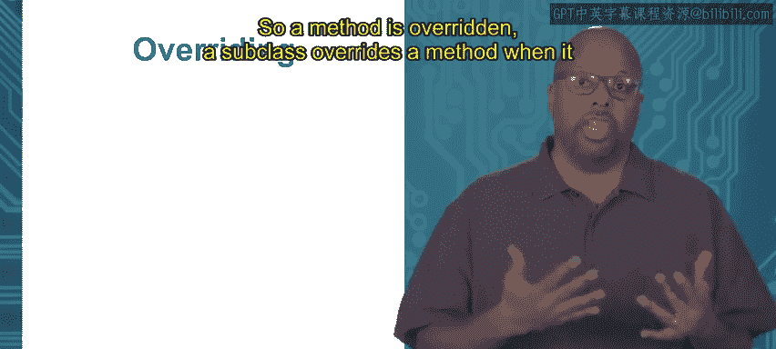

# 加州大学尔湾分校《Go语言编程｜Programming with Google Go》中英字幕 - P50：16_模块4 1 1 多态性.zh_en - GPT中英字幕课程资源 - BV1ggpcevEJf

Module 4 interfaces for abstraction， topic 1。1 polymorphism。

Polymorphism is a property。Very commonly associated with object oriented programming。

It's the ability that for an object to have different forms depending on the context。

 so what does that mean different forms， that can mean a lot of things。

 but what it typically means is that you can have a function or method with one name。

 know area and it does one thing for one object and another thing for another type of object so in one so for instance。

 take area if you want to compute the area of a rectangle that's base times height。

 you're going to compute the area of a triangle is one half base times height So the same function name is going to do two different things depending on the context if you're doing it with respect to a rectangle or with respect to a triangle。

 So that's what polymorphism is So you would say oh area is polymorphic it's polymorphic because it can do two different thing depending on the context。

So， and another way to think about it is that。These two area implementations。

 they are at a high level of abstraction。 They are identical。 What they do is they compute the area。

 right no matter what the objective iss a rectangle or if it's a triangle。

 the area is what's computed。 So at a high level forgetting the detail。

 they do the same thing at the low level and how they actually compute the area。

 they are different right So so really polymorphism is a way of establishing an abstraction。

 These things are the same at the high level of abstraction。

 but underneath they're different right so that's what we want to allow。

 It's very it's useful for a lot of reasons。 So we need we need go length to have some type of support for for polymorphism。

 So what I'll first describe is how polymorphism is usually implemented in traditional object oriented languages。

So one thing that is usually used in objected languages to support polymorphism is inheritance and Going does not have inheritance。

 so I'll just say that again， Going does not have inheritance。

 Inheritance is where you get a series of classes and they have this class subclass super class relationship。

 or sometimes you call it parent and child class， parent class child class。

 So the superclass is the top level class， and the subclass is extends from the super class。

And the subclass inherits the methods and data of the superclass。 So as an example。

Maybe I've got a speaker superclass and a speaker is supposed to represent everything that can speak right with anything that can make noises。

 Okay， you call that a speaker。 Now underneath a speaker。

 a subclass of that might be cat and might be dog right because cats can speak， they can make noise。

 dogs can make noise。 So maybe I've got this subclass cat， subclass dog。

 both subclass of this superclass speaker。And cat and dog will both inherit the properties of the superclass。

 So my superclass speaker， let's say it has a method called speak and that just prints out some you know whatever noise the creature makes。

 So speaker， since it's generic it speak the superclass。

 it speak method will just print out you know noise， arbitrary noise because it's generic。

But then the subclass is cat and dog。They'll also have a speak method。

 they'll inherit it from the speaker superclass， so they get the properties， they extend down。

So cat and dog are different forms of speaker， and this is where the polymorphism。

 they are different forms of each other， this is where polymorphism concepts come into play。

And remember， the go doesn't have inheritance now， inheritance is one thing that you use in a regular object oriented language to support polymorphism。

 But you also on top of that， you're going to need another property overriding the ability to override a method。

So a method is overwritten。A subclass overrides a method when it redefines a method that it inherits from the superclass。

 So in the example we're talking about here， you got this superclass speaker。 And under that。

 you got the subclass cat subclass dog and speaker has this speak method and cat and dog inherit the speak method。

 too， but without overriding the speak method， the cat speak method and the dog speak method。

 do exactly what the superclass， what the speakers speak method does。 they just print out noise。

 which is arbitrary。

So what you want is forget the cat speak method to print out meow and the dogpe method to print out Wolf right So what happens is that's called overriding where the cat。

 the cat class， the cat subclass will redefine the speak method to print out what it wants Miow right and then a dog subclass redefine it to print out what it wants Wolf。

So now the speaker class， the speaker superclass， it has its speak method。

 and cat also has a speak method。 dogg also has a speak method。

 but the cat speak and the dog speak to do two different things。

 so cat and dog classes have overridden the definition of the speak method with their own new definition of the speak method。

 So now you can say speak is polymorphic because speak can it has two different implementation for each class。

 So speak in in the context of a cat， It'll print me out concept of a dog， It'll print Wolf。😊。

But the idea is to support polymorphism， which you normally see in object joint to language。

 you see inheritance， and then you also see the ability to override a method so both the subclasses inherit the speak method。

 but then they can override it and define it the way they want。

So and one thing to note is that they actually had used the same。

 even though they're overriding the method they use the same signature， so these function signatures。

 the method signature is the same so this method speak。

 it has the same name in both cat and dog class has the same arguments and same return types so the signature will say the same and you' would call it polymorphic in that case you。

😡。