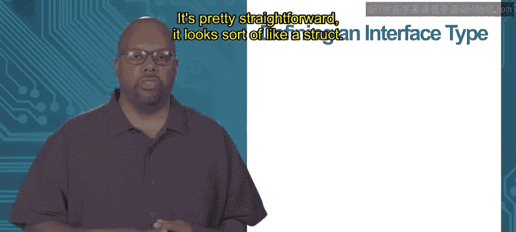

# 加州大学尔湾分校《Go语言编程｜Programming with Google Go》中英字幕 - P51：17_模块4 1 2 接口.zh_en - GPT中英字幕课程资源 - BV1ggpcevEJf

Module 4， interfaces for abstraction， topic 1。2 interfaces。

An interface is a concept used in go。And it helps us get polymorphism so we don't get inheritance。

 we don't need inheritance， we don't need overriding。

 We can use interfaces to basically accomplish the same thing。

 And you know I think it's in a better way， I think it's cleaner。

 but you know this is up this is up for argument right because people who are used to ja or something like that will like it the other way。

 they like their inheritance and you know want to fight to keep it。

 but go does it this in a different way。So an interface is basically a set of method signatures。

 so by signatures， I mean the name of the method， the parameters of the method and their types and the return values in their types。

So that's all it is there's no implementation of a method right so it just defines the signatures for the method so it says the methods have to have this name。

 these parameters， these return values， that's an interface so it's not a type or anything it's less than that。

😡，It's used to express conceptual similarity between types。So what I mean by that is。

 say you got this say I got an interface called shape 2D， right。

 and that's my interface and it's supposed to represent two dimensional shapes。

So all two dimensional shapes， I'm going to say they have to have two methods， okay。

 an area method and a perimeter method if it's a two dimensional shape。

 you got to be able to compute the area you' got to be able to compute the perimeter。

 then I call it a two dimensional shape。So my two dimensional shape interface just says， look。

 you've got to have these two methods with the arguments that I say， in this case， no arguments。

 Youve got to have these two methods in order to be considered a two dimensional shape。

 But if you have those two methods any type that has those two methods。

 it can be considered a two dimensional shape。 That's what an interface is saying。

 So it's saying that they are conceptually similar， you know， a circle， a square， a rectangle。

 a triangle， you can compute the area of all those and the primitive of all those。

 So I'm going to call them all two dimensional shapes。So satisfying an interface。

 a type satisfies an interface if it actually defines all the methods specified in the interface。

 So remember that a method in an interface， an interface doesn't specify， doesn't design。

 give you the method It just gives you the signature for the method。 it doesn't implement the method。

 So if a type actually implements all the methods in the interface with the same methods signatures。

 So same arguments， same name， same return values。 then that type is said to satisfy the interface。

 So， for instance。😊，I can have a shape 2D interface and I might have two types。

 a rectangle type triangle type， and if the rectangle type in the triangle type both define an area and a perimeter method with the appropriate arguments and return values。

 then you will say rectangle and triangle both satisfy the shape 2D interface。

 and so they can be considered to be two dimensional shapes。

Now rectangle and triangle can have lots of other methods beside besides the area and perimeter right any number of other methods。

 also rectangle and triangle can have lots of other data。

 maybe they're strs and str types and they have X Y z points who knows what they have right none of that matters as long as they have the area and perimeter that are specified in in the interface then that's enough and they can be considered to be satisfying the interface and considered to be shape two dimensional shapes so。

What that accomplishes is it basically accomplishes what you get from inheritance and overriding together right So now I've got rectangle and triangle。

 if they're both shape 2 D， if they've satisfied that interface， then they both have area。

 they both have perimeter but their area and parametermeter methods can do completely different things because when you compute the area of a rectangle。

 it is different than computing the area of a triangle right So area implementations can be different。

 but they have the same name and at the high level， they perform the same thing， they compute area。

 So in this way， we're using an interface to accomplish and gol what you would use inheritance and overriding to accomplish typically in a thing like Java or some other object oriented language So how do you define an interface type。

😊，It's pretty straightforward。 It looks sort of like a struct。 I there we got shape 2 D。

 So I say type， shape 2 D interface， Just use that keyword interface after the name of the interface in curly brackets。

 I start listing。

The signatures of the methods， so in this case there's only two methods and two signatures that I need area and perimeter。

 they both of them area perimeter take no arguments and they return a float， a 64 float。So that's it。

 That's how you define this interface。 I just list all these method signatures that I want to put in the interface。

 Now， then say later on， you know， in my code， I define a type triangle。

 and I don't even say what's in it。 I just say have an open curly code curly record with some dots just to say it doesn't matter what data I'm putting inside that triangle。

 right Maybe that data triangle。 Maybe it's astruct or something like that Who knows what it is。

 It doesn't matter。But whatever it is， as long as I define a function area whose receiver type is a triangle and a function perimeter。

 whose receiver type is also a triangle， and the area and perimeter also take no arguments and return floatat 64 is just like the interface。

 then this type triangle is said to satisfy that shape ID D interface， shapepe 2D interface rather。

So and it doesn't matter what other data is in triangle。

 what other methods are using triangles with a se type。

 as long as it's got areaan perimeter and it matches then it satisfies the interface Oh and one other thing I go on is that you don't have to state it explicitly。

So in other languages that have interfaces， you often have to say。

 you know explicitly the triangle satisfies this interface， the shape 2D interface。

 you don't say that and go。 you just say here's the interface and here's my type triangle and here are the methods for triangle and the compiler figure it can do the matching automatically says。

 oh I see you have an area in perimeter I will treat you just like I treat anything that satisfies the shape 2D interface。

😊，Thank you。