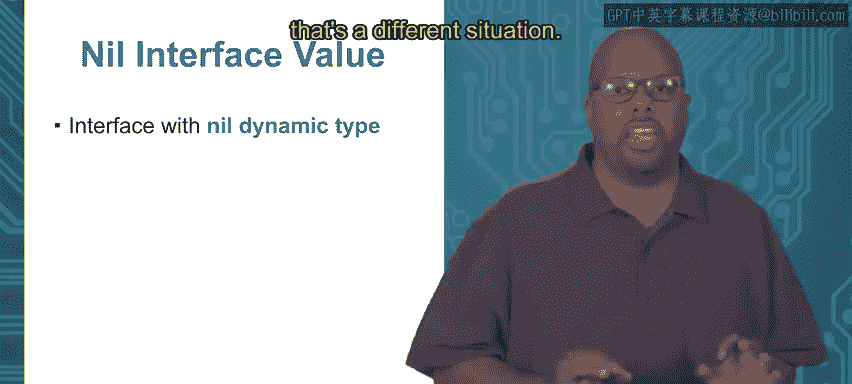

# Go语言编程：4.1.3：接口与具体类型 🆚


在本节课中，我们将学习Go语言中接口类型与具体类型的核心区别，并深入探讨接口值的内部结构，包括动态类型和动态值。

## 概述

具体类型和接口类型在本质上是不同的。具体类型定义了数据的精确表示和所有关联的方法。而接口类型仅指定了一组方法签名，不包含任何数据或方法实现。理解这种差异是掌握Go语言接口的关键。

## 具体类型与接口类型

具体类型是一种常规类型，它精确指定了数据的表示形式以及所有以该类型为接收器的方法。这意味着具体类型是完全指定的，并且拥有所有方法的完整实现。

**具体类型示例：**
```go
type Dog struct {
    name string
}
```

接口类型则不同，它只指定了一些方法签名，不包含任何数据。接口中的方法实现是抽象的，你只能看到方法的签名，而看不到具体的实现代码。

**接口类型示例：**
```go
type Speaker interface {
    Speak()
}
```

这就是两者之间的根本区别。但请记住，当你使用一个接口时，它最终会被映射到一个具体的类型。

## 接口值的构成

上一节我们介绍了接口与具体类型的定义差异，本节中我们来看看接口值的内部结构。当你创建一个接口类型的变量时，这个接口值由两个组件构成：动态类型和动态值。

*   **动态类型**：这是接口变量当前所关联的具体类型。
*   **动态值**：这是该动态类型所对应的具体值。

更具体地说，假设我们有一个 `Shape2D` 接口，以及满足该接口的具体类型 `Rectangle` 和 `Triangle`。当我们把一个 `Rectangle` 的值赋给一个 `Shape2D` 接口变量时，该接口的动态类型就是 `Rectangle`，动态值就是那个具体的矩形对象。

## 接口值示例

以下是一个具体的代码示例，帮助我们理解接口值的动态类型和动态值。

**定义接口和具体类型：**
```go
type Speaker interface {
    Speak()
}

type Dog struct {
    name string
}

func (d Dog) Speak() {
    fmt.Println(d.name)
}
```

**使用接口：**
```go
func main() {
    var s1 Speaker      // s1 是一个接口变量
    d1 := Dog{"Brian"}  // d1 是一个具体类型 Dog 的值

    s1 = d1             // 合法，因为 Dog 实现了 Speaker 接口
    s1.Speak()          // 输出 "Brian"
}
```

在这个例子中，赋值 `s1 = d1` 之后：
*   `s1` 的**动态类型**是 `Dog`。
*   `s1` 的**动态值**是 `d1`，其中包含了名字 “Brian”。
因此，接口值 `s1` 实际上是一个 `(动态类型: Dog, 动态值: d1)` 的组合。

## 动态值为 nil 的接口

接口可以拥有一个动态类型，但动态值为 `nil`（即没有具体的值）。这是合法的状态。

**示例：**
```go
func main() {
    var s1 Speaker
    var d1 *Dog         // d1 是一个指向 Dog 的指针，但未初始化，值为 nil

    s1 = d1             // 合法，s1 的动态类型是 *Dog，动态值为 nil
    s1.Speak()          // 仍然可以调用方法！
}
```

在这种情况下，`s1` 拥有动态类型 `*Dog`，但动态值为 `nil`。你仍然可以调用 `s1.Speak()`，因为编译器可以根据动态类型找到对应的方法实现（即 `(*Dog).Speak()`）。

然而，在方法实现内部，通常需要检查接收器是否为 `nil`，以避免运行时错误。

**安全的 `Speak` 方法实现：**
```go
func (d *Dog) Speak() {
    if d == nil {
        fmt.Println("<noise>")
    } else {
        fmt.Println(d.name)
    }
}
```

## 动态类型为 nil 的接口



我们刚刚讨论了动态值为 `nil` 的情况，现在来看另一种状态：动态类型也为 `nil` 的接口。这描述了一个既没有动态类型也没有动态值的接口。

**示例：**
```go
var s1 Speaker // 仅声明，未赋值
```
此时，`s1` 的动态类型为 `nil`，动态值也为 `nil`。在这种状态下，**不能**调用该接口的任何方法，因为编译器无法确定应该调用哪个具体类型的方法实现。尝试调用 `s1.Speak()` 会导致运行时错误。

## 总结

本节课中我们一起学习了：
1.  **具体类型**与**接口类型**的根本区别：具体类型包含数据和方法实现，接口类型仅包含方法签名。
2.  接口值是一个**对 (pair)**，由**动态类型**和**动态值**组成。
3.  接口可以处于两种特殊的 `nil` 状态：
    *   **拥有动态类型，但动态值为 `nil`**：可以安全地调用方法（方法内部应处理 `nil` 情况）。
    *   **动态类型和动态值均为 `nil`**：不能调用任何方法，会导致错误。

理解这些概念对于在Go中有效、安全地使用接口至关重要。