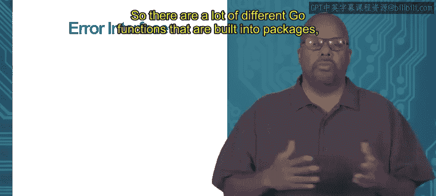
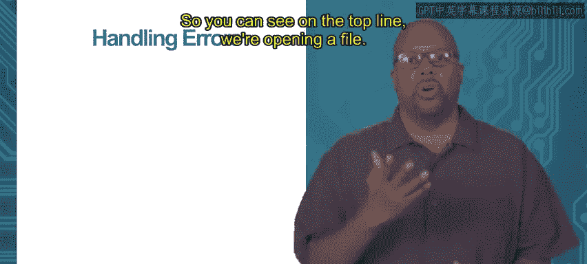

# 加州大学尔湾分校《Go语言编程｜Programming with Google Go》中英字幕 - P55：21_模块4 2 3 错误处理.zh_en - GPT中英字幕课程资源 - BV1ggpcevEJf

Module 4 interfaces for abstraction， topic 2。3 error handling。

So I just want to show a common use of interfaces in go。The error interface。

 So there are a lot of different go functions that are built into packages which return errors and when I say return error。

 what they do is they return whatever they's supposed to return and then their second return value is an error right an error interface so and we see we see it defined over here the error interface just it's any type that satisfies this interface and error interface just specifies that you have to have a method called error which prints the error message essentially which prints something some text that's useful。

So if under correct operation， the error return might be nil right so for instance。

 its say I want to open a file， right？😡，If it opens the file correctly。

 it'll return nil for the error and there's no problem， but if the error actually has a value。

 then you'll probably print the error and it'll call its error method which will successfully print the error。

Show an example of that。So basically the idea is when you this happens there are a lot of different goal language functions like this which return error as the second argument okay and so when that happens you should check that error after the call and hand it if you need to so you can see in the top line we're opening a file so OS。

 open opens a file by that name。

And it returns to things。 One is the file F。 And the second thing is an error。 if an error exists。

 So then right after that， for safety's sake， you should check the error。

 So if error not equal to nil。 So if it's if it's equal to nil， you're fine， you go on。

 If it's not equal to nil， then do a print thats sort of the most obvious thing to do to handle the error is just to print it。

 So youd print line error and return。 So printing the error， the format package， the FMT package。

 which print line is a part of。That package will call the error method of the error to generate the string and then print that string。

 and so this is sort of the generic way of handling errors and go。

 It's a very calm way to handle errors and go。Thank you。

