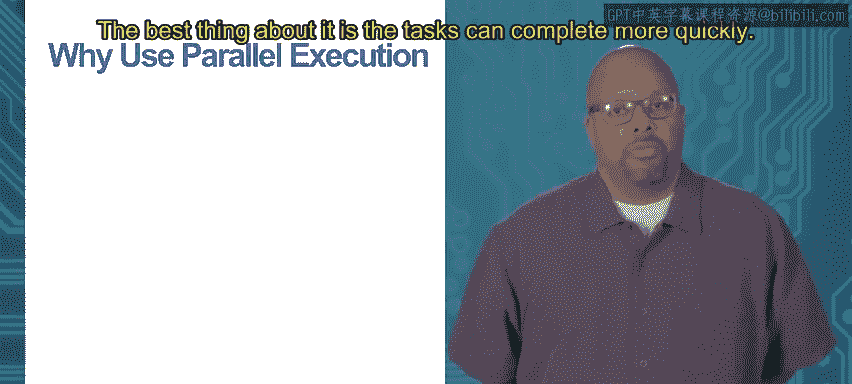
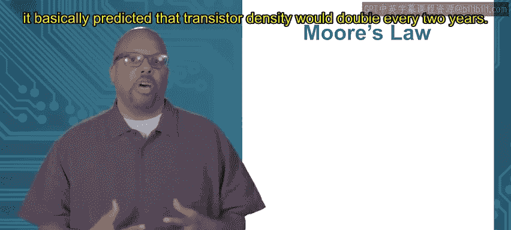
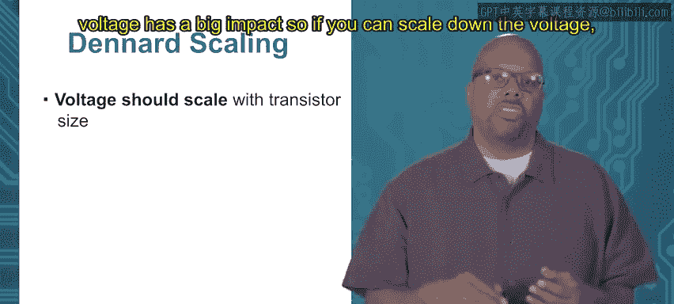

# 加州大学尔湾分校《Go语言编程｜Programming with Google Go》中英字幕 - P56：0_模块1 1 1 第3版.zh_en - GPT中英字幕课程资源 - BV1ggpcevEJf

Recor。Module1， whyU concurrency， topic 1。1 parallel execution。So go language。

 a big property of go language is that concurrency is built into the language Now we're going to talk about this term concurrency right now I'm talking about parallel execution concurrency and parallelism are too closely related ideas and we will be talking about the difference between them I'm starting with parallel but its an important feature and it's built into the language Now this is as compared to other languages like see you know in things are anything Python。

 whatever these languages you can do concurrent programming in these languages。

 but it's not built into the language meaning usually what you do is you import some library。

 some external library and then you can use the functions and it interacts with the operating system and so on gol though they decided look concurrency is important enough。

 we're going to actually bake it right in so the constructs are part of the language which so that's a good thing makes it actually usually the construct are easier to use so we're going to talk about that now right now I'm describing a parallel execution。

Because I really want to motivate why you need concurrency， okay。

 why do you need concurrency now parallel is not the same as concurrent， we'll get to it。

 but they are similar。So parallel execution is when two programs execute at the same time。

 okay exactly the same time， so then you can say these two programs are executing in parallel。

So at some particular time， any particular instant in time。

 you could say there's an instruction from one executing and an instruction from the other executing at the same moment。

 then they are executing in parallel。Now， generally， processors。

 suddenly processor cores are made to execute one instruction at a time。 Now， there are very。

 there are different architectures that do things differently。 Okay。

 there are a wide range of architectures， and this is an architecture class。

 but generally one core runs one thing at a time。One instruction at a time。

So if you want to have parallel actual parallel execution， two things running at the same time。

 you need two processor， or at least two processor courses。 you need replicated hardware。

 you would need to have one CPU and another CPU so for instance。

 you had two completely separate computers， they can clearly run two different programs at the same time or they can be the same computer。

 but maybe some multi core processors it got four cores。

 then you could run four different instructions at the same time。

 one on each core but understand that in order to get actual parallel execution。

 you need multiple versions of the hardware。 you need replicated hardware in order to get parallel execution。

 Now this is not the same as concurr sorry this is not same concurrency。

 but we'll get to the difference in a second。So why should you do parallel execution？

 What's good about it The best thing about it is that task can complete more quickly。 Now， by this。

 I mean， a particular task doesn't complete more quickly just because you're running it in parallel with another task。

 but you get better throughput， meaning overall all the tasks are completed more quickly if you're doing two things instead of one at a time or multiple right So parallel execution can speed things up。

 give you a better throughput overall。 and my simple。

 simple example is say you got two piles of dishes to wash so。😊。

when you wash a dish， you got to wash it。And then dry it So if you have two dishwashers。

 they can cooperate and work as faster， they can just can now how they cooperate is going to depend on the hardware they have available to them right so so some test has to be performed sequentially though So for instance。

 say you got So when you're drying and you're washing a dish。

 you clearly have to wash the dish before you dry the dish that's sequential。

 they have to go in that order。 they cannot happen at the same time right so parallelism。

 parallel execution is not this catch all that makes everything faster。

 certain things can't be executed in parallel。 they have to be executed sequentially one at a time so you got to wash the dish before you can dry the dish。

 but you can have a system say I wanted say I had one sink one sink and one drying rack So that's my hardware available to me and one dish rag for washing off and drying So I can have these two people work where one person wass the dish and it has it to the other person who driveries it。

Right so then in that way， somebody can be washing at the same time somebody's drawing。

 just keeps passing it over so then you're getting you're essentially getting some kind of parallel execution。

Staggggerered parallel execution。 but both people are working at the same time。

 so then you get speed up。 you get a good throughput but even though these tests can have to happen sequentially。

 you can still get get a speed up but I guess a key thing here is that some tasks are more parallelzable than others So like to this dishwashing task。

 you can't just say， okay you two guys both wash this dish at the same time and you both dry it。

 if I only have one sink， only one person can say get it into the sink so one person can wash it a time。

 and I only have one drying racks and one person can dry at a time。

 So because I don't have the hardware。 I can't parallelize them I would need two sinks to parallelize that to do washing the same time。

 and two dry racks to do dry the same time。 But in addition。

 I can never parallelize the washing of a dish with the drying of the same dish you got to finish the washing before you start the drying So some parallelization。

 even if you have extra hardware。 I can have 100 washing sinks in there。

 I still can't do washing and drying of the same。😊。

At the same time so some tasks cannot be parallelzed even with the excess hardware and that's important to know because people often think。

 well， I can just take anything and speed it up through parallelization。 That is not true。

 Some things cannot be parallelzed and that's that know it's just the nature of the computation。

Certain things have to be done in a certain order can't be done at the same time。Module1。

 why Use concurrency， topic 1。2 von Neumman bottleneck。

So we're talking about doing things in parallel， using concurrent programming to execute code in parallel。

 But why do that， coding in parallel， writing concurrent code is hard I haven't brought that up yet。

 but as we get into it， we'll see it is hard for a bunch of reasons And actually if you look at most undergraduate curriculum。

 students don't learn that， You learn sequential programming C or Python or Java or whatever language you learn sequential programming。

 and now maybe sometimes an undergrad will have a class on parallel programming。

 but maybe it's optional， maybe they take it， maybe they don't。

 but the vast majority of programming classes that you see at the undergrad level anyway。

 they are not talking about concurrent programming。

 they're just talking about sequential regular old code runs one instruction at a time。

 So programming and concurrently is actually very hard。

 So why do it Can we get a speed up without doing it clearly， if you do things in parallel。

 you can get speed up but do we need it I would argue and most people would argue yes。

 we do right now in the past。Maybe we didn't need it but now we really need it so one way to do it without one way to get speed up without parallelism is to just speed up the processor so just make a new processor that runs faster than the old processor and then you get speedups and you don't have to change the way you write your code Now this is this had been the way of things until I don't know last recently when I say recently five。

67 years ago， something like that until recent years that had been the way of things so the way things sped up majority of the way code sped up was because the processor were being built faster now I'm from hardware design community and I've always felt that that these software these programmers got away with murder because their speedup were all on our back we design better faster processors they didn don't have to do anything and they just get better faster running code that has really stopped now so part of the problem there are several reasons why that stopped it used to be when was。

kid and I'm old okay when I was a kid when I was a kid when I was in undergrad86 to 90。

 I was an undergrad back then I remember a machine would come out and you'd buy it and you think oh。

 this is the fastest thing out there and seriously a few months later maybe half a year later theyd have for the same price。

 something that was significantly faster and it would just kill you you're like wow I just bought this machine and now they got something faster。

 the clock rate just and when I say faster， I mean the clock rate went up so the clock rate would be 20% higher than mine then the thing I just bought and that was very frustrating and but this used to happen all the time。

 every small short period of time， clock rates would get faster and faster。

 And as the clock rates gets faster， the code executes faster generally a modlo memory bottlenecks which we'll talk about now。

But processes going get faster and faster。 Now one another limitation on the speed that you have now even now is this what you call the von Neuumann bottleneck so it's the delay to access memory。

 So if you think about the way a processor executes code there's a CPU that's executing the instructions and there's memory and it's the CPU has to go to memory to get the instructions also to get data that you want to use。

 you want to say x plus y equals z， you got to go to memory grab the data out add them together。

 put the result in the Z or rather into X but you have to access memory。

 So the CPU is regularly reading from memory writing back to memory and memory are always slower than the CPU。

 So if you even if you crank up the clock speed， make that thing work a lot faster。

 the memory is still slow now memory speed up slowly over time。

 but slower a lot slower than the clock rates with speed up。

 So you get what's referred to as a von Neumman bottleneck where。😊。

Even if you crank up your clock feed， you could double your clock speed。

 but your code only runs a little bit faster and that would be because even if you crank up the clock speed。

 you're still waiting on memory so you'd waste a lot of time just waiting for memory access。😡。

So what people do for that or have done in the past for that and you know they can do less so now。

 what they have done for the past for that is they build cash so fast memory on the chip。

 so you don't have to go to main memory which is too slow。

 you go to fast cash so they like to pack more and more cash onto the chip and it speeds things up。

So that's what traditionally had been done until when I say recently， you know， I don't know，5。

 six7 years， something like that， that's what happened。

 And sos clock rates would go up memory cache capacity would go up and so speed would go up these performances on these processes would just go up and up and up and as a programmer you don't really have to do anything you could just write your code the same way way you wrote your code and expect that it would speed up magically because you know because the processes themselves were getting improved So that's how it used to be that's not how it is now。

It's changed for a couple of reasons， first thing is that Moore's law， which I'm about to describe。

 has really died， I don't know what the right term is it doesn't really happen anymore。 Okay。

 so Moore's law， it basically predicted that transistor density would double every two years。

 18 months two years was was a number。

Transisted density would double every two years Now。

 you know these processes they're all a pack of transistors。

 lots of transistors that are used to do computation。 So if you can double the transistor density。

 then basically the transistors are getting smaller and smaller and they switch faster when they're smaller I meaning they can go high and low faster so as they get smaller they get faster And so when as the density increases。

 you get this speed up。 this natural speed up in the transistors。 Now this Moore's law。

 it's not really a law， law sort of a bad term。 it is not a physical law。 it's just an observation。

 So so what was observed was that if you draw actually you can see this in I don't have a picture of this image。

 but you can see processor speeds clock rates over time。 as you have time going up。

 clock rates going up and they're going up they were going up very faster now they've tapered off now if you look recently you can see that it's tapered off and the clock rates just can't get any higher can't get much higher than they are。

😊，But what we were getting for a while was this exponential increase in density over time。

 so you get an exponential or roughly exponential increase in speed。

So Moore's law was sort of doing everything for us right or most of the things for us。

 it was just getting giving us a speed up programs didn't have to worry about things and now of course in order to make Moore's law happen。

 hardware designers had to work our butts off in order to get in order to achieve this。

 I mean it's not sort of magic that transistor just get smaller would just get smaller every few years。

 that was work hard work on the part of hardware designers figuring out how to get these transistors smaller and still accurately made and all this very hard work。

 but they were consistently doing it so software people had an easy time with it but that's not how it is anymore。

 that type of thing has gone away， So software in order to continue getting speedups has to do something else to keep achieving those speedups over time。

Module1， whyU concurrency， topic 1。3 Powerwall。So as I was saying。

 the speed up that you get from Moore's law， so density increase which leads to a speed up and performance improvement。

 it can't continue so you might say， well why， why can't that just go on forever reason why because these transistors consume power？

And so sure， the density of transors can go up and up and up on these processors。

 but these transitionors consume a chunk of power and the power has now is becoming a critical issue。

And they call it power wall okay so as you increase the number of transistors on the chip。

 increasing the density， that would naturally lead to increased power consumption on the chip。

 Now back in the old days， power consumption was really low and people didn't use battery power so much。

 So nowadays， though everything's portable running off of a battery Also the density has gotten so darn high。

 the power use has gotten high。😊，Now power use， even if you are plugged into the wall and you have access to power high power leads to high temperature right if something is running consuming a lot of power。

 it's going to be physically hot so I don't know if you've ever opened up desktop computer you look inside if you look at the motherboard there's at least like a bunch of cooling like cooling fins actually you can see this picture as is a fan actually this is a very common thing inside the board。

 there's a processor， the main processor say I'm using an I7 so on the board there's gonna to be an I7。

 but it will be on top of it will be a fan just like glue screwed on top of the thing a fan with a bunch of cooling fins aluminum fins just to release the heat to let the heat dissipate and then at a fan just to air cool it to blow blow the heat away。

So this is necessary because these chips。Running at such high power that they're heating up and you need the cooling right And if you don't have the cooling。

 if you don't have this heat sink to dissipate the heat and the fan to blow away the heat。

 then it'll hurt the chip。 eventually， the chip just melts， physically melts。

 So this is basically what you call in the power wall。

 So even if you could put more transistors on there。

 you got to be careful about power now and specifically power and its impact on temperature。

 temperature is probably the biggest wall there。 But power is also an important thing because if you want to have portable device is you have battery。

 you don't want to run in your battery instantly right So power all by itself is important。

 but the temperature is probably the biggest limitation because you will melt a chip。

 if you don't if you you don't do it， if you don't cool the thing And just to note。😊。

Air cooling is the standard right， I mean， anybody who's desktop laptop。

 you air cool it or server too， you air cool it。 Now you could go to an extreme where you say。

 look I'm gonna water cool it and actually supercomputers do this。

 They have pipes they're plugged into a cool a liquid cooling system and they typically don't use water。

 they probably use liquid nitrogen。 some super cool fluid。

 they pump that through the device to cool it much better。 gives you much better cooling。

 but nobody wants that on a laptop or desktop to have to plug it into water system right maybe at a supercomputer。

 that's okay but air cooling is the best we're gonna do in practice， people want air cooling。

 they don't want tona have to go to liquid cooling so you at this limit where you can only dissipate so much heat。

So to be a little bit more specific about these limitations that happen due to power use。

What I'm showing up here is this generic equation for power， okay P P power。

 And there are a bunch of you know there's an alpha。 So alpha is a percent of time switching。

 So what that means is that these transistors， they consume power or what's called dynamic power。

 they consume power when they switch So when they go from  zero to1， one to0， they consume power。

 if they're just holding constant， if the switching， if they're not switching at all。

 then they don't consume dynamic power So that alpha is a number from0 to1。

 which indicates how often they're switching。 Now note that if if you design your system well。

 they're switching a heck of a lot right I mean， you probably want to use the transitionor to do computation。

 So that alpha should be fairly high。😊，C is a capacitance we don't want to go into detail what that is。

 but it's related to the size of the transistor， so capacitance goes down as it transistor shrinks。

 which is a good thing， so power will go down to some extent。F is a clock frequency。

 that is what you want to increase， right to make your device work fast。

 you want to increase the frequency， but note that if you increase the frequency。

 you're increasing the power。Now then there's v squared V that V is the voltage swing from low to high So what that means is that basically whenever transistor goes from 0 to 11 to0。

 those binary values， those are actually analog voltages so zero is typically zero volts and a1 might be5 volts like if it's this with an Arrduino or something like that it goes from  zero to 5 volts now in a real processor they're going to reduce that so that V is important because that notice that V is a squared factor right so if you reduce the voltage you can significantly reduce the power。

So maybe you're going to use voltage swing from 0 to 1。3 volts a 0 to 1。1 volts， something like that。

 So it's very so voltage is sort of the first thing that you want to reduce if you want to save power。

So Denard scaling is another thing sort of iss paired together with Moore's law。

 Denard scaling is what gave us these speedups that we get over time。

The idea within our scaling is that voltage， the voltage swing should scale with the transistor size。

 so as the transistors get smaller and you get more density， more transistors on the chip。

 you would also like to scale down the voltage at the same time because basically for the power reason I just told you that equation voltage has a big impact so if you can scale down the voltage。

 then you can keep power consumption and then temperature low or within limits。

So that's what you want to do want to you would like to have den art scaling。

 The problem is denard scaling can't continue forever voltageage can't go too low。

For physical reasons， first reason is that the voltage swing between low and high has to be higher than the threshold voltage of the transistor。

 so transistors have what's called a threshold voltage below a certain voltage they can't switch on。

So you got to have at least enough voltage to hit the threshold now as you shrink it。

 you can manipulate the threshold voltage， but it can only go physically so low。

And then another thing is that noise problems occur。

 So one good thing about having a big voltage swing from 0 to5 volts is if there's some kind of noise on your signal right in your system。

 which voltage your voltage， say your voltage goes plus and minus0。5 volts So instead of 5 vols。

 you get 4。5 volts that's okay because you know well it's only minus。

5 volts so you know even though the voltage is 4。5。

 you know it had to have been5 that's a high right and if instead of 0volts， you get 0。5volts。

 you say， look it's not exactly0， but it's close so you can tell the difference but the reason why that's okay is because the voltage swing from 0 to 5volts is pretty big if you have your voltage swing come down to say1volts say you use 0 vol is a low and 1 vol is a high then if you have the same noise in there05 volts of noise then when the voltage is 0。

5volts， you can't tell if it was high or if it was low so you can't recover from the errors so you become less noise tolerant and that's a big problem。

Because there's always noise in any kind of practical system， so for these reasons。

 Dennard's scaling can't continue。You can't keep scaling the voltage down there's a limit to that。

In addition。nonene of this considers leakage power so the equation I showed for power is what's called dynamic power。

 the power that the transistor uses when it switches when it goes from low to high high to low there's also another kind of power called leakage power which the transistor transistor leaks off power even when it's not switching now in the old days leakage power was pretty low compared to dynamic dynamic power because mostly because everything was big so leakage happens when you have sort of thin insulators so if you think about basically how leakage happens is there's conductor and a conductor and current leaks from one to the other。

 there's insulator in between and the insulator is not thick enough now in the old days everything was big when I say big I mean scaling was different it's not big still miroscopic but relatively big so you have thick insulators so it's hard for leakage to happen but as you scale everything down these insulators become thinner and thinner and leakage can occur and so leakage power has been growing over time so。

😊，Lakage power even scaling the voltage doesn't save you with the leakage power。

 leakage power is actually increase over time so for these reasons the power you just can't even you can't continue the deny scaling。

 you can't keep scaling the voltage down so that power equation keeps going up and that's what they mean by power wall basically we're at a place where if you get to this thing running any faster the temperature is going to go so high that the things are going to actually melt the device will actually melt in the system so。

So what happens is there's our power equation again。 You can't increase the frequency。

 not without melting things。 So what do you do， So what do designers do in order to improve performance。

 even though they can't they can't increase the frequency and beyond just improving performance。

 say you're intel， you want to sell chips right So if you you know say you come out with a generation chips that's sort of4 gigHz and the next generation is also at four gigHz。

 people may not buy the chip they need some reason to buy this thing It's got to be some improvement。

 So what do people do， they increase the number of cores on the chips。

 this is where you get multico systems。 So you probably heard of this， a processor of core。

 it basically executes a program roughly and you can have multiple of them。

 So you know when I7 might have four processored cores or something like this。

 they have variable numbers of cores but they're still increasing density。

They're putting they're just having more of this replicating hardware on the chip but they don't increase the frequency。

 they don't increase the clock frequency， they keep it roughly the same so for instance clock frequencies they go up slowly but much more slowly than they used to go up。

 but the number of cores still continue to increase。Now， the thing about having a multico system。

 having lots of cores is that you have to have parallel execution。

 parallel slash concurrent execution to exploit multico systems。

 meaning if you got four cores in your processor，And you can't run anything in parallel right then what's the point of having four cores。

 then you're using one core and the other three cores is sitting idle。

So in order to exploit these multico systems， in order to get speed up。

 you have to be able to take your program divide it amongst a bunch of cores and execute different code concurrently on the different core so this is where parallel execution becomes necessary in order to keep achieving speed up in the presence of multico systems。

 you got to be able to use to exploit this parallel hardware so you need to be able to write concurrent code just to exploit it。

😡，So that is really the motivation。 This is why concurrency is so important nowadays。

 because a programmer。Has to tell has to tell the program how it's going to be divided amongst cores that's really what concurrent programming is doing It's saying。

 look， here's a big piece of code。 you can put this on one core， this on another core。

 this on another core these things can all run together That's what the program is doing when you're doing concurrent coding and you have to do that meaning there are actually it's funny There are things called parallel compilers there's a big research field or there was anyway they still is in parallel compilers and what they supposed to do is they take sequential code or regular C program or whatever language and they parallelize it So they do concurrent programming automatically for you。

 They say， look here's a big piece of code。 I'm going chop it up into these different tasks that can all run concurrently。

That is an extremely hard problem and it basically I hate to say it but it doesn't work that well now I know and I say that I'm going to fan a bunch of researchers。

 but it doesn't work that well and so what has to happen is since you can't automate that easily you need the programmer to actually do that that's what concurrent programming is the programmer is saying look I can decompose this task in the following way。

😡，It's hard but it's important now because dont if the code programmer doesn't do it。

 then it's not going to get done， everything runs on one core and then what's the point of having four cores if you're running everything on one core。

😡，Thank you。