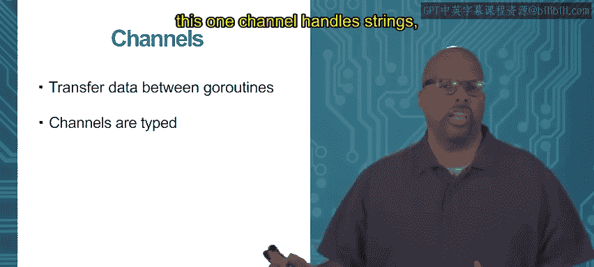
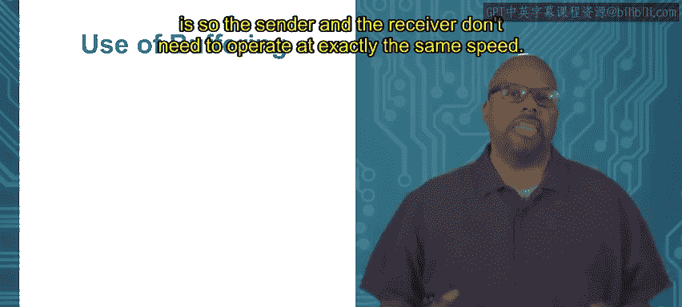

# Go语言编程：模块3：Go程通信 🧵


在本节课中，我们将要学习Go程之间如何进行通信。到目前为止，我们已经讨论了如何创建Go程以及一些同步操作，比如等待Go程退出。然而，Go程之间有时也需要进行通信。通常，Go程会协同工作以完成一个更大的任务，这意味着它们并非完全独立，而是需要交换信息来协作。

## 为什么需要通信？ 🤔

上一节我们介绍了Go程的基本概念，本节中我们来看看它们为何需要通信。Go程通常作为更大程序中的半独立部分运行。例如，在构建一个Web服务器时，通常会采用多线程（或多Go程）模型。每当一个新的浏览器连接到服务器，就会创建一个新的Go程来处理与该浏览器的通信。虽然每个连接的处理是独立的，但它们都服务于同一组网页数据，因此这些Go程之间需要共享和交换数据。

## 通信示例：计算乘积 🧮

为了理解通信机制，我们来看一个简单的例子。假设我们需要计算四个整数的乘积，并决定使用两个Go程来并行计算两对整数的乘积，然后由主Go程汇总结果。



以下是实现此逻辑的步骤：
1.  主Go程创建两个子Go程。
2.  每个子Go程接收两个整数并计算其乘积。
3.  子Go程将计算结果发送回主Go程。
4.  主Go程接收这两个结果，计算最终乘积并输出。

在这个流程中，数据需要从主Go程流向子Go程（传递待计算的整数），也需要从子Go程流回主Go程（返回计算结果）。

## 通道：Go程通信的桥梁 🌉

Go程之间的通信通过**通道**完成。通道是类型化的，用于在Go程之间传递特定类型的数据。

你可以使用 `make` 函数创建一个通道。例如，创建一个传递整数的通道：
```go
c := make(chan int)
```


通道使用箭头操作符 `<-` 来发送和接收数据：
*   **发送数据**到通道：`c <- 3` （将整数3发送到通道c）
*   **从通道接收**数据：`x := <- c` （从通道c接收数据并赋值给变量x）

以下是完整的示例代码，演示了如何使用通道完成上述乘积计算任务：
```go
package main
import "fmt"

// 子Go程函数，计算v1和v2的乘积，并通过通道c发送结果
func prod(v1 int, v2 int, c chan int) {
    c <- v1 * v2
}

func main() {
    // 创建一个整数通道
    c := make(chan int)
    // 启动两个Go程，并传入它们需要计算的数据及共享的通道
    go prod(1, 2, c)
    go prod(3, 4, c)
    // 从通道接收两个子Go程的计算结果
    a := <-c
    b := <-c
    // 主Go程计算并输出最终乘积
    fmt.Println(a * b)
}
```
需要注意的是，在启动Go程时，通过函数参数传递数据（如 `1, 2, c`）是另一种初始数据传递方式。但在Go程启动后的任何时刻，如果需要进行数据交换，就必须使用通道。


## 通道的阻塞行为 🚧

默认情况下，通道是**无缓冲**的。这意味着通道本身没有存储空间，数据的发送和接收操作是同步且阻塞的。

无缓冲通道的阻塞规则如下：
*   **发送操作**会阻塞，直到另一个Go程执行了对应的接收操作。
*   **接收操作**也会阻塞，直到另一个Go程执行了对应的发送操作。

这种机制确保了数据不会在传输中丢失，同时也提供了同步功能。例如，即使接收方丢弃数据（`<-c` 而不赋值），发送和接收操作仍然会同步两个Go程的执行，这可以作为一种简单的等待机制。

## 缓冲通道：提升并发灵活性 ⚡

为了减少因速度不匹配导致的阻塞，Go提供了**缓冲通道**。缓冲通道拥有一定的容量，可以在其中暂存一定数量的数据。

创建缓冲通道时，需要指定其容量：
```go
c := make(chan int, 3) // 创建一个能缓冲3个整数的通道
```



缓冲通道的阻塞行为有所不同：
*   **发送操作**仅在通道缓冲区已满时才会阻塞。
*   **接收操作**仅在通道缓冲区为空时才会阻塞。

缓冲通道的典型应用场景是**生产者-消费者**模型。在这种模型中，一个Go程（生产者）生成数据，另一个Go程（消费者）处理数据。如果生产者和消费者的处理速度存在短暂的不匹配，缓冲区可以平滑这种差异，允许两者继续执行而不必立即相互等待，从而提高了程序的整体并发性能。

## 总结 📚

本节课中我们一起学习了Go程通信的核心机制——通道。
*   我们了解了Go程需要通过通信来协作完成复杂任务。
*   我们学习了如何使用 `make(chan type)` 创建通道，并使用 `<-` 操作符进行数据的发送和接收。
*   我们探讨了无缓冲通道的同步与阻塞特性。
*   最后，我们介绍了缓冲通道，它通过提供临时存储空间，允许生产者和消费者以略有差异的速度运行，从而增强了程序的并发灵活性。

掌握通道是编写高效、正确并发Go程序的关键。