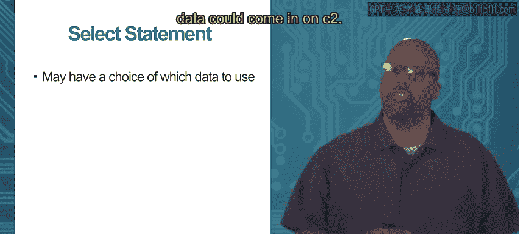
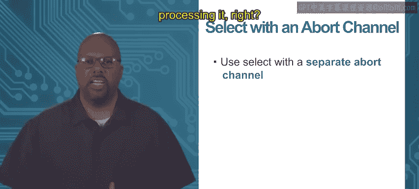

# 加州大学尔湾分校《Go语言编程｜Programming with Google Go》中英字幕 - P63：7_模块4 1 1 第2版.zh_en - GPT中英字幕课程资源 - BV1ggpcevEJf

Module 4， synchronized communication， topic 1。1 blocking on channels。

So a comment operation on a channel。Is to iterate through the channel。

 So iteratively read from the channel。 So this would happen in a scenario where you had a producer and consumer。

 The consumer is receiving from a channel， and it just wants to continually receive data from the channel and then process it in some way。

 Very common scenario， receive data process， receive data process。

 and you just continue as long as the code is running。😊。

So so that's what this there's a construct made to do specifically that this four four range。

 so we have already seen four loops， but you can use this range keyword to continually just read from a channel。

 so for instance here we say for I equal range C。What that'll do is it'll just iterate that for loop will go will just continually iterate one pass for every piece of data that's received on that channel。

 So every time a piece of data is received on that channel。

 I is assigned to that data and what's in the curly brackets is executed right the for loop is executed one pass and it'll just continue forever。

 or not forever until a close happens， I'll talk about it in a second。

 but it'll just continually read data off of that off of that channel and assign it to this variable I or whatever variable you want to call it。

 Now in this case， and this toy example， I'm not doing anything useful with the data。

 I'm just printing it， but you could be doing anything in there you just process the data and use it in some way。

 So this is a very common thing to do。😊，Now this for loop， it would be an infinite loop。

 it could be an infinite loop right so what has to happen is in order to end this loop when does it actually quit it quits when you close the channel So this is another method on a channel you can close the channel so you can see it out have in the last line highlighted in red the sender。

 the person who who's doing the sending， it can call close on the channel。

And who and if they call clothes on the channel， then the receiver realizes close and this for loop will end Now you don't have to ever call close on a channel。

It's not like a file you don't have to call close on a channel unless you're doing what I'm showing here unless you're using a range construct。

 if you use this range keyword to forever read from a channel you need to close the channel。

 the sender needs to close the channel so the receiver eventually knows oh I can quit this loop because now this channel is done So the only time you would call close on a channel is if you knew as a sender you knew I'm never going to send more data on this channel again then you can call close and that basically sends a message to the receiver to say oh now this channel is closed so you can jump out of the loop that whose range you're going you're iterating through。

So this is sort of a very common thing to read from channels。Now。

 another thing that you might want to do。Is read from multiple go routines from multiple channels。

 really， which can be associated with multiple go routines。

 they might be actually be associated with the same go routine， but reading from multiple channels。

 put like that。 So let's say like in this example， I got I got these three go routines， T1， T2 T3。

 T3 is receiving data from T 1 and T2 and from T 1 is receiving it on channel1。

 T1 and T3 is receiving T2 is receiving on channel on T2。 So it's got these two channels。

 T3 is these two channels that it's receiving data from。😊，Now。

There are different scenarios about reading from multiple channels。

 Maybe like in the case I'm showing here， maybe you need data on both channels。

 So you need so for instance， it depends on what totally it depends on the application。

 but let's say。T 3 is trying to。Compute the product of the two numbers' from T1 and T2 so if that's the case and you do what I'm doing here。

 just read the two channels sequentially。 A equals arrow C1 B equals arrow C2。

 So you read from both channels。 And then once you get them both。 then you print the product。 fine。

 does the product。 So in this case， we actually needed T3 actually needed data from both C1 and C2 needed both both channels to complete is task。

 the product And you know these are blocking these are blocking。

 So C So the first read weight until something gets written onto C1。

 But then the second one and but eventually T2 will read from both of them and it'll do is task。

 But this is an example where you need data from multiple channels。😊。

But sometimes you have a choice so sometimes。You got a go routine which can read from different channels。

 but it doesn't have to read from all of them。 It just needs one of them， one or the other。

 So sort of there's an orura relationship you can get from this one or this one or that one。

 You don't need all the channels。So if you have a choice。

 a situation like that where you have a choice of which data to use and you know whichever data comes in first。

 that's the one you want to use So say you got two channels C1。

 C2 data could come in on C1 data come in on C2 and this scenario。

 whichever one comes in first first come first serve that's the one I'm gonna to use and do something with in that situation you don't want to read from both channel 1 and channel 2 if you read from both of them then you block on one of them So say data gets sent on C1 So that read will work but then the read on C2 will never happen because maybe data never gets sent on C2 so you don't want to wait on C2 when no data is gonna come and vice versa。

 maybe data comes in on C2， but not on C1 So you don't want to have to wait on both of them in the last slide we wait on both channels C1 and C2 because we need data from both channels and we knew the data would come in on both channels and this scenario we just need data from one of the channels and we don't know that data。

come in all channels data might just come in on one of the channels and so we don't want to wait on all of them。

 we want to wait on just one of them， but we don't know which one so that's the case we use a select statement like I'm showing here。

So select statement allows you to wait for the first data from a set of channels。

 So so in this case we got two cases actually， so in the select you got case the first case。

 the second case， first case is waiting on C1 to write it to a second case is waiting on C2 and whichever one of those two happens first。

 that's the one that's going get that's going to get executed And so if the data comes in on C1 first it'll do the first case and it'll skip the second case and vice versa。

😊，Thank you。哦。Module 4， synchronize communication， topic 1。2， select。

So we've been talking about select and I showed how select allows you to choose。

Choose data from one of several channels you don't have to block on all the channels。

 You can just block on the first one that comes in。

 the first one that's satisfied where data comes in。

 and you can just you just wait for that and you can continue your execution more quickly Now the way I described it before the select was I was assuming that we were blocking on receiving data but we can also block on sending data too So with select you can your case can either be receiving data from a channel or sending data on a channel。

 So I have that here。 let's say my first case， I say a is assigned to be arrow inchan So I have some input channel called inchan and if something comes in on that then a gets assigned to that。

And you print receive day now the other case， instead of receiving its ascending thing。

 so in the other case I'm taking some number B， I don't know what that is。

 I'm taking number B and I'm writing it to Outchan。

Now note that either one of these two cases can block right so like reading from inchan。

 that'll block if nobodys actually sent anything on inchan and outchan write into outchan will block if nobody's receiving on outchan So either one of these two cases can block and what happens with the select is whether it's a read or is a write。

 which one of the cases is unblocked first， that's the case is executed。 So if in this case。

 if some data came in on inchan first before outchan became available。

 then you would execute the first case， otherwise if if somebody did some other go routine data read on outchan。

 then the second case would be executed first So select allow to select allow to select either send or received。

 you can block on either sends or receives and select one of them whichever one completes first that's the one you execute。

Now， one a common use of a select。Is to have an abort， a separate abort channel。

 Okay so say there's some task that you're doing over and over。

 You're reading data and processing it， right， so this is produce a consumer scenario again。

 right So something is producing some data and sending it on a channel to you， the consumer。

 and your consumer， its job is basically to receive the data and then do something with it。

 So let's assume that the code I have here is' for a consumer like that。

 Now notice it first thing it's a for loop， an infinite for loop。

 It's an infinite for loop So because that's typical for a consumer it's just going to keep receiving。

 receiving， receiving。😊。

Now then in there I select the first case is to receive data on channel on the C channel and assign it to A。

 and then I process it in this case I just print A。And so I'll keep doing that。

Receiving data processing， receiving data processing until eventually there's an abort signal。

 So there's some other somehow an abort happens and that can happen any number of ways。

 you know maybe a know another go routine receives user input。

 the input user types in something that says quit。 Who knows So at some point after normally what it wants to do is that first case。

 receive data process of data。 But at some point there's an abort that comes in on another channel。

 So you have this separate abort channel。 And if anything comes in on the abort channel。

 then you just return， right you just quit the whole process。 quit the whole loop。

 So this is basically this is normally an infinite infinite for loop until that abort happens。

 So if some data comes in and notice that we are not paying attention to the data that comes in on the abort channel。

 noticeice that I'm not saying it just says case arrow abort。 I didn't say case X equals arrow abort。

 just a case arrow abort。 So I don't care what data is coming in on the abort channel。

 If something comes in on the abort channel。That means the user wants to abort or somebody is ordering you to quit this loop and then you just return at that point。

 So this is a common use of select so you can have this separate channel that happens probably infrequently。

 So most of the time you're going through the first case reading data and processing off the normal channel。

 but every once in a while at some point somebodys going to want to abort your procedure and so you have a separate abort channel that you select from。

Another thing that's done with select is to have a default case。 So this is a lot like a case。

 you know， case switch and C， but or it looks like it。 It's not， it's not the same。

 but it has a similar structure。 You can have a default case。 So in this case， we got。😊。

The regular cases are waiting on channelnel1。 then the second ones waiting on channelnel 2。

 The default says， look， I don't want to wait on anything。 if if if neither one of those other case。

 if none of those other cases are satisfied， then I will execute the default。 So I won't wait。

 I won't block at all in this case。 when I have a default。

 you don't block you just go into and execute the default if none of the previous cases are ready。

Thank you。