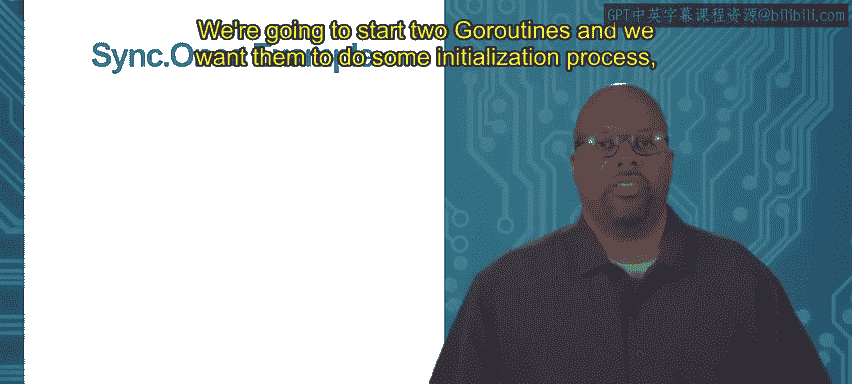
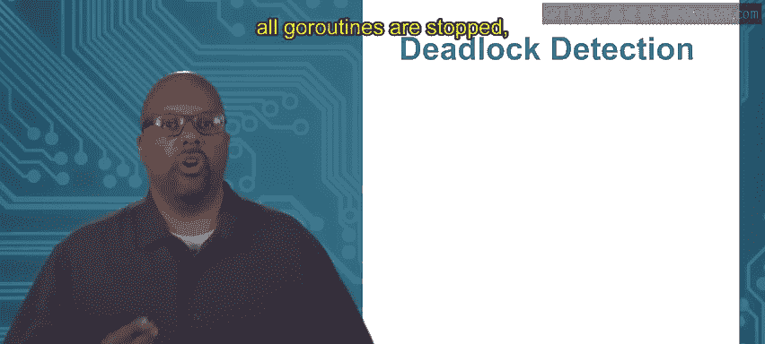
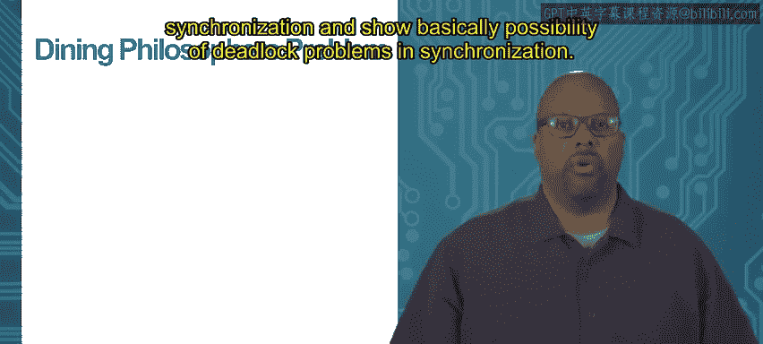

# 加州大学尔湾分校《Go语言编程｜Programming with Google Go》中英字幕 - P65：9_模块4 3 1 第3版.zh_en - GPT中英字幕课程资源 - BV1ggpcevEJf

Module 4 threads and go topic 3。1 once synchronization。

So we've been talking about go routines and we're going to talk about some of the features of the sync package。

 so sync packages gives you a set of methods that we can use to do synchronization between different go routines and here's another useful idiom that people form a lot is initialization so say you've got some multi threaded Ie multi go routine program running。

And you need to perform some initialization task。 Now， by definition。

 initialization is something that should happen once， happen only one time。

 and it has to happen before everything else happens， right， It should be the first thing is initial。

 So sometimes that's a little bit hard to guarantee when you have multi threaded when you have lots of go routines that are running in parallel because you don't know in exactly which order they're going to execute。

 So which go routine should you have the。Should you put the initialization in， right。

 because you can't guarantee the order of execution of these multiple go routines。

So so how do you do initialization guaranteeing that there's some initialization function that happens one time happens before everything else happens。

 how do you guarantee that when you have multiple go routines Well one way is to actually perform initialization before starting the go routine so maybe you can do your initialization inside your main inside the main which would be the first go routine。

 you could do at the beginning and only then create the go routines。

 but sometimes you may or may not have that option。😊。

So another facility that allows you to do this is part of the sync package is sync dot once。

 so this once method once object， it has this method do。

And one method do and you pass it some function as an argument， so you can see there one that do F。

 whatever that function F is。And you can put this once this call to one do do。

Putting in lots of different go routines。And this function F though will only be executed one time。

 so the go runtime guarantees that even if this one that do is called is called in 20 different go routines。

 only one of them will actually execute。And and it also guarantees that all calls to one dot do inside any go routine。

 they block until the first one， the one that executes actually returns。

 So that makes sure that the initialization execute first before anything else can proceed。

 So you can put with this one dot do at the beginning of all your go routines。

 Let's say one of them will actually execute and the other ones will block until it finishes executing。

 So this sync dot once， it allows you using one do do。😊。

It allows you to guarantee that first initialization happens only one time because only one of these ones that dos is actually going execute Also it ensures that initialization happens before everything else because all the other ones that do calls will block until the first one actually returns So this sync that once is useful for when you need to do initialization and you have multiple go routines executing So let's show an example of where we might use that。

😊，So let's say。We got two go routines。And we're gonna start two go routines in addition to the main go routine。

 We're gonna start two go routines， and we want them to do some initialization process。

 some of initialization function and do it only once。

 So each go routine is gonna to be associated with this code do stuff。

 So if you look at the main right there。 I have go do stuff twice So I'm starting to two different go routines。

 both the running do stuff， whatever that is。 And I'll show that in the next slide。

 also just notice we've done this before， but notice that I put the weighting the weight group。

 So I create a weight group at the top。 And then I say I call Wg add2 to say I'm gonna wait for two functions。

 wait for two go routines rather。 And then I call Wg weight at the end。

 This is to make sure that the main go routine weights until these two subgo routines actually complete。

 Otherwise， the main go routine will just exit before the do stuff actually gets to do anything so。😊。

That's not the point of this。 But I just want to mention that。 So you understand the code。 All right。

 so we got these two go routines are going to do stuff。 And we they're both。

 they're both going have to one of them is gonna have to do initialization， right。

 We need initialization done at the beginning of the stuff that's going be done。

 So let's go to the next slide。 So now first， you can see on this slide a few things。 First the top。

 we're defining our sync out once object of v on sync out once。😊，Oh， N， I called it。

 call it whatever you want。 Then I define this function called setup。

 So this function called setup is what I wanted want to execute once think of this as my initialization。

 Now， this could be whatever I want it to be。 In this case。

 I just had to print and knit just to do something。 but you know。

 you can have any sort of initialization operations in there that you want。

 So setup is a function that we want to have happen once。 Now。

 funk do stuff down below is what's being executed by each one of the go routines。

 So you can look at each go routine。 look do stuff。 And first thing it does is it calls O N do set。😊。

Then it says print hello， so we should see hello printed twice on the screen at some point because there are two go routines and then it calls WG Dun just to let the weight group know that this go routine is finished doing what it's doing。

So。😊，Now notice that both of these go routines are executing the same code do stuff。

 So both these go routines have this ON do do calling set up at the beginning of them right but what's going to happen is that only one of those X are going to execute not both of those go routines are going to execute only one's going to execute。

So。When we execute the code where you get this appearing on the screen you get a knit first because that's the result of setup。

 setup print a knit so that's the initialization process and that noticed that that happens first which is what we expected then hello hello you get twice because both of the go routines do execute both excuse me for the capitalization on one of the hellos but both them execute and they both print hello so yeah so this works so in knit appears once and knit appears before hello so the initialization is done before any of the other stuff in the go routines actually execute which is what we want of initialization。

Thank you。Module 4， threads and go， Top of 3。2 deadlock。

So right now what we're going to talk about are problems that come with synchronization。

 so we've been talking about synchronization， synchronization facilities provided in the sync package。

 also even outside the sync package with channels too they also provide synchronization。

 but you know the synchronization you' get have problems with synchronization if you're not careful specifically deadlock so this is something you have to avoid when you're coding you don't want to put basically build deadlock into your system。

So deadlock well deadlock comes from synchronization dependencies。

 So what I mean by that is you can have multiple go routines and synchronization can cause one go routines execution to depend on the other Okay so as an example here。

 we got G1 G2， these are two go routines。 and let's start look at the top the top row So I got on in G1。

 there's you know， there's a channel C。😊，And G1 is writing the number one onto the channel。

Now on the other side on G2 G2 is reading from that channel is taking C reading something from it assigning it to X So there's a dependency here because G1 is writing onto the channel and G2 is reading from the channel so that's the dependency and it's a blocking dependency in the sense that G1 it writes to the channel but G2 can't continue past that line that read line until G1 does the right because G2 is going to wait since it has to read from the channel it's going wait right there until G1 actually does the right。

 so there's dependency G2 depends on G1 Its execution depends on G1 also there's data dependency here too data is being passed from G1 to G2 also but where unless interested in that in terms of deadlock but we're more worried about the execution dependency G1's execution cannot continue until G1 executes a statement。

And you can see the same thing on the bottom。In in this time instead of using channels。

 we're using Mut so say I've got a muttex object and G1， it unlocks that muttex and G2 locks it。

 So in this case， again， you can get a dependency because G2 can't accept the lock until G1 unlocks G2 can't get the lock until G1 unlocks So G2 again。

 its execution is dependent on G1 G2 can't continue past that lock until G1 gives up the lock。

 So in both cases you get G2's execution depending on G1's execution。

 So G2 can't continue until G1 does something So in one case it's right into a channel。

 the other case is it's unlocking a mut textex， but either way。

 So synchronization causes the dependencies。 He's blocking dependencies。😊。

Now when you can get into a problem when you get into deadlock is when the dependencies are circular okay so what I mean by circular is if G2 G1 is waiting for G2 and G2 is waiting for G1 so G1 is waiting for G2 to do something like unlock a mutX or something like that and maybe G2 is waiting for G1 to write onto a channel they're both waiting for each other to do something but they're both blocked right so neither one of them can progress and that's called Delock。

 nothing can happen at that point。So this can be called by waiting on channels。

 it can also be caused by mut text， waiting on mut text2， waiting for unlocking of mut text。

 but it can also be called by waiting on channels too。

So this type of circular dependency where G1 waits for G2 and G2 waits for G1。

 that's what you need to avoid in your code。 So this is up to the programmer to avoid making such dependencies。

 So let's show an example of a dependency like that。

So we're going make we're gonna make a couple of go routines in the main and I'm not showing you the main right now right now I'm showing you do stuff。

 This is a code that each go routine is going to execute。

 They're both going execute same code This do stuff it takes two channels， channel1， C1 is C2。

 two channels is input and do stuff first thing it does is it is it waits to receive something on the first channel on C1。

And then it writes a one on the second channel。So that's all it does。

 It waits to receive something on the first channel， and it writes to the second channel。

 And both of these go routines are going to do the same thing。 Now。

 they're gonna have different arguments， as I'll show you in a second。

 But that's basically what they're gonna do。 Wait on the first channel， Write to the second channel。

Now， okay， so now in the main here I'm going this is the main， I make two channels， CH1， C2。

They have integers。 then I have the weight groups so we can don't have to worry about that。

 but the main point is the go do do stuff。 Ive got two calls to that。

 So I'm creating these two these two go routines。 Now notice they both take two arguments， C1 C2。

 but the first call， the first go routine， the first go do stuff it takes the order of the arguments is C1 first C2 second then the second go do stuff the order changed C2 first C1 second。

So what this means is that so remember do stuff that we just saw what it does is it waits for to receive something on the first argument on the first channel argument。

 and that it writes something to the second。 So what that means is the first go routine is going to wait to receive something on channel1 and write something on channel 2。

In that order， now then the second go routine is going to wait to receive something on channel two。

 then write on channel one。And notice how they're depending on each other right so the second go routine is is going to write on channel one while the first one is waiting to receive something on channel one。

 so the first one is going to be blocked。Then the second one。

Is going to is waiting to receive something on channel two。

 where the first one is writing on the channelnel 2。 So the second one is going to be blocked。

 both people， both go routines are blocked and nothing can progress。

 So this is an example of deadlock。So you have to avoid this as a programmer。 Now。

 if you were to run that code that I just showed you filled in with the details。

 if you run that code， go lay runtime actually detects this deadlock。

 So if there's a situation where all go routines are locked。

 which is what we just saw right all go routines is stopped。

 Then the going runtime automatically detect it and you get an error like what I'm showing here。

 these are just the first few lines of the error， but basically it gets an error。

 it says there's a deadlock and it let you know， which is a good thing。 However。

 the Going runtime cannot detect when only a subset of go routines are deadlocked。

 So when that happens， then it'll just it'll lock those。

 they'll be deadlock and you won't know it in any obvious way。

 it's just your program wont won't operate correctly and you'll notice it somewhere down the line。

 it's harder to debug。 So this type of deadlock， these type of circular dependencies have to be avoided by the programmer。

Thank you。

Module 4， threads and go， Top of 3。3 dining philosophers。

So now we're going to talk about the dining philosopher's problem This is one of these classic concurrency problems that people use to talk about synchronization and show basically possibility of deadlock problems in synchronization so this is one of the classics I mean you always teach this when you talk about concurrency so we're going to talk about it and so show how how deadlock can sneak up on you you have to be careful to avoid it Okay so in this problem you got five philosophers sitting at a round table。

Each one has a plate in front of them， you plate a rice， okay？

And they're chopsticks that they're going to use to eat this rice。

 so one chopstick is placed between each adjacent pair of philosophers。

 so there are five five philosophers in a circle， there are also five chopsticks between them。

Now everybody wants to eat their rice from the plate， but you need two chopsticks to eat the rice。

 so every philosopher in order to eat is going to have to pick up a chopstick on the left。

 pick up the chopstick on the right and then eat but only one philosopher can hold a chopstick at a time right so one philosopher is eating his neighbors can't eat because he's got both of the chopsticks so the neighbors don't have their neighboring chopsticks so at least one of them so they can't eat。

So there are not enough chopsticks for everyone to eat at once and this is key right so you know not that necessarily one can eat at a time。

 you get multiple people eating at a time， but you can't just they can't all eat at a time right so they have to be properly ordered in order to all eat。

So the problem with this is if you implement this in an naive way。

 or I wouldn't even call naive in a way without thinking through， without thinking it through。

 you can easily cause a possibility of deadlock in the system。So yeah here's a picture of our table。

 got this round table， there's five plates for the five philosophers。

 and then you see those little sticks between those are the chopsticks， so there's five chopsticks。

And so in our model， when we code this， we' gonna make each chopstick a muttex And that makes sense because a chopstick can only be held taken or locked by one philosopher right So a philosopher。

 So there's a chopstick and one at the top right there's a philosopher to the left of it philosopher to the right。

 Only one of them can grab that chopstick at a time。 So they can only have mutual exclusive access。

 So it makes sense to represent a chopstick as a muttex。 So chopsticks a muttex。

 and then each philosopher is going to be associated with a go routine， you know。

 because it's going to be eating。 It go routine is going to be the action of eating。😊。

But it's also associated with two chopsticks， one on the left， one on the right。

 So every philosopher is going to have a left chopstick and right for the chopstick。

So let's look at how we might code this in an obvious way first we'll define our chop S as chopstick our type and that's just a mut sync out muttex。

 so that's a muttex like we were saying， then we make our philosopher type and that's a struct with two things。

 a left CS left chopstick and a right CS right chopstick and those are both pointed to chopsticks。

So we got a philosopher， we got a chopstick Now the philosopher is going to have to have associated with it a method for eating。

 So this is what were we're going to say the eating method looks like。

 So it's an infinite loop so that four at the top。And。What it does is it basically the philosopher。

 first thing it does is it gets it locks the left chopstick， then it locks the right chopstick。

 so then it's got both chopsticks Locking is basically picking up the chopsticks off the table。

Then it eats so format I just print eating to represent the active eating so it eats。

 then when it's done it puts down the chopstick puts on the right puts down the right chopstick。

 puts down the left chopstick and by the way， they order and putting on chopsticks doesn't really matter for us。

 So that's what eating is and it's an infinite loop， it's just going to eat over and over and over。

And each one of these five philosophers is basically executing the same code。So now in the main。

 you know I'm omitting some of these details， weights and such。

 but the main I'm just getting to the heart of it， first thing， if we look at this code。

 we're initializing， we're doing some initialization in the main。

First initialization first few lines are creating the chopsticks and the next few lines are creating the philosophers。

 So we' got to make five chopsticks and five philosophers。

 So if you look at the top we make these make this slice for five chopsticks pointers and then in that loop from equal equals0 to lesson than 5。

 we create these chopsticks and fill in this array so we create these new chopsticks， five of them。

 all numbered C stickicks0 through4。😊，Then then we do the same thing with the philosophers。

 So we make this philosopher slice right there enough for five。 Then we have another for loop。

 and we createate the philosophers。 We fill in the philosopher right。 now notice phil I。

Equals am percent because these are pointers And then the constructor。 Basically when I construct it。

 when I call Phillo， I'm passing it two things。 Okay now remember the order the order of the structure feel。

 So philosopher's a structure Its got left chopstick， right chopstick。

 That's the order So in the curly bra is there after a phlo you can see two things。

 the first thing is going to be the left chopstick。

 The second is going to be the right chopstick So the first thing the left chopstick is C sticks I So if this is philosopher 0 left chopstick is going chopstick 0 and then notice that the right chopstick is I plus 1 modular 5 right now so you have to do the modular 5 to account for the last philosopher。

 philosopher 4。 So what this means is that philosopher 0 is going to have chopstick 0 is this left chopstick。

 chopstick 1 is this right philosopher2 is going have chopstick 2 is this left chopstick。

 chopstick 3 is this right。 but philosopher 4， He has。😊。

Chpsick4 as his left chopstick and chopstick 0 as his right chopstick。 It's in a circle。 Okay。

 that's why you have to do the modular 5 because there's no chopstick 5。 He gets chopstick 0。

 So so we had to do I plus1 mod5 in there。 but basically， you get the idea。

 So we've created in this in here。 We've initial the set of chopsticks，5 of them。

 And we made five philosophers and associated their left and right chopsticks with each one of the philosophers。

😊，Now。This program。 So this is basically this is almost it。

 One more thing we have to do in the main after we do this initialization is we have to actually create the go routines。

 a go routine for every philosopher and get him eating right So we have right after that we start start the eating。

 we say4， you know have a four loop equals 0 to 5 because we want to make five go routines one for each philosopher。

 We just say philosopher I dot E and it calls this eat， which is an infinite execution。

 So this will start each philosopher eating。😊，And so starting these five go routines。

 Now this we would also I'm not putting this in here， but we'd also have to add the weighting。

 the weight group， some waitinging in the main， some form of weight in the main so that the main doesn't complete before these philosophers complete because the philospher is the way I've written it。

 these philosopher go routines will never complete。

 They're in infinite loop right And so we got to make sure that the main doesn't complete either So we would have to put it in a little synchronization in there。

 a weight or something like that。 but you know I just want to focus on the philosophers at the moment。

Okay， so this is sort of how you would write the code in an naive way。

So the place where deadlock can happen。Is if all philosophers。

 if they all grab their left chopsticks at the same time。 now remember， if you remember their code。

 so this is a little summary of the code that each one of of the eat code for a philosopher first it grabs its left chopstick locks its left。

 then it locks the right then it eats， then it unlocks the two chopsticks So now we don't know what interchleaving is going to happen with between these different these different philosophers right but there is an interleaving where each one of these each one of these five philosophers。

 it executes its first lock locking the left chopstick and then and without going on right and then the next philosopher does that grabs this left。

 the next one grabs this left each one of these five could grab its left chopstick before they continue。

😊，And in that state， if they all grab their left chopstick。

 meaning they lock the left left chopstick， then all five chopsticks are locked。 Okay。

 so then when they try to execute their next instruction， locking the right chopstick。

 they won't be able to because all the chopsticks are locked because your right chopstick is somebody else's left chopstick。

 So if you everybody's locked all the left chopsticks。

 they're all locked and we would be in a deadlock situation。 So there is an interch leaving here。

 at least one into leaving where where you can get into this deadlock situation。

 And it's easy not to see that。 it would be easy to code this the way I just coded it and and run into that type of deadlock。

 Now。😊，This is a sort of a fundamental problem， there are lots of solutions that have been proposed ways to fix this。

 one way to fix this， so Dytra's way in this particular case。Dyextra is a genius。 Anyway， Dyketra。

 he decided to fix it by basically modifying the code。 and I won't show you the modification， really。

 but he wants to modify the code so that each philosopher picks the lowest numbered chopstick first。

 Now here's what I'm showing there in the blue is is the code that we have Okay。

 and our code does not do that。 Our code， the first one that you pick up is the one to your left。

 which is the lowest， which is for most of the the philosophers， that's the lowest number， right。

 So if you're talking about philosophers 0。😊，To his left is chopst0 to his right is chopstick 1。

 So the lowest numbered chopstick is chopstick 0 so and that's the one that he picks up first。

 the left one。 And so that's true for all of them， except for philosopher 4。

 Phililosopher 4 on his left， he has choppsstick4 on his right， he has choppsstick 0。

 And he picks up4 picks up chopstick 0 first。 sorry。

 picks up 4 picks would according to our code4 would pick up chopstick4 first and then pick up choppsstick 0。

 So the code that we have violates this rule that I have in read。

 Pick up the lowest numbered chopstick first。 If you change change the ordering。

 So it always picks up the lowest chopstick first。 Then philosopher 4 would pick up chopstick 0 before chopstick4 and it would try to pick it up and if there was if there were about to be in a deadlock situation。

😊，If everybody else had picked up their left chopstick。

 then philosopher 4 would be blocked because it would try to pick up chopstick 0。

 but it would already have been picked up by philosopher0 right so so so then you wouldn't get into the block and you wouldn't into the absolute deadlock state that we would have。

 then it wouldn't pick up this chopst since it tried to pick up chopstick zero first。

 it would never get to pick up chopstick4， which means philosopher 4 would block and philosopher 3 would be allowed to eat because phosopher 3 could then grab its right chopstick chopstick 4 and it could eat and then we could continue So there's no deadlock in this situation but philosopher 4 may starve So what that means is that philosopher 4 in this setup gets lowest priority He's the one who ends up having to wait on others most of the time now so that's called starvation he would it literal starvation in this example。

 but that can happen in other scenarios too where you have multiple threads， multiple go routines。

 they're all。😊，But some number of them don't get to execute as often as the other ones because of the way you've made the because of way you you've set up your your synchronization。

 So starvation is another issue， but deadlock is the worst。 and you can avoid in several ways。

 but just be careful of these circular dependencies。

 So this is a case where you have the circular dependency， but the circle is five philosophers long。

 right The dependency， it has to go through all five philosoppheres before the circle circular dependency completes itself。

 So it's a little more subtle to see。Thank you。