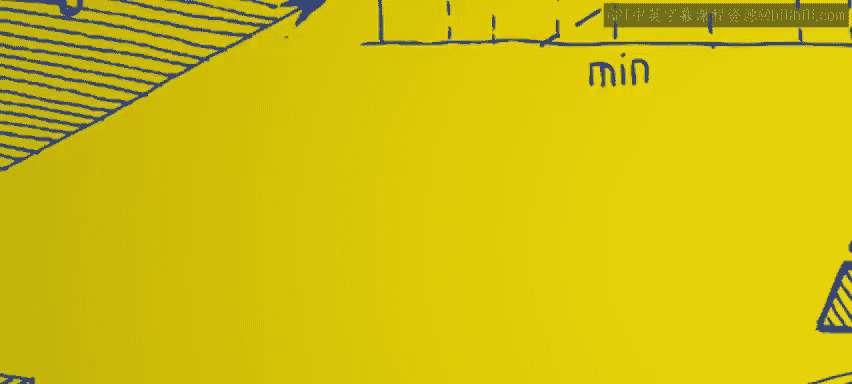
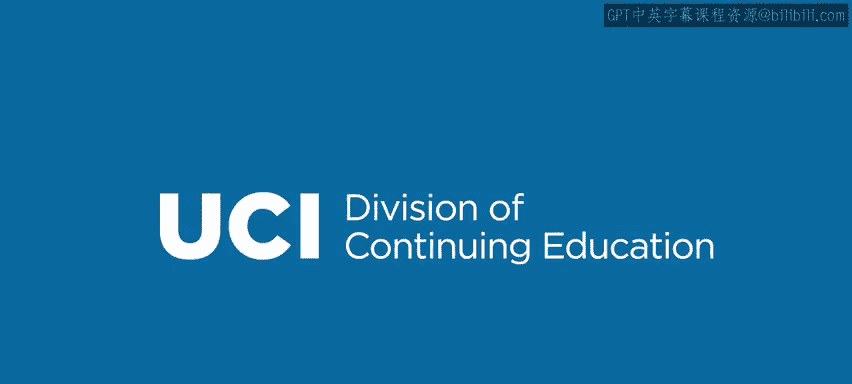

# Go语言编程：1.2.1：安装Go 🛠️

在本节课中，我们将学习如何下载和安装Go编程语言的工具链，以便能够立即开始运行程序。我们将首先讨论下载过程，然后实际操作，展示如何编译你的第一个程序。本节内容主要聚焦于安装步骤，这个过程相当直接明了。

## 下载Go工具链

首先，你需要访问Go语言的官方网站：**golang.org**。

下图展示了当你访问该网站时看到的部分页面。为了适应幻灯片，这里并非完整页面，但它基本展示了当前页面的核心内容。请注意，网站设计可能会随时间变化。

你会在页面上反复看到地鼠图标，它是Go编程语言的吉祥物。页面上最重要的元素是底部的 **“Download Go”** 按钮。你的第一步就是点击这个按钮。

此外，在网页的左侧（图中未完全展示），你会看到一个黄色的文本框，可以在其中输入Go代码并点击“运行”按钮。这会在远程服务器上编译并执行你的代码。不过，我们不会使用这个在线工具。相反，我们将把编译器下载到你的本地机器上，进行本地开发。当然，如果你想先体验一下，可以在那里输入一些Go代码并运行。

## 选择安装包

点击“Download Go”后，你会进入一个类似下图的页面。同样，这里只展示了部分内容，页面下方和右侧还有更多信息。

在这个下载页面，你可以为不同平台下载预编译的版本，包括 **Windows**、**Linux** 和 **macOS**。你也可以选择下载源代码，如果你愿意，可以从零开始编译整个Go工具链。不过，我们不建议初学者这样做，因为过程较为复杂。Go是开源的，所有源代码都可以在此下载。

本教程将以Windows平台为例进行演示，但步骤在Linux或macOS上同样适用。

对于Windows用户，最简单的方法是下载页面中高亮显示的 **.msi** 文件。建议选择最新的稳定预编译版本，避免使用不稳定的测试版。点击对应的链接即可开始下载。

## 安装过程

下载完成后，你会得到一个.msi安装文件。请注意，如果你的机器上安装了杀毒软件，它可能会弹出警告。请放心允许操作。

运行该安装文件后，会启动一个标准的安装向导。你只需要按照向导的提示操作即可：

以下是安装过程中的关键步骤：
*   点击“Next”开始安装。
*   接受许可协议。
*   选择安装目录（默认位置通常即可，你也可以自定义）。
*   继续点击“Next”，直到安装完成。

安装向导会引导你完成所有步骤，包括选择安装路径等。使用默认设置对大多数人来说都是合适的。

## 总结

本节课中，我们一起学习了如何从 **golang.org** 官网下载并安装Go编程语言的工具链。我们了解了如何选择适合自己操作系统（如Windows的.msi文件）的稳定版本，并跟随安装向导完成了本地环境的搭建。现在，你的机器已经准备好了Go编译器，在下一节中，我们将使用它来编写和运行你的第一个Go程序。