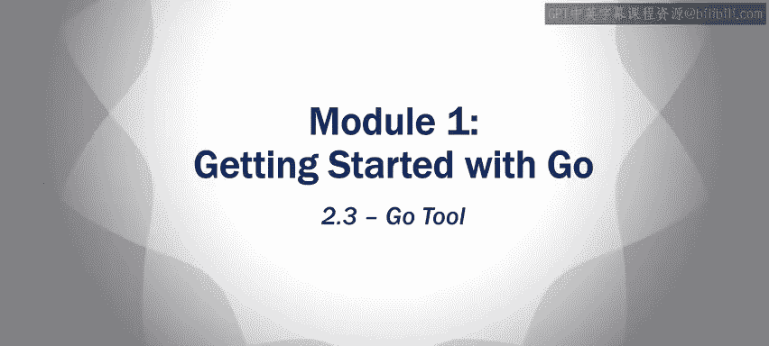

# 加州大学尔湾分校《Go语言编程｜Programming with Google Go》中英字幕 - P8：7_模块1 2 3 Go工具.zh_en - GPT中英字幕课程资源 - BV1ggpcevEJf

🎼。

🎼う。🎼Yeah。

So we're going to talk about the go to a little bit， just overview it really。

 it has a lot of features and we'll get to those。in different courses。

 actually during the specialization， we'll talk about a little bit of it now。

 but start off with import。So just to restate what import does。

 it's a key word and it's used to access other packages now for the most part。

 the packages that we're going to be importing will be the built in packages of ones that come with the go language to implement different functions that we're going to use in the course so for instance right now right off the start we're gonna use this format package FMT and it has a printf statement built into it and we use it for printing things。

Now， what happens is when you do an import。The go tool， when it does a build。

 it has to find the imported packages， so it searches through the directory specified by the go route and the Go path environment variables。

So。If you keep everything inside your go path and you go route， so inside your workspace。

 it'll find them if you decide you want to import some package from some other place and maybe it's installed in a different directory。

 something like that， then you're gonna to have to change your go path and go route paths you're gonna have to increase them。

 change the path， change the environment variables so that it can find them but that won't be a problem for basically the majority of this course right we're not doing that。

 but I'm saying in the future when you're working with really big code you might need to alter these environment variables in order to be able to find the packages that you're looking for。

So the Go tool go， when you download go， you get this go tool and it's a general tool used to manage Go source code。

There are many commands， a bunch of different commands that you can use the go tool to do。

 The first one is going to be go build so that。It's just compiling the program right the arguments to go build。

 you can have no arguments in which case it just compiles a go file in the local directory。

 but you can give it a bunch of packages， a bunch of package names or a bunch of go files that you want to build you can give that as the arguments to this go build command and it'll go build whatever you tell it to build or you could just say go build that's what I would actually that's what I did in the demo I just said go build and I was already in the directory where I had my main package and so it just compiled that。

So it creates an executable for the main package and the executable has the same name as the first。

go file， so if you're just using one。go file you're just going to get that as the name。😊。

The dot EXc suffix is what you're going to see for executables and Windows in general。

 right so it looks see a dot EX。In the executable， and that should be in the directory where you did the build。

 if you given it no other arguments， it'll just place it in the same directory。 Now。

 there are tons of arguments to these commands that I'm not really going to go through。

 but you can have arguments where you can tell it to build and put the executable in a different directory and so on。

 I'm not going to do that right now。 We'll finesse that stuff later。

So some of the other Go tool commands just go through these a little bit， go Doc。

 goDc prints documentation for a package now we'll go over this later。

 but you have to as a programmer， you have to put the documentation in your package and GoDc will just pull it out of all your packages and print it。

Go format that format source code files。We're not gonna get heavily into this。

 but if you program it all， you must have heard arguments about， oh。

 you need this type of indentation and stuff like this。

 So this go format will just indent it the way it should be done。 Okay。

 it'll you just give it the source code file and it'll indent it right to get past all those arguments。

 There is a standard indentation。 You don't have to use it， right， remember。

 the indentation isn' enforce forced on you。 This isn't Python or something like that。

 You don't have to。 but go format will do it for you。 So why not。Go get。

 downloads packages and installs them。 So if you want to get new packages that do interesting things that aren't standard default packages。

 you can say go get and give the name of the package， it'll go online， find the package， download it。

Go list， list， install all the installed packages， go run。

Compiles the go file and it runs the executable。 So if you just say go build。

 that compiles it and does not execute it， but run go run。

 actually compiles it and then executes the executable in the end。Or if it's already compiled。

 it'll just run the executable。Now you don't need go run you can like in my demo。

 I think I did a go bill to get the executable thing was called hello dot EX。

 and then I just typed hello dotX at the command line and it executed it right so I didn't have to use go run in order to run the executable。

 but you can。And go test actually the last course， the fourth course in this specialization is actually about testing and we'll get to that then go test。

 it runs tests and it looks basically you have a bunch of test files that end with this underscored test Id go and you can run these tests using the go test command。

 but we'll cover that later。

