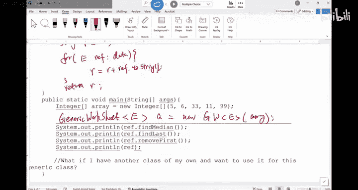

# 003：泛型实践与数组操作

在本节课中，我们将通过一个泛型工作表（Generic Worksheet）的练习，来复习和巩固泛型、数组操作以及Java编程中的一些核心概念。我们将学习如何创建泛型数组、进行深浅拷贝、查找中位数和最后一个元素，以及移除数组中的第一个元素。

## 泛型数组的初始化与深浅拷贝

上一节我们讨论了泛型的基本概念，本节中我们来看看如何在类中声明和使用泛型数组。

首先，我们有一个泛型工作表类，它使用一个泛型类型 `E`，并包含一个泛型数组 `data` 作为实例变量。

```java
public class GenericWorksheet<E> {
    private E[] data;
    // ... 其他代码
}
```

在构造函数中，我们需要初始化这个数组。以下是如何正确地进行初始化：

```java
// 这是初始化实例变量的一种方式
this.data = (E[]) new Object[length];
```

请注意，由于Java的类型擦除机制，我们不能直接创建泛型数组（如 `new E[length]`），而需要先创建 `Object` 数组，然后将其类型转换为 `E[]`。

接下来，我们探讨深浅拷贝的区别。浅拷贝意味着两个引用指向内存中的同一个数组对象。深拷贝则意味着创建一个全新的数组，并将原数组中的每个元素复制到新数组中。

以下是实现浅拷贝和深拷贝的方法：


**浅拷贝**： 直接将参数数组的引用赋值给实例变量。
```java
public void shallowCopy(E[] paramData) {
    this.data = paramData; // 两个引用指向同一个数组
}
```

**深拷贝**： 创建一个新数组，并逐个复制元素。
```java
public void deepCopy(E[] paramData) {
    // 1. 创建新数组
    this.data = (E[]) new Object[paramData.length];
    // 2. 复制元素
    for (int i = 0; i < paramData.length; i++) {
        this.data[i] = paramData[i];
    }
}
```

进行深拷贝时，必须首先初始化实例变量数组，否则会出现空指针异常。

## 查找数组的中位数

上一节我们处理了数组的拷贝，本节中我们来看看如何在一个泛型数组中查找中位数。

查找中位数的思路是：先对数组排序，然后根据数组长度的奇偶性返回中间的元素。但这里有几个重要的注意事项：

1.  **不要修改原数组**： 应该先创建数组的一个副本，对副本进行排序和计算，以保持原数组不变。
2.  **泛型的局限性**： 对于泛型数组，我们不能假设其元素支持算术运算（如加法、除法）。因此，当数组长度为偶数时，我们通常只返回排序后位于 `length/2` 索引处的元素，而不是计算两个中间元素的平均值。

以下是查找中位数方法的实现框架：

```java
public E findMedian() {
    if (data == null || data.length == 0) {
        return null;
    }
    // 创建副本以避免修改原数组
    E[] copy = Arrays.copyOf(data, data.length);
    // 对副本进行排序
    Arrays.sort(copy);
    // 返回中位数（对于偶数长度数组，返回靠后的中间元素）
    return copy[copy.length / 2];
}
```

为了使 `Arrays.sort()` 能正常工作，泛型类型 `E` 必须实现 `Comparable<E>` 接口。在类声明时应进行约束：

```java
public class GenericWorksheet<E extends Comparable<E>> {
    // ... 类体
}
```

## 查找与移除数组元素

现在，我们继续探讨对泛型数组的其他基本操作：查找最后一个元素和移除第一个元素。

**查找最后一个元素**： 这个操作相对简单，但必须进行严谨的错误检查。

以下是实现步骤：
1.  检查数组引用是否为 `null`。
2.  检查数组是否为空（即长度为0）。
3.  返回索引为 `data.length - 1` 的元素。

在组合条件判断时，要注意逻辑运算符的**短路求值**特性。`||` 运算符会先计算左边的表达式，如果为真，则不再计算右边。因此，应该先检查 `null`，再检查长度，以避免对 `null` 引用调用 `.length` 导致空指针异常。

```java
public E getLast() {
    if (data == null || data.length == 0) {
        return null;
    }
    return data[data.length - 1];
}
```

**移除第一个元素**： 移除操作需要创建一个比原数组小一个元素的新数组，并将剩余元素复制过去。

以下是实现步骤：
1.  进行必要的空值和长度检查。
2.  保存要移除的第一个元素。
3.  创建一个大小为 `data.length - 1` 的新数组。
4.  使用循环将原数组从索引1开始的元素复制到新数组。
5.  将实例变量 `data` 指向这个新数组。
6.  返回之前保存的第一个元素。

```java
public E removeFirst() {
    if (data == null || data.length == 0) {
        return null;
    }
    E removedElement = data[0]; // 保存要返回的元素
    // 创建新数组
    E[] newArray = (E[]) new Object[data.length - 1];
    for (int i = 0; i < newArray.length; i++) {
        newArray[i] = data[i + 1]; // 从原数组的第二个元素开始复制
    }
    this.data = newArray; // 更新引用
    return removedElement;
}
```

## 实现toString方法

对于一个完整的类，实现 `toString` 方法是一个好习惯，它能方便地输出对象的内容。

对于我们的泛型工作表，`toString` 方法可以遍历数组，将每个元素的字符串表示连接起来。

```java
@Override
public String toString() {
    if (data == null) {
        return "null";
    }
    StringBuilder result = new StringBuilder();
    for (E element : data) {
        result.append(element.toString()).append(" ");
    }
    return result.toString().trim();
}
```



## 实例化泛型类

最后，我们来看看如何实例化这个泛型类。由于类型擦除，在创建对象时，需要指定具体的类型参数。

例如，要创建一个处理 `Integer` 数组的 `GenericWorksheet` 对象：

```java
Integer[] intArray = {1, 2, 3, 4, 5};
GenericWorksheet<Integer> worksheet = new GenericWorksheet<>(intArray);
```

注意，在构造函数的右侧（`new GenericWorksheet<>`），我们可以使用菱形运算符 `<>` 省略类型，编译器会根据左侧的声明进行推断。

---

本节课中我们一起学习了如何在一个泛型类中操作数组，包括数组的初始化、深浅拷贝、查找中位数、获取及移除元素等核心操作。我们特别强调了错误检查的重要性、避免修改原始数据的原则，以及泛型编程中类型约束（如 `Comparable`）和运算符短路求值的细节。掌握这些基础是进行更复杂数据结构设计和实现的关键。