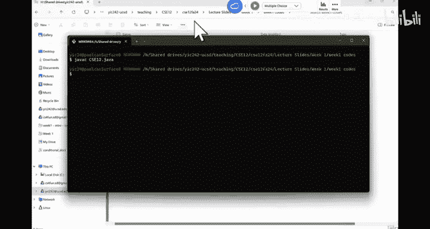
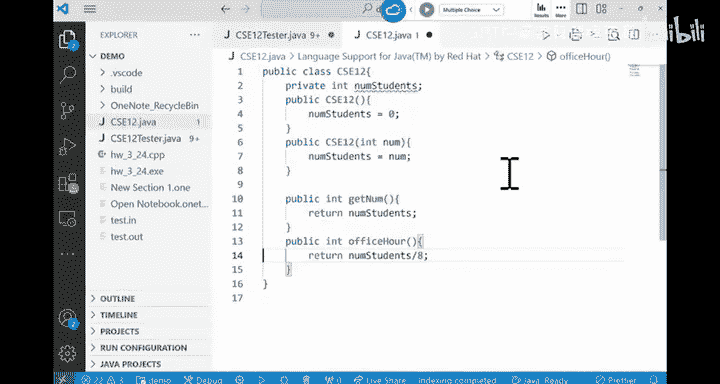

# CSE 12：004：抽象数据类型、测试与作业发布 🎯

在本节课中，我们将要学习抽象数据类型（ADT）与具体数据结构的区别，并介绍软件测试的基本概念，特别是黑盒测试与白盒测试。课程最后会发布第一项编程作业。

## 抽象数据类型 vs. 数据结构

上一节我们讨论了泛型，本节中我们来看看抽象数据类型（ADT）与具体数据结构的区别。在CSE 12课程中，我们会大量实现基础数据结构。因此，理解ADT与具体实现是两个完全不同的概念非常重要。

**抽象数据类型（ADT）** 是系统用户与系统实现者之间共同依赖的接口。它描述了系统应具备的功能，但不涉及具体实现方式。例如，烤箱的温度控制旋钮就是一个ADT，用户通过它来操作烤箱，而无需关心烤箱内部是使用电力还是燃气加热。

**具体数据结构** 则是ADT的一种特定实现方式。如果某种数据结构只有一种实现方式，那么它就更偏向于一个具体的数据结构，而非ADT。

两者的核心区别在于：ADT描述的是“做什么”，而数据结构定义了“如何做”。

## ADT与API的区别

现在我们来澄清一个常见误解：ADT和API是相同的吗？答案是否定的。

**API（应用程序编程接口）** 是一组明确定义的函数、类或方法，供其他程序调用以使用某个工具箱或框架的功能。例如，Google的TensorFlow框架提供了一系列API函数。

**ADT** 则是对一个数据结构的抽象描述，定义了其行为规范，而不绑定到任何具体的代码接口。

因此，ADT更侧重于概念描述，而API是具体的编程接口，两者是不同的概念。

## 软件测试简介

在CSE 8A或11中，你们已经接触过测试。在CSE 12中，我们将更进一步，介绍工业界常用的测试理念和工具。

从第二次作业（PA2）开始，你需要提交自己编写的测试代码，这会被计入成绩。第一次作业（PA1）我们会提供测试代码，你只需要学会如何运行它来检验自己的程序。

### 黑盒测试与白盒测试

测试他人程序主要有两种方式：

以下是两种主要的测试方法：
*   **黑盒测试**：测试者不了解也不关心程序内部如何实现。只根据给定的输入，检查程序是否产生预期的输出。例如，我们课程使用的自动评分系统就是黑盒测试。
*   **白盒测试（或透明盒测试）**：测试者就是代码的开发者，清楚代码的内部逻辑。可以根据代码的执行路径来设计定制化的测试用例。这是你应该为自己代码编写的测试类型。

理想情况下，你应该在开始编写程序之前就设计好测试用例，这有助于你更深入地理解问题。

### 测试覆盖与路径分析

如何设计好的白盒测试？关键在于实现**测试覆盖**，即让你的测试用例尽可能覆盖代码的所有执行路径。

考虑以下函数：
```java
boolean foo(int x) {
    if (x > 5) {
        // 执行操作 A
    }
    for (int i = 0; i < x; i++) {
        if (i % 2 == 0) {
            // 执行操作 B
            break;
        }
    }
    return true;
}
```
设计测试时，你需要思考不同的 `x` 取值，如何让代码执行 `if (x > 5)` 的 **真** 分支和 **假** 分支，以及 `for` 循环执行 **0次**、**1次**、**多次** 等不同情况。你的目标是让测试用例覆盖从函数入口到出口的所有可能路径。

### JUnit测试框架

在CSE 12中，我们将使用 **JUnit** 框架进行自动化测试。JUnit是一个用于Java编程语言的单元测试框架，可以方便地测试方法和类。

一个典型的JUnit测试类结构如下：
```java
import org.junit.*;
import static org.junit.Assert.*;

public class CSE12Tester {
    CSE12 ref;

    @Before
    public void setUp() {
        ref = new CSE12();
    }

    @Test
    public void testDefaultConstructor() {
        assertEquals("Number of students should be 0", 0, ref.getNumStudents());
        assertTrue("Large class should be true by default", ref.isLargeClass());
    }

    @Test
    public void testParamConstructor() {
        CSE12 obj = new CSE12(200);
        assertEquals(200, obj.getNumStudents());
        assertFalse(obj.isLargeClass());
    }
}
```

以下是代码中关键部分的说明：
*   **`@Before` 注解**：标记一个方法在每个 `@Test` 方法运行前执行，常用于初始化测试对象，保证每个测试都在干净的环境下开始。
*   **`@Test` 注解**：标记一个方法为测试方法。
*   **断言方法**：如 `assertEquals(expected, actual)`，用于判断实际结果是否与预期一致。如果断言失败，测试即不通过。




### 全面的测试策略

编写测试时，一个常见的错误是只测试函数的返回值，而忽略了对象内部状态的完整性。

例如，测试一个从数组中获取元素的方法 `get(int index)`：
1.  你需要测试它是否返回了正确的值。
2.  **同样重要的是**，你需要测试调用该方法后，原始数组的内容**没有**被意外修改，其他实例变量（如`size`）也保持正确。

因此，测试一个函数时，不仅要检查其返回值，还要验证该函数所依赖或影响的对象内部所有数据是否正确。

### 测试异常

对于会抛出异常的方法，也需要进行测试。在JUnit中，你可以使用 `try-catch` 块来捕获并验证异常。

```java
@Test
public void testException() {
    CSE12 ref = new CSE12(-1); // 传入非法值
    boolean exceptionThrown = false;
    try {
        ref.officeHours(); // 此调用应抛出异常
    } catch (ArrayIndexOutOfBoundsException e) {
        exceptionThrown = true; // 成功捕获异常
    }
    assertTrue("Should have thrown an exception", exceptionThrown);
}
```

## 关于第一次编程作业（PA1）

本节课将发布第一次编程作业（PA1）。作业内容是实现一个“石头剪刀布”游戏的扩展版本。你会获得一个定义好的Java接口，你的任务是按照接口规范编写实现类。

我们会提供一个完整的JUnit测试文件。如果你的代码能通过所有提供的测试，那么你很有机会在该作业中获得满分。尽管如此，**强烈建议你在此基础上添加自己的测试用例**，例如测试更多自定义的“招式”组合，以确保代码在各种边界情况下都能正确运行。

---



本节课中我们一起学习了抽象数据类型（ADT）与具体数据结构的核心区别，明确了ADT与API的不同。我们深入探讨了黑盒测试与白盒测试的理念，并介绍了如何使用JUnit框架编写全面的单元测试，包括测试正常功能、对象状态完整性以及异常处理。最后，我们了解了第一次编程作业的要求。掌握这些测试技能对于后续实现和调试复杂数据结构至关重要。