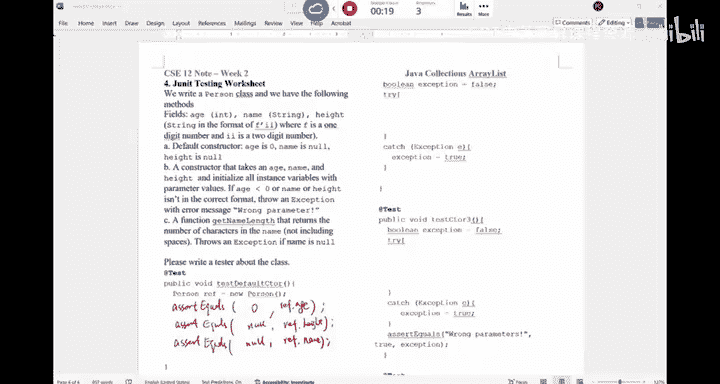

# 005：Java集合、异常与JUnit测试入门


在本节课中，我们将学习Java集合框架的层次结构，回顾异常处理机制，并初步了解如何为类编写JUnit测试用例。这些知识对于完成后续的编程作业至关重要。

## Java集合框架概述

Java、C++或Python等语言之所以流行，不仅因为它们提供了基础的编程工具，还因为它们内置了许多可以直接使用的功能。在Java中，集合框架就是一组可以免费使用的数据结构。

上一节我们介绍了课程的基本信息，本节中我们来看看Java集合框架的具体构成。

集合框架的整体层次结构如下图所示。虚线左侧的所有元素都是**接口**，它们作为父类，定义了抽象数据类型，规定了集合应具备的基本行为。从`Collection`接口衍生出`Set`、`List`、`Queue`等接口。


两条虚线之间的元素是**抽象类**。它们实现了对应接口中规定的部分功能，但并非全部，将一些具体实现留给了子类。

最右侧区域的元素是**具体类**，我们可以直接使用它们来创建对象。例如，`TreeSet`、`HashSet`、`ArrayList`、`LinkedList`等。

以下是这三类概念的区别总结：
*   **接口**：不能实例化对象，但可以声明引用。只能包含方法声明。
*   **抽象类**：不能实例化对象，但可以声明引用。可以包含构造器、具体方法和抽象方法。
*   **具体类**：可以实例化对象，也可以声明引用。必须实现所有继承或实现的抽象方法。

理解这个层次结构有助于我们正确选择和使用集合类。你不需要记忆整个图表，但需要理解其设计原理。

## 集合框架理解练习

基于上述层次结构，请判断以下说法的正确性。

1.  `LinkedList` 是一个 `List`。
2.  `ArrayList` 是一个 `LinkedList`。
3.  `List` 是一个 `ArrayList`。
4.  `LinkedList` 是一个 `Collection`。

**正确答案是1和4。** 因为`LinkedList`实现了`List`接口，而`List`接口又继承自`Collection`接口，所以1和4正确。`ArrayList`和`LinkedList`是并列的具体实现类，没有继承关系，故2错误。`List`是接口，`ArrayList`是实现类，是“父与子”的关系，因此“List是一个ArrayList”的表述是错误的，应为“ArrayList是一个List”，故3错误。

接下来，假设所有类都有默认构造器，请判断以下哪些代码行是合法的。

```java
A. Collection c = new List();
B. ArrayList a = new LinkedList();
C. List myList = new ArrayList();
D. List myLinkedList = new LinkedList();
   Collection c = myLinkedList;
```

**正确答案是C和D。** 代码A错误，因为`List`是接口，不能使用`new`进行实例化。代码B错误，因为`ArrayList`和`LinkedList`之间没有直接的继承关系，不能直接赋值。代码C正确，这是多态的典型应用，用父接口`List`的引用指向子类`ArrayList`的对象。代码D也正确，首先`LinkedList`是`List`，所以第一行赋值合法；接着，`List`又是`Collection`，所以第二行将`myLinkedList`（此时编译时类型为`List`）赋给`Collection`引用也合法。

## 异常处理回顾

在CSE 11中我们已经接触过异常。异常是破坏程序正常执行流程的事件。在CSE 12中，我们将更频繁地使用异常，例如在实现`ArrayList`时，如果用户请求索引为-5的元素，我们就可以抛出一个异常来指示错误状态。

那么，为什么我们需要异常，而不是简单地返回一个特殊值（如-1或null）呢？原因有几个：首先，并非总能找到一个合适的“特殊值”来代表所有错误情况；其次，异常提供了一种独立于正常返回通道的错误信息传递机制，就像为消防车开辟了专用车道，使错误处理更加清晰和专一。

Java异常主要分为两类：**受检异常**和**非受检异常**。

以下是两者的核心区别：
*   **受检异常**：编译器会强制检查的异常。如果代码可能抛出此类异常，则必须用`try-catch`块处理，或者在方法声明中用`throws`子句标明。常见的如`IOException`。
*   **非受检异常**：编译器不强制处理的异常，通常是程序逻辑错误导致的，如`ArrayIndexOutOfBoundsException`、`NullPointerException`。编译器不强制处理是因为这些错误本应通过修正代码来避免，而不是在运行时捕获并掩盖。

## 异常处理练习

让我们通过一些练习来巩固异常处理的知识。请完成以下代码片段。

1.  生成并捕获一个`ArithmeticException`（算术异常）。
    ```java
    try {
        int x = 7 / 0; // 除零操作会引发 ArithmeticException
    } catch (ArithmeticException e) {
        // 处理异常
    }
    ```

2.  生成并捕获一个`NumberFormatException`（数字格式异常）。
    ```java
    try {
        int x = Integer.parseInt("water"); // 解析非数字字符串会引发 NumberFormatException
    } catch (NumberFormatException e) {
        // 处理异常
    }
    ```

3.  生成并捕获一个`ArrayIndexOutOfBoundsException`（数组索引越界异常）。
    ```java
    try {
        int[] arr = new int[5];
        arr[20] = 7; // 访问索引20，远超数组长度，会引发 ArrayIndexOutOfBoundsException
    } catch (ArrayIndexOutOfBoundsException e) {
        // 处理异常
    }
    ```

4.  处理多个catch块的情况。当有多个catch块时，异常会按顺序匹配第一个符合的catch块。因此，catch块的顺序很重要，应该将更具体的异常类型放在前面。
    ```java
    try {
        // 抛出一个 ArrayIndexOutOfBoundsException
        throw new ArrayIndexOutOfBoundsException();
    } catch (ArithmeticException e) {
        // 不会匹配到这里
    } catch (Exception e) {
        // 会被这里捕获，因为 ArrayIndexOutOfBoundsException 是 Exception 的子类
    }
    ```
    可以在抛出异常时附加自定义信息：`throw new ArithmeticException("这是我自定义的错误信息");`，在catch块中可通过`e.getMessage()`获取。

5.  处理受检异常。如果一个方法可能抛出受检异常，必须在方法声明中表明。
    ```java
    public void checkedExceptionDemo() throws FileNotFoundException {
        // 可能抛出 FileNotFoundException 的代码
        throw new FileNotFoundException();
    }

    public static void main(String[] args) {
        try {
            checkedExceptionDemo(); // 调用可能抛出受检异常的方法，必须处理
        } catch (FileNotFoundException e) {
            // 处理异常
        }
    }
    ```
    如果`main`方法中不适用`try-catch`处理，则必须在`main`方法声明中也加上`throws FileNotFoundException`。

## JUnit测试入门实践

接下来，我们将练习编写JUnit测试。假设有一个`Person`类，其字段和构造器如下，我们将为其编写测试。

**Person类概要：**
*   字段：`age` (int), `name` (String), `height` (String，格式为“英尺'英寸”，如`"5'03"`代表5英尺3英寸)。
*   默认构造器：将`age`初始化为0，`name`和`height`初始化为`null`。
*   带参构造器：接受`age`, `name`, `height`三个参数。
*   方法：`getNameLength()`，返回名字的字符长度。

我们的任务是测试默认构造器。测试应验证通过默认构造器创建的对象，其所有字段是否被正确初始化。

以下是测试默认构造器的思路：
```java
@Test
public void testDefaultConstructor() {
    Person person = new Person(); // 使用默认构造器创建对象
    assertEquals(0, person.getAge()); // 验证 age 应为 0
    assertNull(person.getName());     // 验证 name 应为 null
    assertNull(person.getHeight());   // 验证 height 应为 null
}
```
你需要为`Person`类编写类似的测试方法，并确保覆盖其所有行为。课后请尝试完成讲义中关于JUnit测试的其余部分。

## 课程总结

本节课中我们一起学习了三个主要内容：
1.  **Java集合框架**：了解了其接口、抽象类、具体类三层层次结构，以及如何根据多态性正确声明和使用集合引用。
2.  **异常处理**：回顾了受检异常与非受检异常的区别，并通过练习掌握了抛出、捕获及声明异常的方法。
3.  **JUnit测试入门**：开始学习如何为类的行为编写单元测试，这是保证代码质量的重要手段。

下节课我们将深入探讨`ArrayList`数据结构的实现，这是你们下一个编程作业的核心。请确保理解本节课的内容，为后续学习打下基础。



