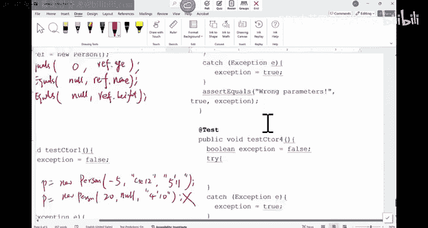
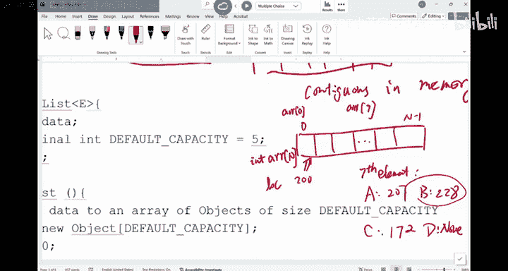
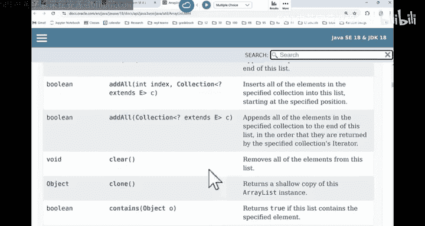
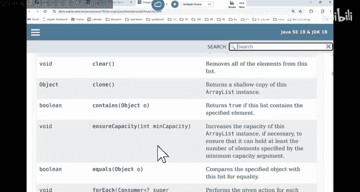
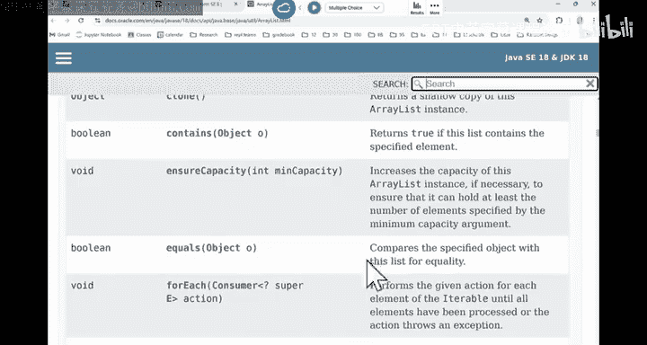
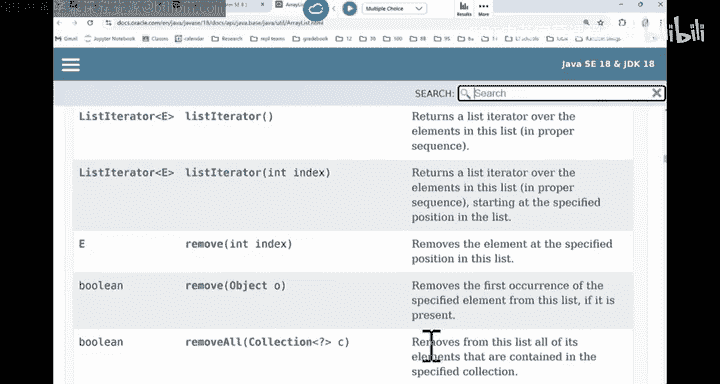
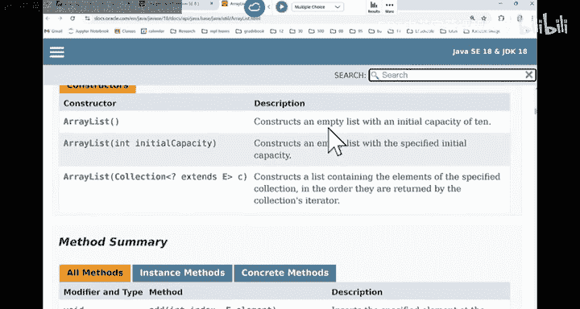
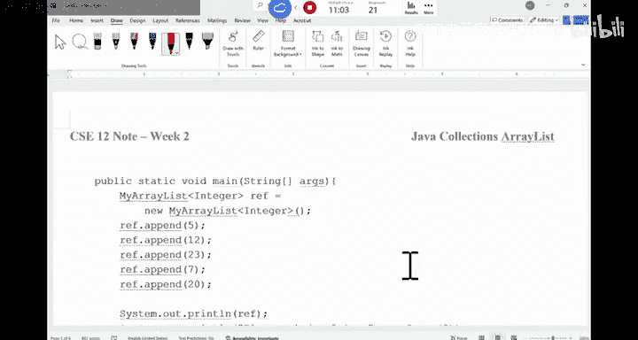

# CSE 12：006：JUnit测试与ArrayList入门 🚀


在本节课中，我们将要学习如何为代码编写JUnit测试，并开始探索我们的第一个数据结构——ArrayList。我们将了解其背后的核心概念、工作原理以及如何实现其基本方法。

---

## JUnit测试回顾 📝

上一节我们介绍了JUnit测试的基本概念。本节中，我们来看看如何为一个可能抛出异常的类编写具体的测试用例。

我们有一个`Person`类，其构造函数和`getNameLength`方法在参数错误时可能抛出异常。在编写`Person`类本身之前，我们需要先为其编写测试。

### 测试默认构造函数

以下是测试默认构造函数的代码示例。我们调用默认构造函数创建一个对象，然后测试其变量是否正确。

```java
@Test
public void testConstructor1() {
    Person p = new Person();
    // 断言测试对象的初始状态
}
```

### 测试可能抛出异常的构造函数

现在，我们需要编写测试来触发第二个构造函数（接收年龄、姓名和身高）的异常。以下是编写此类测试的方法。

1.  **测试单个错误参数**：首先，应单独测试每个可能出错的参数。
2.  **测试错误参数组合**：之后，可以测试多个参数同时错误的情况，以确保代码能正确处理复合错误。
3.  **测试正常情况**：除了错误情况，也需要测试参数正确的正常情况，确保功能正常工作。



对于正常情况，可以将多个测试用例放在一个测试方法中。对于会抛出异常的错误情况，每个测试应单独编写，因为一旦抛出异常，其后的代码将不会被执行。

```java
@Test
public void testConstructor2_WrongAge() {
    boolean thrown = false;
    try {
        Person p = new Person(-5, "CSE12", "5'11\"");
    } catch (IllegalArgumentException e) {
        thrown = true;
    }
    assertTrue("Age should be less than 0", thrown);
}

@Test
public void testConstructor2_NormalCase() {
    // 测试正常输入，不应抛出异常
    Person p = new Person(20, "CSE12", "5'11\"");
    // 可以进行其他断言，例如 assertNotNull(p);
}
```

**重要提示**：在编程作业中，请勿与他人分享你的测试代码，这被视为违反学术诚信的行为。

---

## 数据结构：ArrayList 🧱

现在，我们开始学习第一个数据结构——ArrayList。在CS11中，你们可能已经使用过它。ArrayList是一个实现了List接口的Java类，可以动态地插入和删除元素。

### 什么是List？

List是一个有顺序的集合。集合中的每个元素都有一个特定的位置，我们称之为索引（index）。这与Set（集合）不同，Set只是一组无序的元素。

### ArrayList的本质

尽管ArrayList看起来是“动态的”，但其底层实现仍然是一个基础数组。数组在创建时大小是固定的。所谓“动态”，是我们通过创建新数组并复制旧数据来实现的假象。作为CSE12的学生，我们需要了解并实现这些“幕后工作”。

### 数组的核心特性

数组最重要的特性是其在内存中的**连续性（Contiguous）**。这意味着数组中的所有元素在内存中是相邻存储的。



**连续性带来的好处**：如果知道数组的起始内存地址，就可以通过简单的数学计算快速定位到任何一个元素的位置。这实现了**常数时间（O(1)）** 的访问速度。

计算公式为：
`元素地址 = 数组起始地址 + 索引 * 元素大小`

例如，一个整型数组（每个int占4字节）起始于内存地址200，那么第7个元素（索引为6）的地址是：
`200 + 6 * 4 = 224`

### 数组的缺点

连续内存的优点也是其缺点：**插入和删除元素成本高昂**。

*   **在中间或开头插入**：需要将该位置之后的所有元素向后移动一位。
*   **在中间或开头删除**：需要将该位置之后的所有元素向前移动一位。
*   **在末尾操作**：插入或删除末尾元素则不需要移动其他元素，效率最高。

因此，`ArrayList`的`add(E e)`方法默认将元素添加到列表末尾，因为这是最不“破坏性”的操作。









### ArrayList的扩容

当数组已满，需要添加新元素时，`ArrayList`会进行“扩容”（resize）。这不是简单地增加一个位置，而是创建一个更大的新数组（通常是原容量的1.5倍或2倍），然后将旧数组的所有元素复制过去，最后再添加新元素。为了避免频繁扩容带来的性能损耗，通常会采用成倍扩容的策略。

### 实现ArrayList的基本方法



让我们来看一个简化的`MyArrayList`类的框架，并尝试实现其中两个基本方法。




```java
public class MyArrayList<E> {
    private Object[] data; // 底层存储数组
    private int size;      // 列表中当前元素数量
    private static final int INITIAL_CAPACITY = 5; // 初始容量

    // 默认构造函数
    public MyArrayList() {
        data = new Object[INITIAL_CAPACITY];
        size = 0;
    }

    // 其他方法...
}
```

**重要概念区分**：
*   **容量（Capacity）**：`data.length`，表示数组最多能容纳多少元素（房间里的椅子总数）。
*   **大小（Size）**：`size`，表示当前列表中有多少有效元素（坐在椅子上的学生数）。始终满足 `size <= capacity`。

#### 实现 `append` 方法

该方法将元素添加到列表末尾。

需要考虑的步骤：
1.  检查元素是否为`null`（如果设计不允许）。
2.  检查数组是否已满（`size == data.length`），如果已满则需要先扩容（本节课暂不实现扩容逻辑）。
3.  将元素放入`data[size]`的位置。
4.  将`size`加1。

```java
public void append(E element) {
    if (element == null) {
        return; // 或抛出异常，取决于设计
    }
    // 注意：此处应检查并处理扩容，当前示例省略
    data[size] = element;
    size++;
}
```

#### 实现 `get` 方法

该方法根据索引返回元素。

需要考虑的步骤：
1.  检查索引是否越界。有效索引范围是 `0 <= index < size`。
2.  如果越界，抛出`IndexOutOfBoundsException`。
3.  返回对应索引的元素，由于`data`是`Object[]`，需要将其转型为`E`。

```java
public E get(int index) {
    if (index < 0 || index >= size) {
        throw new IndexOutOfBoundsException("Index: " + index + ", Size: " + size);
    }
    // 需要类型转换
    return (E) data[index];
}
```
**注意**：`IndexOutOfBoundsException`属于“unchecked”异常，在方法签名中不需要使用`throws`声明。

---



本节课中我们一起学习了如何编写更完善的JUnit测试来覆盖正常和异常情况，并深入探讨了ArrayList数据结构的核心原理——其基于连续内存数组的实现，以及由此带来的快速访问和插入删除成本高的特点。我们还初步实现了`append`和`get`两个基本方法。下节课我们将继续完善ArrayList的其他功能。