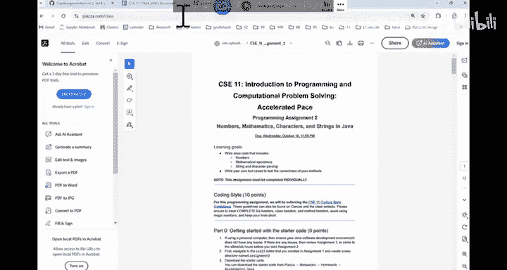

# 007：数组列表实现详解 🧱

在本节课中，我们将学习如何实现一个基础的数组列表数据结构。我们将从构造函数和基本方法开始，逐步深入到更复杂的操作，如删除和字符串表示，最后会介绍课程项目P2的要点。

## 数组列表基础

数组列表的后端是一个数组。我们有一个默认构造函数，其初始容量为5。`size`变量表示数组中实际被使用的元素数量。我们默认只使用数组从开头开始的连续位置。例如，如果容量为5但只使用了3个元素，那么索引0、1、2的位置被使用，其后的位置是空闲的。

## 追加元素方法

上一节我们介绍了数组的基本结构，本节中我们来看看如何向列表末尾添加元素。

`append`方法用于在列表末尾添加一个新元素。它的逻辑类似于C++中向量的`push_back`方法。

**核心逻辑如下：**
1.  检查数组是否有足够容量。
2.  如果有，则在`size`索引处插入新元素。
3.  更新`size`。

```java
public void append(E element) {
    if (size == data.length) {
        // 需要扩容
        resize();
    }
    data[size] = element;
    size++;
}
```

当数组已满（即`size == data.length`）时，需要调用`resize`方法。这是一个代价较高的操作，通常会将数组容量翻倍，并复制所有旧元素到新数组中。

## 获取元素与删除首个元素

理解了添加元素后，我们来看看如何获取以及删除元素。

`get`方法根据索引返回元素，实现相对简单。

```java
public E get(int index) {
    // 应包含索引越界检查
    if (index < 0 || index >= size) {
        throw new IndexOutOfBoundsException();
    }
    return (E) data[index]; // 注意类型转换
}
```

接下来，我们实现`removeFirst`方法，它用于移除并返回列表的第一个元素。这个操作效率较低，因为它需要将所有后续元素向左移动一位。

以下是实现步骤：
1.  错误检查：如果列表为空（`size == 0`），则无法移除。
2.  保存要返回的第一个元素。
3.  执行左移循环，将每个元素复制到前一个位置。
4.  更新`size`。
5.  返回保存的元素。

**关键点：** 在移位前保存对第一个元素的引用是有效的，因为引用指向的是对象本身，而不是数组中的位置。即使数组位置0的内容被覆盖，返回的引用依然指向原来的对象。

```java
public E removeFirst() {
    if (size == 0) {
        throw new NoSuchElementException();
    }
    E toReturn = (E) data[0]; // 保存要返回的元素

    // 左移所有元素
    for (int i = 0; i < size - 1; i++) {
        data[i] = data[i + 1];
    }
    size--;
    // 可选：将最后一个空闲位置设为null
    data[size] = null;
    return toReturn;
}
```

## 转换为字符串

现在，我们来看看如何将列表内容转换为一个格式良好的字符串。

`toString`方法的目标是生成类似`[元素1, 元素2, 元素3]`的字符串。常见的错误包括使用数组长度`length`而不是实际大小`size`进行遍历，以及在最后一个元素后多添加一个逗号。

以下是优化的实现方法，它通过单独处理最后一个元素来避免在循环内进行冗余的条件判断：

```java
public String toString() {
    if (size == 0) {
        return "[]";
    }
    StringBuilder sb = new StringBuilder("[");
    for (int i = 0; i < size - 1; i++) {
        sb.append(data[i].toString()).append(", ");
    }
    sb.append(data[size - 1].toString()).append("]");
    return sb.toString();
}
```

## 项目P2要点介绍

掌握了数组列表的基本操作后，我们简要了解一下即将发布的编程项目P2。

P2要求你完整实现一个自己的`MyArrayList`类。项目总分100分，其中75分用于实现，20分用于编写自定义测试，5分是代码风格分。

**重要注意事项：**
*   **禁止导入`ArrayList`：** 必须自己实现所有功能，导入Java内置的`ArrayList`会导致得零分。集成开发环境（IDE）的自动导入功能需格外小心。
*   **实例变量：** 类中应只有两个实例变量：一个`Object[]`数组和一个`int`类型的`size`。
*   **需要实现的方法：** 包括`expandCapacity`（扩容）、`insert`、`append`、`prepend`、各种`remove`、`rotate`（循环右移）、`find`等。
*   **编写测试：** 除了提供的公开测试，你必须编写自己的测试用例，覆盖边界情况和异常输入。
*   **代码风格：** 遵循提供的风格指南，包括文件头、类头、方法头注释，使用有意义的变量名，避免魔法数字，保持方法简短。鼓励创建**私有**辅助方法，但切勿创建公共辅助方法，否则会导致原型不匹配错误。
*   **尽早提交：** 不要等到截止前一分钟才提交，以便有时间处理可能出现的编译或风格问题。

## 总结




本节课中我们一起学习了数组列表的核心实现。我们从基础的`append`和`get`方法开始，探讨了低效的`removeFirst`操作及其背后的引用原理，优化了`toString`方法的实现。最后，我们预览了项目P2的要求，强调了独立实现、充分测试和遵守代码规范的重要性。理解这些基础操作是掌握更复杂数据结构的基石。