# 009：链表与迭代器 🧩

在本节课中，我们将要学习链表的剩余部分，特别是如何手动操作节点链接，并深入探讨迭代器的概念、工作原理及其在数据结构遍历中的应用。

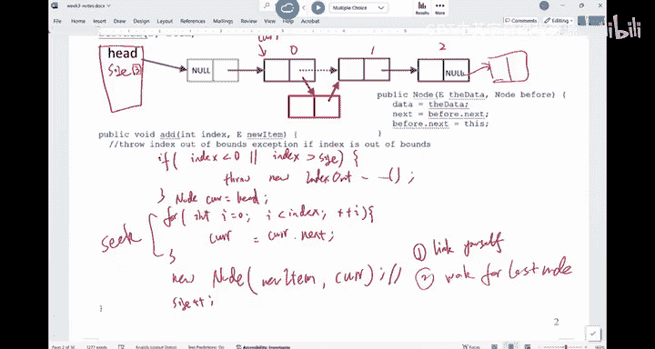

---

## 链表插入操作的细节 🔗

上一节我们介绍了链表的基本插入操作。本节中，我们来看看如果不依赖节点的特殊构造函数，如何手动完成节点的链接。

假设我们有一个单链表，`current`指针指向我们想要插入新节点的位置之前。目标是创建一个新节点`temp`，并将其正确地插入到`current`之后。

以下是手动链接新节点的正确步骤：

1.  首先，将新节点`temp`的`next`指针指向`current`节点原本的下一个节点。这确保了新节点之后链表的连续性。
    ```java
    temp.next = current.next;
    ```
2.  然后，将`current`节点的`next`指针指向新节点`temp`。这完成了新节点到链表中的链接。
    ```java
    current.next = temp;
    ```

**核心要点**：这两个步骤的顺序至关重要。必须先保存`current.next`的引用（步骤1），然后再修改`current.next`（步骤2）。如果顺序颠倒，会导致链表断裂或形成循环引用。

这个逻辑同样适用于在链表末尾插入节点。当`current`指向最后一个节点时，`current.next`为`null`。执行上述步骤后，`temp.next`将被设为`null`，而`current.next`指向`temp`，从而正确地将新节点添加到了链表尾部。

---

## 不同类型的链表 📚

链表有多种变体，以适应不同的需求。

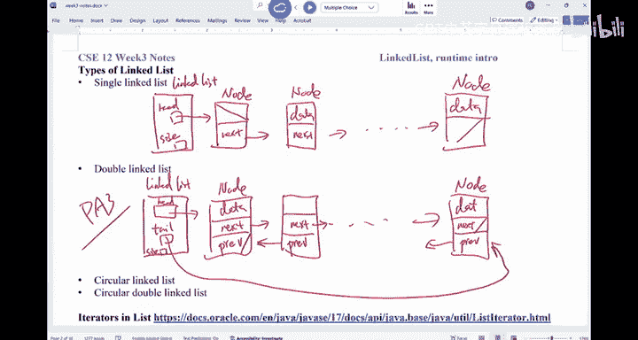


以下是几种常见的链表类型：


*   **单链表**：每个节点包含数据和指向下一个节点的引用（`next`）。通常有一个头节点（`head`）指向第一个节点（或哑元节点），并维护一个`size`变量记录长度。
*   **双链表**：每个节点除了数据和`next`引用外，还包含一个指向前一个节点的引用（`prev`）。这种结构允许从两个方向遍历链表。实现时通常还会维护一个尾节点（`tail`）指针。
*   **循环链表**：链表的最后一个节点的`next`指针指向头节点，形成一个环。双链表也可以构成循环结构。这些变体不如单链表和双链表使用广泛。

---

## 迭代器：遍历的通用工具 🚀

我们已经了解了如何组织数据（如链表）。现在，我们来看看用户如何访问这些数据，而无需了解其内部结构。这就是迭代器的作用。

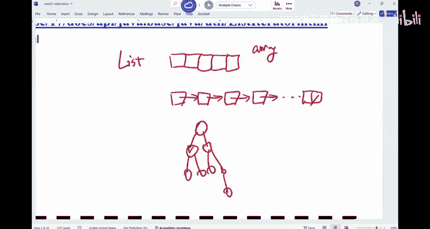

迭代器充当了数据结构和用户之间的“中间人”。它提供了一种统一的方式来顺序访问一个集合（如链表、数组、树）中的元素，同时隐藏了底层数据组织的具体细节。例如，`Scanner`类本质上就是一个用于遍历输入流（如文件）的迭代器。

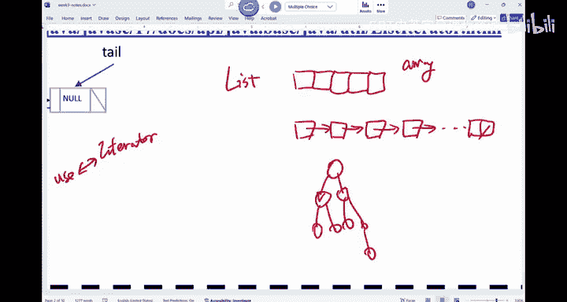


对于用户来说，他们只需要知道如何使用迭代器的几个标准方法（如`next`, `hasNext`），而不必关心数据是存储在数组、链表还是其他复杂结构中。


---

## 链表迭代器的实现细节 ⚙️

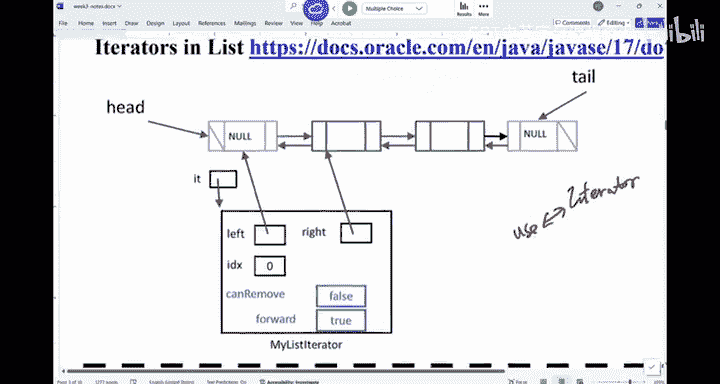

在CSE 12中，你将需要为链表实现一个迭代器。让我们深入了解一下它的设计。

一个链表迭代器本身是一个对象。它不直接“坐在”某个节点上，而是“跨坐”在两个节点之间。它通常包含以下实例变量来跟踪状态：


*   `left`: 指向迭代器当前位置左侧的节点。
*   `right`: 指向迭代器当前位置右侧的节点。
*   `index`: 指示迭代器在链表中的逻辑位置。
*   `forward`: 一个布尔值，记录上一次移动方向（调用`next`后为`true`，调用`previous`后为`false`）。
*   `canRemove`: 一个布尔值，指示当前是否允许调用`remove`方法。

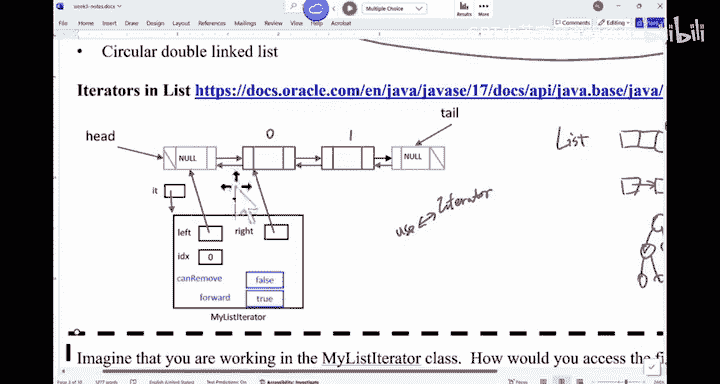

当用户从链表获取一个迭代器时，链表会返回一个配置好初始状态（例如，`left`指向哑元头节点，`right`指向第一个实际节点）的迭代器对象。


**重要概念**：区分**变量本身**和**变量的值**。例如，在迭代器内部，`this.right`这个引用变量存储的值是某个`Node`对象的地址。要访问该节点的`next`字段，需要使用`this.right.next`。`this.right`是迭代器的实例变量，而`this.right.next`是`Node`对象的实例变量。

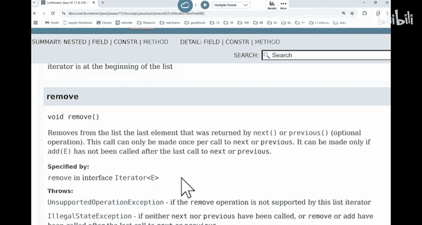

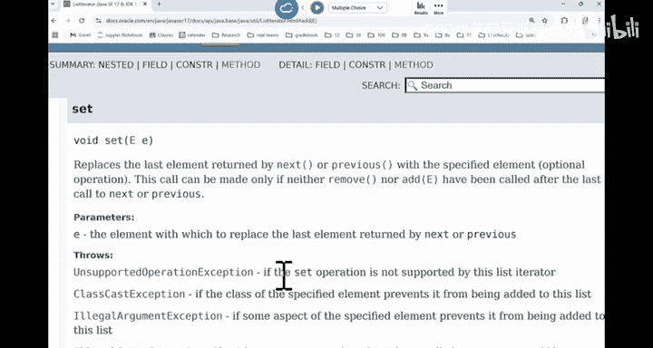

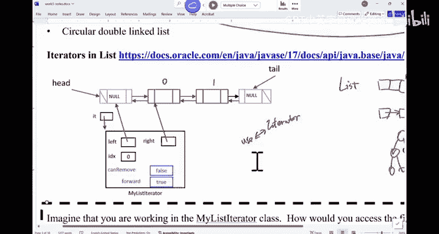

---


## 迭代器方法的行为与约束 ⚠️

使用迭代器遍历链表是简单的，但若要通过迭代器修改链表（插入、删除、替换），则必须遵守特定的规则，以保持迭代器状态的正确性。

以下是关键方法及其约束：

*   **`add(E element)`**：在迭代器当前位置插入新元素。新元素被插入到`next()`方法将返回的元素之前，或`previous()`方法将返回的元素之后。插入后，迭代器位置不变，后续调用`next()`不受影响，而调用`previous()`将返回新插入的元素。
*   **`remove()`**：移除由最近一次`next()`或`previous()`调用所返回的元素。此方法**只能**在每次成功调用`next()`或`previous()`之后调用一次。它依赖于`forward`标志来判断该移除`left`还是`right`所指向的节点。
*   **`set(E element)`**：替换由最近一次`next()`或`previous()`调用所返回的元素。与`remove()`类似，它也只能在调用`next()`或`previous()`之后进行，并且不能与`add()`或`remove()`操作混淆。

这些约束确保了在通过迭代器修改集合时，迭代器自身的位置和状态仍然是可预测且有效的。

---

## 迭代器操作示例 🧪

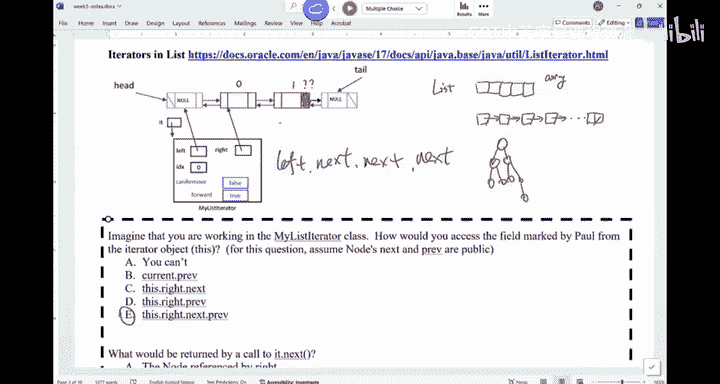


让我们通过一个具体问题来巩固理解。假设有一个双链表和一个处于初始位置的迭代器。

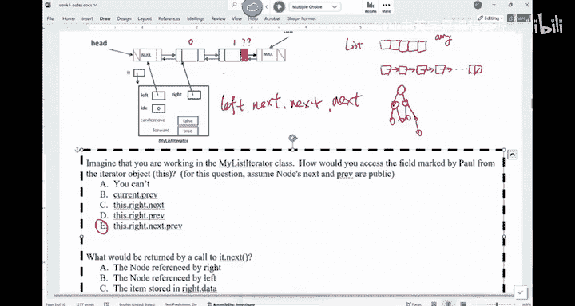

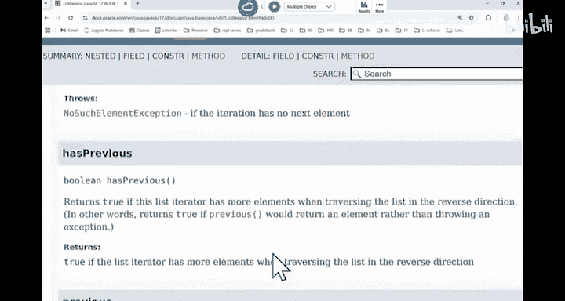

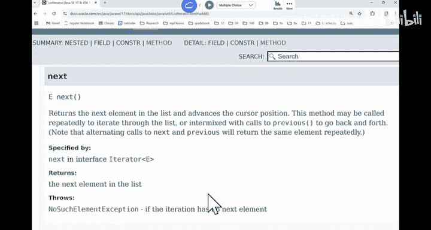


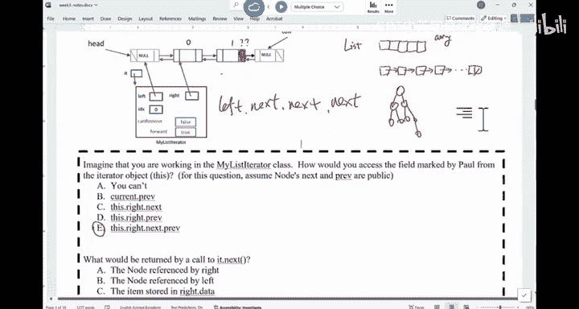

考虑调用迭代器的`next()`方法：


*   **返回值**：`next()`方法应返回`right`指针所指向节点的**数据**（`right.data`），而不是节点引用本身。用户通过迭代器永远接触不到底层的`Node`对象。
*   **状态变化**：调用`next()`后，迭代器的多个内部状态需要更新：
    1.  `left`指针向右移动（指向原`right`节点）。
    2.  `right`指针向右移动（指向原`right.next`节点）。
    3.  `index`增加1。
    4.  `forward`标志应设置为`true`。
    5.  `canRemove`标志应设置为`true`（因为刚刚通过`next()`移动过）。

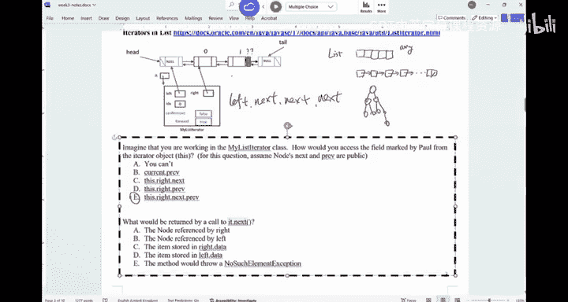


理解这些内部状态的变化对于正确实现迭代器至关重要。

---


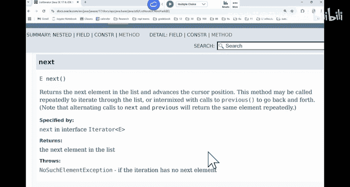

本节课中我们一起学习了链表插入链接的手动实现、不同类型链表的区别，并重点探讨了迭代器的核心概念。我们了解到迭代器如何作为数据结构和用户之间的抽象层，以及实现和使用迭代器时需要遵循的关键规则和状态管理逻辑。掌握这些知识将为后续实现链表迭代器打下坚实基础。